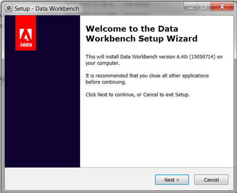
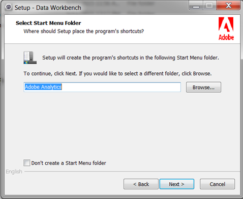
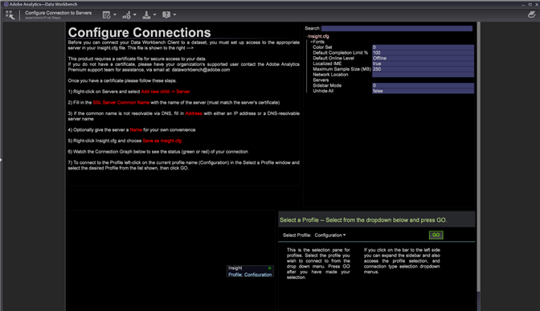

# Workstation Setup Wizard{#workstation-setup-wizard}

Data Workbench provides a set up wizard to install the workstation (client) application.

## Installing the Workstation using the Setup Wizard {#section-58da9bb6196c46eab3b54146913fdcb8}

Launch the installation wizard executable and walk through each step to install the workstation client program. After installation of the workstation, you can connect to servers and profiles.

1. Double-click the workstation installer executable. 
1. Click **Yes** to allow the program to install on Windows. 
1. Select a **Language** for the setup wizard.

   The wizard will open:

   

1. Click **Next** on the **Welcome to Data Workbench Setup Wizard** dialog. 

1. Select to install a **New Installation** or to **Upgrade or repair** an existing installation.

   **New Installation** overwrites any previously installed files.

   **Upgrade** updates your Workstation to the latest version or lets you repair an existing installation. Data Workbench will compare installed ** [!DNL Insight.exe]** files and run the Workstation Setup Wizard if a newer version of the client is available. 

1. Select install location:

   **Typical** installs to a default folder and location.

    * Program files are saved by default to:     
    
      ```    
      C:\Program Files\Adobe\Adobe Analytics\Data Workbench
      ```    
    
    * Data Files (profiles, certificates, trace logs, and user files) are saved by default to:     
    
      ```    
      C:\Users\<username>\AppData\Local\Adobe\Adobe Analytics\Data Workbench\
      ```

      >[!IMPORTANT]
      >
      >A generic ***Insight.cfg*** file without server details will be installed initially. It is recommended that you use the newly installed ***Insight.cfg*** file and customize it rather than moving a file from a previous installation. Because the path for installing the workstation has changed, the addition of fonts, removal of the *User Folder*, and the removal of the *TraceFileComponent * is recommended.

1. (optional) Select** Custom** to choose the language package and the location of the program and data files. 
1. Select location for **shortcuts in the Start Menu**.

   

   Click **Don't create a Start Menu folder** to not install a shortcut on the Windows Start Menu. 

1. Click **Next.** A summary of selected file location paths and languages will display. Click **Install.** 

1. Locate the **Data Workbench Certificate**.

   If the setup wizard cannot find the Data Workbench certificate during installation, it will open a dialog to browse to the location of the certificate (a ** [!DNL .pem]** file located by default in the client ** [!DNL Certificates]** folder), or click **Skip** to find the certificate after installation.

   Click **Install** after locating the certificate. 

1. After the setup wizard is complete and Data Workbench installed, click **Finish** to complete setup. 

   >[!NOTE]
   >
   >The default log location for the Workstation Set up Wizard at ** [!DNL C:\Users\<userName>\AppData\Local\Temp.]**

   Select the **Launch application** checkbox to open the workbench after setup. 

1. **Configure connections **to servers in ** [!DNL Insight.cfg]** file.

   After installation of the workstation, the Enhanced Workstation Configuration Experience workspace will open with additional information about [entering server connection information](https://marketing.adobe.com/resources/help/en_US/insight/client/?f=c_insght_config_param) in the *Insight.cfg* file and an option to select a profile from the drop-down. You can also view the connection status to your servers.

   

## Installation Folders {#section-b5ea5a3b3ecb4622aef713972f3f8ebd}

The Data Workbench folder structure has two installation locations:

* **Program Files** The ** [!DNL Insight.exe] **and supporting client files (** [!DNL Insight.ini]**) are now located by default at

  ```
  C:\Program Files\Adobe\Analytics\DataWorkbench
  ```

* The **Appdata** folder.

  ** [!DNL Insight.cfg]**, profiles, certificates, trace logs, and user files are now located by default at 

  ```
  <filepath>
  C:\Users\<Winuser>\AppData\Adobe\Analytics\DataWorkbench\ 
</filepath>
  ```

  You can set the path for the ** [!DNL Appdata]** folder in the** [!DNL Insight.ini]**file:

  ```
  [InitialSettings] 
  AppDataFolder=C:\Users\mhiatt\AppData\Local\Adobe\Adobe Analytics\Data Workbench\ 
  Locale=en-us
  ```

## Uninstalling the Workstation {#section-5ce2e233fe4348469ef1b3c451dd5b70}

Data Workbench now includes an executable to uninstall the workstation (located by default at ** [!DNL Program Files\Adobe\Adobe Analytics\Data Workbench]\ [!DNL unins000.exe]**).

Launch and follow steps to remove the Data Workbench Workstation files from your hard drive.

>[!NOTE]
>
>You can launch the **unins000.exe** executable from the folder, using the **Uninstall Data Workbench** shortcut from Start Menu, or from **[!UICONTROL Control Panel]** > **[!UICONTROL Program and Features]**.

