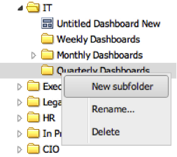
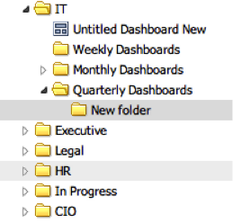

# Adding Folders{#adding-folders}

1. Right-click an existing folder, and select **[!UICONTROL New subfolder]**.

   

1. A new subfolder will be created.

   

   If the operation was successful, you will also see a prompt indicating that the folder has been created.
