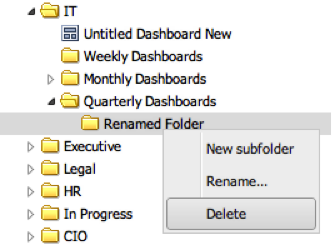

# Deleting Folders{#deleting-folders}

1. Right-click a folder to delete and select **[!UICONTROL Delete]**.

   

   >[!NOTE]
   >
   >The folder must be empty before you can delete it.

1. You will be prompted to make sure you wish to delete the folder.
1. If the operation was successful, you will also see a prompt indicating that the folder has been deleted.
