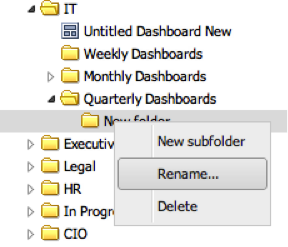
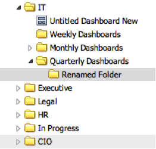

# Renaming Folders{#renaming-folders}

1. Right-click the folder to rename, and select **[!UICONTROL Rename…]**.

   

1. Enter the new name for the folder and press **[!UICONTROL Enter]**.

   

   If the operation was successful, you will see a prompt indicating that the folder has been renamed. 
