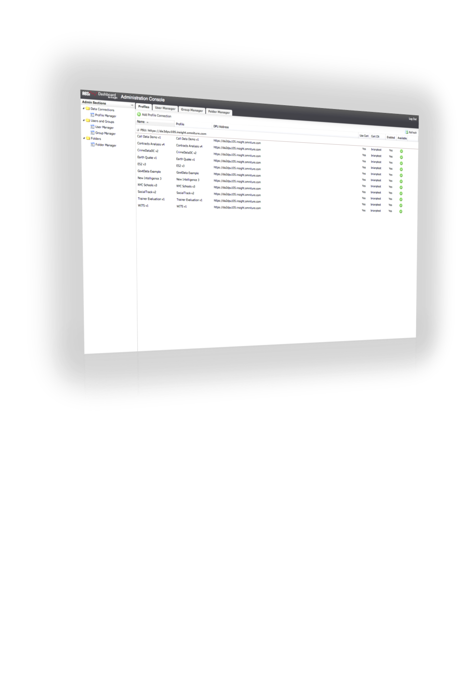

# Managing from the Administration Console{#managing-from-the-administration-console}

Administrative functions of the dashboard application are performed using the **[!UICONTROL Administration Console.]** Using this console, you can manage profile connections, users, user groups, folder hierarchies, and the schema definitions used within the dashboard.

To reach the Administration Console, you must first be logged in to the dashboard as an administrator. Once logged into the dashboard interface, click **[!UICONTROL User]** > **[!UICONTROL Admin]** to navigate to the Administration Console.

