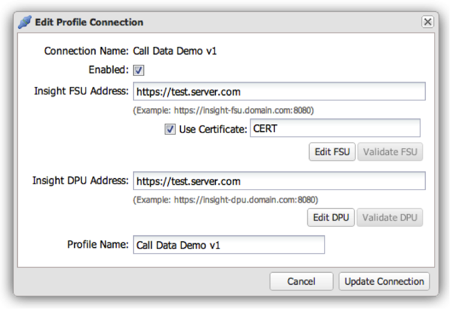

# Editing a Profile Connection{#editing-a-profile-connection}

1. Click the gear icon  at the end of the row for the profile connection you wish to edit.

   

1. Edit the profile connection’s settings and click **[!UICONTROL Update Connection]** to save.

   If the operation was successful, you will see a message indicating that profile connection was successfully updated. 