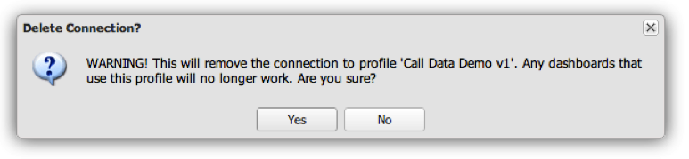

# Removing a Profile Connection{#removing-a-profile-connection}

1. Click the **[!UICONTROL X]** at the end of the row to remove the connection to the profile.
1. A prompt will be displayed asking if you want to delete the profile connection. Select **[!UICONTROL Yes]** to delete the profile connection.

   

   If the operation was successful, you will see a message indicating that the profile connection was successfully removed. 
