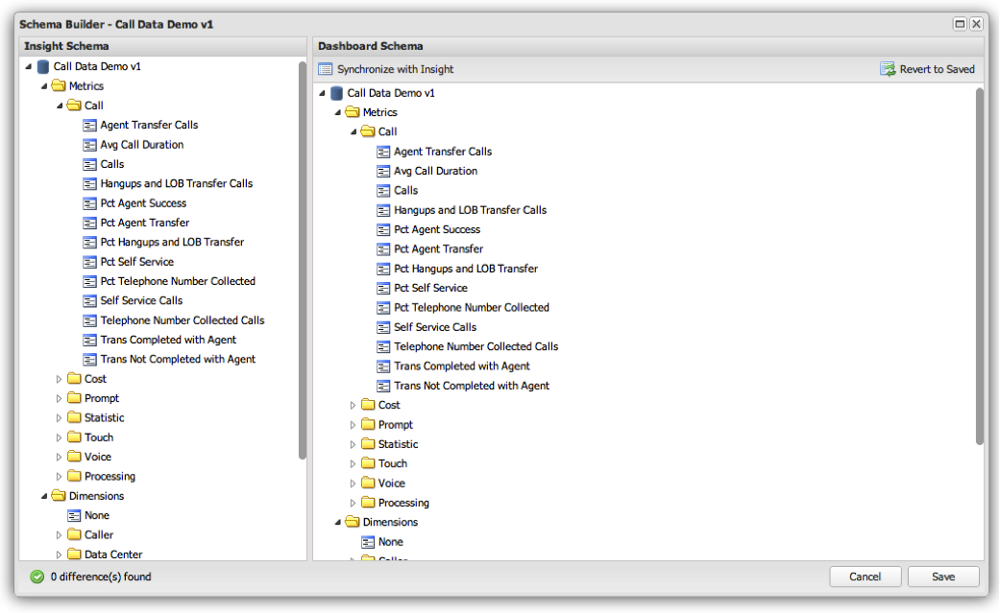

# Managing the Schema{#managing-the-schema}

The schema used within the Adobe Insight dashboard is not retrieved live from Insight. Instead, the dashboard administrator exposes certain items from the Insight schema to end-users of the dashboard system. This allows the administrator to only provide access to the metrics, dimensions, and filters relevant to dashboard users.

Schema management is performed using the **[!UICONTROL Schema Builder]** window in the **[!UICONTROL Administration Console]** and is accessible by clicking the icon to the right of a profile connection’s row.

