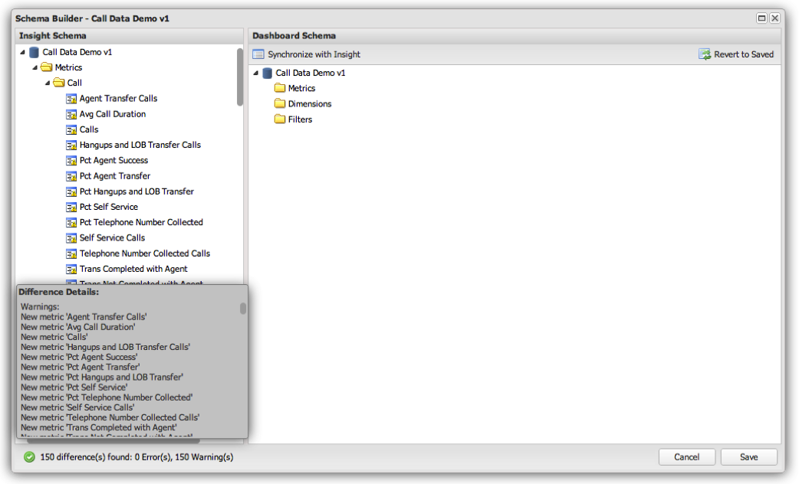
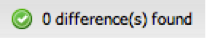

# Initializing and Updating a Profile's Schema Definition{#initializing-and-updating-a-profile-s-schema-definition}

1. Open the **[!UICONTROL Schema Builder]** for the profile you would like to set up.
1. A **[!UICONTROL Loading]** message will be displayed while the schema is being retrieved from the Insight profile. The length of time for loading the schema is dependent on the complexity of the profile being loaded.
1. When complete, you will see a summary of the differences between the **[!UICONTROL Insight Schema]** in the left pane, and the **[!UICONTROL Dashboard Schema]** in the right pane. This summary will appear in the lower left-hand portion of the **[!UICONTROL Schema Builder]** window.

   >[!NOTE]
   >
   >When setting up the schema for the first time, each metric, dimension, and filter will be listed differently from the dashboard’s schema. This is because the dashboard schema objects do not exist at this time.

   

1. Click the **[!UICONTROL Synchronize with Schema]** button to synchronize all metrics, dimensions, and filters from the Insight Schema view with the Dashboard Schema view.
1. When complete, you should see a message indicating that there are no differences found:

   

1. If there are any errors with the Dashboard Schema—such as duplicate metrics and dimensions—then you must correct them manually before you can save.

   >[!NOTE]
   >
   >You can selectively remove any metrics, dimensions, or filters from the **[!UICONTROL Dashboard Schema]** that you do not want to appear to end-users of the dashboard. You will receive a warning that items are not present in the Dashboard Schema, but it will not prevent you from saving.

1. When ready, click **[!UICONTROL Save]** to save your changes to the dashboard’s schema.
1. The dashboard system will use this schema definition to populate the dimensions, metrics, and filters available to end-users of the dashboard interface.
