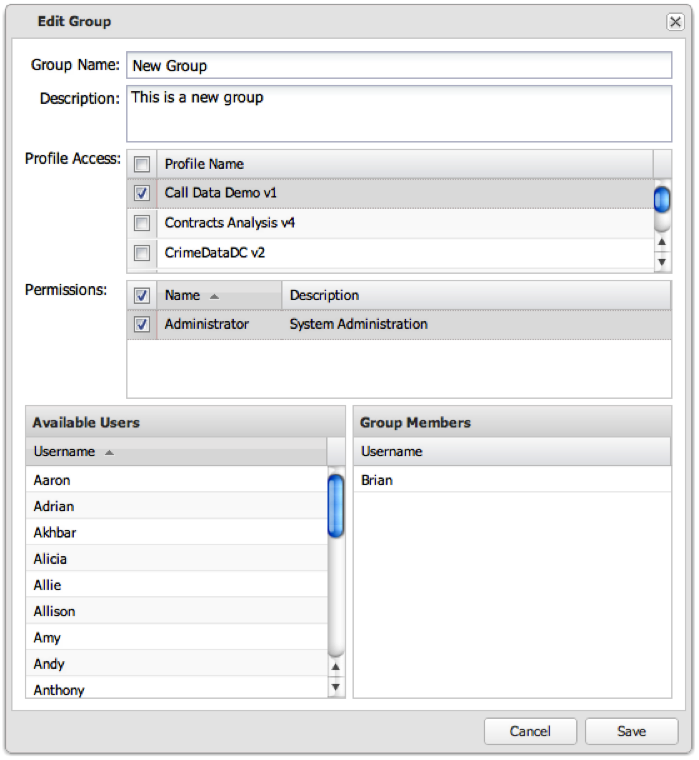

# Editing a User Group{#editing-a-user-group}

1. Click the gear icon at the end of the row to edit the group.

   

1. Edit the group’s settings and click **[!UICONTROL Save]** to save the changes.

   If the operation was successful, you will see a message indicating that the user group was successfully saved.
