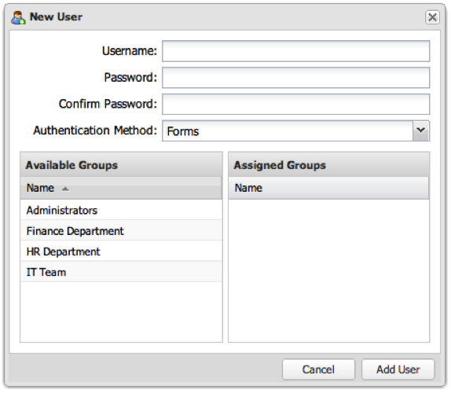

# Adding a User Account{#adding-a-user-account}

1. Click **[!UICONTROL Add User]** to bring up the **[!UICONTROL New User]** prompt.

   

1. Fill in the necessary fields to complete the form.
   1. **[!UICONTROL Username]**: Enter the user name.
   1. **[!UICONTROL Password]**: Enter a password more than 6 characters long.
   1. **[!UICONTROL Confirm Password]**: Reenter the password.
   1. **[!UICONTROL Authentication Method]**: select an option from the drop-down list.

       | **Forms** | By default, the dashboard stores the user account and authenticate internally. |
       |---|---|
       | **LDAP** | Select this option if the user is to be authenticated via LDAP. (The user must already exist in the directory). |
       | **Windows** | Select if the user is to be authenticated using Windows authentication (the user must already exist in the Windows directory). |

1. **[!UICONTROL Assigned Groups]**: Choose from the default Administrators group and any other groups that have been created. No groups are required at this time and the user’s group membership can be modified at any time.
1. Once the form has been configured appropriately, click **[!UICONTROL Add User]** to add the user to the system.

   If the operation was successful, you will see a prompt indicating that the user was created.
