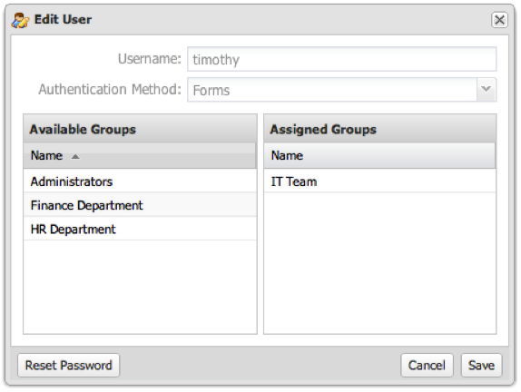

# Editing a User Account{#editing-a-user-account}

1. Click the gear icon  at the end of the row for the user you wish to edit

   

1. Edit the user’s account settings and click **[!UICONTROL Save]**.

   If the operation was successful, you will see a message indicating that the user group was successfully saved. 