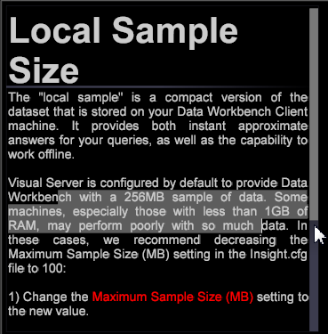
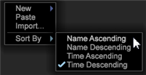
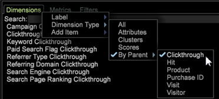
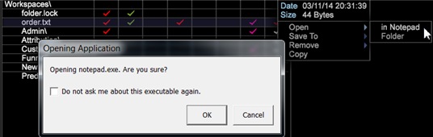

# Data Workbench 6.21 Update{#data-workbench-update}

Data Workbench 6.2.1 provides new features and bug fixes.

## New Features {#section-1aacfe9a6a964c91b1d24fc1b181db34}

Data Workbench 6.2.1 includes these new features: 

<table id="table_E28A6D31E7D941F7A0C2048F0F0F7838"> 
 <thead> 
  <tr> 
   <th colname="col1" class="entry"> Features </th> 
   <th colname="col2" class="entry"> Description </th> 
  </tr> 
 </thead>
 <tbody> 
  <tr valign="top"> 
   <td colname="col1"> Vertical Scroll Bars in Text and Wrapping Text features. </td> 
   <td colname="col2"> Text boxes now have vertical scroll bars and wrapping text. 
  
 </td> 
  </tr> 
  <tr valign="top"> 
   <td colname="col1" valign="top"> Sorting Thumbnails on the worktop </td> 
   <td colname="col2"> Names sorted on the worktop are now insensitive to the case of the character, sorting alphabetically AaBbCcDd instead of ABCDabcd . 
  
 </td> 
  </tr> 
  <tr valign="top"> 
   <td colname="col1"> Searching dimensions based on the parent dimension. </td> 
   <td colname="col2"> 
In the Finders panel, you can now right-click on the Dimensions tab and click select Dimension Type &gt; By Parent. A list of top-level countable dimensions will display. When you select one of these parent dimensions, a list of its subordinate dimensions will appear in the search results. 
  </td> 
  </tr> 
  <tr valign="top"> 
   <td colname="col1"> Dialog asking to open an external application. </td> 
   <td colname="col2"> 
You will now be presented with a dialog box the first time you try to open an external application in Data Workbench. 
 
For example, if you open a text file in Notepad, you will get the following message. 
  
This will also create a local file called  InsightSES.dat  placed in the client install folder. 
 </td> 
  </tr> 
  <tr valign="top"> 
   <td colname="col1"> Changing Toolbars to Buttons </td> 
   <td colname="col2"> You can opt out of using the new toolbar icons provided in Data Workbench 6.2. by changing the  Toolbar Icons  argument in the  insight.cfg  file to  false . <code> Toolbar&amp;nbsp;Icons&amp;nbsp;=&amp;nbsp;bool:&amp;nbsp;false&amp;nbsp;&amp;nbsp;&amp;nbsp;&amp;nbsp;&amp;nbsp;&amp;nbsp; </code> 
You will need to restart the client for the change to take effect. 
 </td> 
  </tr> 
  <tr valign="top"> 
   <td colname="col1"> Reset options in Propensity Scoring and Decision Trees updated </td> 
   <td colname="col2"> In the <a href="http://marketing.adobe.com/resources/help/en_US/insight/client/?f=c_visitor_propensity" format="http" scope="external"> Propensity Scoring </a> (  Tools &gt; Predictive Analytics &gt; Propensity Score ) and the <a href="http://marketing.adobe.com/resources/help/en_US/insight/client/?f=c_decision_trees" format="http" scope="external"> Decision Tree </a> (  Visualizations &gt; Predictive Analytics &gt; Classifications &gt; Decision Tree Builder ) visualizations, you now have two reset options: 
<b>Reset Models</b>—Clears out the model but maintains the settings and inputs. Makes the <b>Go</b> button selectable. 
 
<b>Reset All</b>—Resets all settings (as in previous design). 
 </td> 
  </tr> 
 </tbody> 
</table>

## Bug Fixes {#section-8704a9ac358246cd81233dd0982d534f}

* The **[!UICONTROL Browsers]** and **[!UICONTROL Operating Systems]** lookup files will not be updated within the legacy **[!UICONTROL Traffic]** profile (for example, [!DNL Lookups\Traffic\Browsers.txt)]. Instead, configuration of the **[!UICONTROL Traffic]** profile will utilize the DeviceAtlas bundle ( [!DNL Lookups\DeviceAtlas\DeviceAtlas.bundle]) to provide this configuration information. 
* Data Workbench 6.2.1 will be the last release to provide a download of the 32-bit client application. All future client application downloads will be 64-bit and continue to require Windows 7 or newer. Memory limitations of the 32-bit application are addressed with the introduction of the 64-bit application beginning with the 6.1 release. 

  >[!NOTE]
  >
  >The 32-bit version of the Data Workbench client application may experience potential issues related to memory limitations when running predictive models using the clustering and scoring features.

