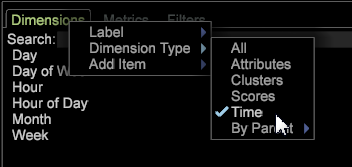
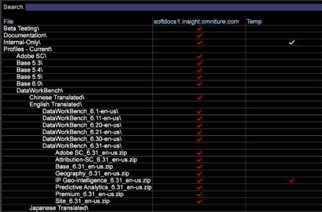
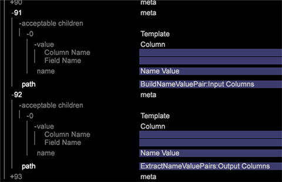
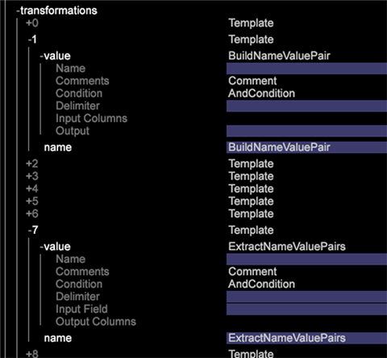

# Data Workbench 6.3 Release Notes{#data-workbench-release-notes}

Data Workbench 6.3 release notes include new features, upgrade requirements, fixed bugs, and known issues.

## New Features {#section-1225066ea8f44cf68e42e019d0bca816}

Data Workbench 6.3 includes these new features: 

<table id="table_E28A6D31E7D941F7A0C2048F0F0F7838"> 
 <thead> 
  <tr> 
   <th colname="col1" class="entry"> Features </th> 
   <th colname="col2" class="entry"> Description </th> 
  </tr> 
 </thead>
 <tbody> 
  <tr> 
   <td colname="col1"> <a href="../../../home/c-get-started/c-attribution-profiles/c-attrib-algorithmic/c-attrib-algorithmic.md"> Best Fit Attribution </a> </td> 
   <td colname="col2"> Best Fit Attribution provides a machine-learning approach to determine the varying levels of influence that customer interactions contribute to a successful conversion event, and then assigns the appropriate level of attribution to each event. Best Fit Attribution lets you evaluate touches over a window of time before the successful conversion event occurred, and then employs the Data Workbench algorithm to build an attribution model based on your data with results specific to your marketing campaigns and internal workflow. </td> 
  </tr> 
  <tr> 
   <td colname="col1"> <a href="../../../home/c-get-started/c-exp-data-seg-exp/c-mmp-integration.md"> Integration with Master Marketing Profile </a> </td> 
   <td colname="col2"> Share rich customer segments created in Data Workbench to the Adobe Experience Cloud. Integrating with Profiles and Audiences enables the <a href="https://www.adobe.com/solutions/digital-marketing.html?promoid=KLXLZ" format="https" scope="external"> Adobe Experience Cloud </a> and other Adobe Analytic capabilities the opportunity to leverage rich audience segments created in Data Workbench. This requires that you have the Experience Cloud configured and running. <p>Integrating with the Master Experience Cloud lets you run predictive features such as clustering or propensity scoring, and then push out segments to the larger Adobe Experience Cloud or other products such as Adobe Target and Adobe Experience Manager. </p> </td> 
  </tr> 
  <tr> 
   <td colname="col1"> <a href="../../../home/c-get-started/c-exp-data-seg-exp/c-segment-export.md#concept-ac18fdb34edc4b9592130ab98fabd05e"> Segment Export Format Options </a> </td> 
   <td colname="col2"> Added industry-standard format options for segments for direct integration with other capabilities, such as <b>R</b>, without additional file manipulation. This provides a more seamless workflow and quicker analysis. </td> 
  </tr> 
  <tr> 
   <td colname="col1"> <a href="../../../home/c-get-started/c-analysis-vis/c-visitor-cluster/c-clustering-2.md"> Clustering 2.0 </a> </td> 
   <td colname="col2"> Includes a new <span class="filepath"> KMeans++ </span> algorithm ( <span class="filepath"> KMeans </span> is currently supported) that uses a faster approach to finding centers for an expedited cluster-generation process. </td> 
  </tr> 
  <tr> 
   <td colname="col1"> <a href="../../../home/c-get-started/c-analysis-vis/c-graphs/c-trend-lines.md#concept-2898b2ef97dc4762bda7df292713e9a2"> Trend Lines </a> </td> 
   <td colname="col2"> Present a very visual and easy-to-interpret depiction of the data. </td> 
  </tr> 
  <tr> 
   <td colname="col1"> <a href="../../../home/c-get-started/c-analysis-vis/c-graphs/c-regression-analysis.md#concept-58ec981ab50549488585a88295fa14b7"> Regression Analysis graph </a> </td> 
   <td colname="col2"> Provides the ability to compare the impact of one factor to another directly within the analyst workflow. </td> 
  </tr> 
  <tr> 
   <td colname="col1"> <a href="../../../home/c-get-started/c-analysis-vis/c-chord-visualization.md#concept-ca600beb11674f3bb2696edf41f1dda9"> Chord Visualization </a> </td> 
   <td colname="col2"> The Chord Visualization provides another view of the <a href="https://docs.adobe.com/content/help/en/data-workbench/using/client/analysis-visualizations/correlation-analysis/c-correlation-analysis.html" format="http" scope="external"> Correlation Matrix </a>. </td> 
  </tr> 
  <tr> 
   <td colname="col1"> <a href="../../../home/c-get-started/c-admin-intrf/c-query-que/c-query-string-grouping.md"> Query String Grouping </a> </td> 
   <td colname="col2"> If you have many fields with custom evars, props, and variables, during log processing you can build a name value pair to combine fields in a report. </td> 
  </tr> 
  <tr> 
   <td colname="col1"> <a href="../../../home/c-get-started/c-analysis-vis/c-latency.md#concept-a18c23d45af0460ba531f94da0cdfe6a"> Latency Analysis </a> </td> 
   <td colname="col2"> The Latency visualization lets you analyze latent customer behavior within a set number of days before or after an event occurred after a campaign or other event type. </td> 
  </tr> 
  <tr> 
   <td colname="col1"> <b>Time</b> dimension </td> 
   <td colname="col2"> In the Finders panel, you can now right-click on the <span class="uicontrol"> Dimensions </span> tab and select <span class="uicontrol"> Dimension Type &gt; Time </span>. A list of time dimensions will display in the search results. <p>  </p> </td> 
  </tr> 
  <tr> 
   <td colname="col1"> <b>Lock</b> feature </td> 
   <td colname="col2"> The new <b>Lock</b> feature displays an icon in the toolbar when a workspace is locked. You can unlock the workspace by clicking the <b>Add</b> menu and then clicking <b>Temporarily Unlock</b>. </td> 
  </tr> 
  <tr> 
   <td colname="col1"> Logical Operators and new Metric features in the <b>Filter Panel </b> </td> 
   <td colname="col2"> AND/OR logical operators were added to the <b>Filter Panel</b>, allowing you to join or add metrics when filtering data. As you change metrics, the Filter Percentage adjusts and displays accordingly. </td> 
  </tr> 
  <tr> 
   <td colname="col1"> Keyboard Shortcuts </td> 
   <td colname="col2"> New keyboard shortcuts in Data Workbench allow you to navigate across the main worktop and individual workspaces using the arrow keys. In addition, the toolbar in the workspace is now displayed on the worktop window. </td> 
  </tr> 
  <tr> 
   <td colname="col1"> Windows 8.1 support </td> 
   <td colname="col2"> Microsoft Windows 8.1 64-bit is <a href="https://docs.adobe.com/content/help/en/data-workbench/using/install/c-data-workbench-client-install.html" format="https" scope="external"> now supported </a> for client installation. </td> 
  </tr> 
 </tbody> 
</table>

## Upgrade Requirements and Recommendations {#section-8704a9ac358246cd81233dd0982d534f}

New profiles for Data Workbench are located on the **Software and Docs** profile at 

```
Profiles - Current\DataWorkBench\ 
  English Translated\DataWorkBench_6.31-en-us\
```



**Upgrade Server:** 

>[!NOTE]
>
>If you have customized profiles that take precedence over the default files provided in the [!DNL Base] package, then you will need to update these customized files:

* **Update the Meta.cfg file** ( [!DNL E:\..\Profiles\<your custom profile>\Context\meta.cfg)]to set updated password encryption for the File System Unit (FSU server), and to add entries for the Name Value Pair tranformations to take advantage of [Query String Grouping](../../../home/c-get-started/c-admin-intrf/c-query-que/c-query-string-grouping.md).

    1. Open the [!DNL meta.cfg] file on the FSU. 
    1. Change the data type for **[!UICONTROL Proxy Password]** from " [!DNL string"] to " [!DNL EncryptedString]" in the *Workstation Configuration* section.     
    
       ```
       Proxy User Name = string: 
       Proxy Password = EncryptedString:   (from Proxy Password = String) 
       Use Address File = bool: true
       ```

    1. Add new entries to enable the new Name Value Pair transformations: *BuildNameValuePair* and *ExtractNameValuePairs*.

       Open a workspace and right-click **Admin** > **Profile Manager**.

       Under **Context**, click the **meta.cfg** file in the **Base** column and then click **Make Local**. From the User table column, right-click and select **Open** > **in Workstation**. 
    
       

        * In the new window, click **metadata** and add acceptable children templates. 
        
        

        * Open **transformation** and add new templates. 
        
        

* **Update for Fast Merge improvements**. Add parameters or change values to the following configuration files to take advantage of speed improvements in Data Workbench during a transformation.

    * **Communications.cfg** ([!DNL E:\Server\Components\Communications.cfg])

      ```
      18 = SourceListServer:  
          URI = string: /SourceListServer/ 
          Listing Interval = int: 10 (new)
      ```

    * **Disk Files.cfg** (at [!DNL E:\Server\Components] and [!DNL E:\Server\Components for Processing Servers])

      ```
      Disk Cache Size (MB) = double: 1024 (from double: 256) 
      Disk Cache Read Limit (MB) = double: 768 (new)
      ```

    * **Log Processing Mode.cfg** ( [!DNL E:\Server\Profiles\<your profile>\Dataset\Log Processing Mode.cfg])

      ```
      <i>(changed)</i> 
      Batch Bytes = int: 268435456 
      Cloud Bytes = int: 268435456 
      Real Time FIFO Bytes = int: 268435456
      ```

      ```
      (new) 
      Cache Bytes = int: 32000000 
      Fast Input Decision Ratio = double: 200 
      Fast Input FIFO Bytes = int: 268435456 
      FIFO Hash Mask = int: 16383 
      Fast Merge Buffer Bytes = int: 536870912 
      Slow Merge Buffer Bytes = int: 268435456 
      Fast Merge Fan In = int: 64 
      Key Cache Size Logarithm = int: 21 
      Max Seeks = int: 512 
      Output Old Buffer Bytes = int: 536870912 
      Overflow FIFO Bytes = int: 67108864 
      Paused = bool: false
      ```

      >[!NOTE]
      >
      >* To take advantage of the Fast Merge improvements, make sure you have at least 8 GBs of RAM per DPU. 
      >* The Save Interval, the duration between dataset saves, might need to be reduced if the new Log Processing Mode parameters are applied. Because the Transformation will complete faster, the dataset state file will contain more data between Save Intervals compared to prior versions. 
      >
      >  **It is recommended to reduce the Save Interval setting to 1800 seconds (30 minutes)**—the default Save Interval is 3600 seconds (1 hour). (If this line needs to be added to the [!DNL Log Processing Mode.cfg], note that there are two (2) leading spaces).
      >
      >  ```
      >    Save Interval (sec) = int: 1800
      >  ```
      >
      >  * It is recommend that the new Log Processing Mode parameters not be applied to a dataset that is configured with a **CrossRows** using the **All** operation. With these settings, the memory usage for this operation can become too great for the environment.

* **Adobe Target with DWB integration update**. A new export file, [!DNL ExportIntegration.exe], replaces the existing [!DNL TnTSend.exe] file on the Insight Server ( [!DNL E:\Server\Scripts\TnTSend.exe]). This new export file supports both Adobe Target integration and coordination with the new Master Marketing Profile (MMP) and Adobe Audience Manager.

  You will need to update the following commands for Adobe Target exports.

  `Command = string: TnTSend.exe`

  to

  ```
  <filepath>
  Command = string: ExportIntegration.exe 
  </filepath>
  ```

  >[!NOTE]
  >
  >This will only affect exports created prior to version 6.3. 
  >
  >
  >You can also try the following to employ the old export process: 
  >    
  >* Create a new Test And Target Export in the workstation. 
  >* Modify the old Test and Target export found in Server/Profiles/`<your profile>`/Export.

* **Update the Adobe SC profile.** Changes to the [!DNL Exclude Hit.cfg] file require a field to be declared in the associated [!DNL Decoding Instructions.cfg] file.

  >[!NOTE]
  >
  >If your Adobe SC profile includes a customized [!DNL Decoding Instructions.cfg] file, you will need to include a [!DNL DelimitedDecoder] parameter to your customized file.

  ```
  0 = DelimitedDecoder: 
     Delimiter = string: \t 
     Fields = vector: x items 
     …  
        5 = string: 
  Changed to: 
         
  5 = string: x-hit_source
  ```

  Adding the [!DNL DelimitedDecoder] field allows you to take advantage of feature updates and to avoid possible Log Processing problems resulting from these updates.

**Upgrade Client:**

* **Update your client from the server**.

  Once your server has been updated, your client can update automatically if the [!DNL Insight.cfg] file is configured properly:

    1. Edit the [!DNL Insight.cfg] file.
    
       ```
       Update Software = bool: true
       ```
    
       Then **[!UICONTROL Save]**. 
    
    1. Exit and launch the client. 
    1. Connect to the profile.

       The client will automatically upgrade to Data Workbench 6.3. 
    
    1. Exit out of the client. 
    1. Edit [!DNL Insight.cfg]

        * Change [!DNL Proxy Password = string:]

          to [!DNL Proxy Password = EncryptedString:]

          Remove the value of the previous Proxy Address and Proxy Password. 
        
        * **[!UICONTROL Save]**.

    1. Launch the client. 
    1. Edit [!DNL Insight.cfg].

        * Enter Proxy Password for all the servers and Save. 
        * Enter the Proxy Address for all the servers and Save.

          >[!IMPORTANT]
          >
          >The Proxy Address and Proxy Password must be entered and saved from within the client.

    1. Connect to the profile.

  >[!NOTE]
  >
  >
  >    
  >    
  >    * Follow the exact upgrade sequence in order to avoid an account lockout. If the account is locked, please perform all the required changes in the exact sequence listed, save your work, and exit out of the client. Wait for the lockout to release (about 45 minutes), then launch the client again. 
  >    * The password modification should be performed in the client only due to the fact that the passwords are saved in Windows Credential Vault. 
  >    
  >

* **Recommendation**: **New Windows Aero Themes. ** Upgrade the look of your client application using Windows Aero Themes. 

* **Recommendation: Fonts for Chinese and Japanese versions**:

  Chinese:

    * Arial 
    * SimSun

  Japanese:

    * MS Gothic 
    * Meiryo 
    * MS Mincho 
    * Arial 
    * SimSun

  >[!NOTE]
  >
  >*SimSun* can be used for Chinese and Japanese. If attempting to write in half-byte characters in Japanese, you also need to include *MS Mincho*. To enable these fonts in [!DNL Insight.cfg], you can add these parameters.

  ```
  0 = string: Arial 
  1 = string: SimSun 
  2 = string: MS Mincho
  ```

  These fonts should be listed in the workstation configuration file: [!DNL Insight.cfg.]

**Upgrade to Adobe Analytics Premium**

To run **Best Fit Attribution** in Data Workbench, you need to receive new certificates from Adobe ClientCare for your Client, Server, and Report Server (.pem files) to support Adobe Analytics Premium. Each of the new certificates will have this parameter:

```
Product = Premium
```

The Premium Package is available for download on **[!UICONTROL Software and Docs]** under the **[!UICONTROL Getting Started]** tab on the **Profiles and Lookup** files workspace. Navigate to `Profiles - Current\DataWorkBench\<language>\Data WorkBench_6.30-en-us\Premium_6.30_en-us.zip`.  Once the **Premium** profile is loaded on your Server, you will need to add a *Premium* parameter to your custom [!DNL Profile.cfg] file. This allows your custom profile to include the menus, visualizations, and workspaces as part of Adobe Analytics Premium.

## Fixed Bugs {#section-e1e3df3da3594987a325344cd5e8b855}

* Fixed issue where the **Density Map** visualization was missing largest elements. 
* Fixed issue in **Density Map** where area of elements was not portraying the proportion of the metric value. 
* Fixed issue where dragging metric from **[!UICONTROL Finders]** panel to metric legend outside of the metric column would delete the legend from the workspace. 
* Fixed issue where **[!UICONTROL Print Workspace]** using **[!UICONTROL Sidebar]** and **[!UICONTROL Both]** options will not include the Copyright info in the printed page.

## Known Issues {#section-751e8698e9f14b75a85f63253782be41}

* Users of **AMD Radeon™ graphics cards** should update to the latest graphics drivers. Some early versions of the driver claim they support openGL 3.2 but are inconsistent. 
* Output generated by **Segment Export** configuration without a header declaration can result in a bogus header appearing at the beginning of the file that conflicts with the first set of rows. 
* **Add Dimensions** is showing only the *Extended Dimensions*. The workaround is to use the **Finders** tool to drag dimensions to tables. 

* When 3D Scatter Plot Visualization includes callouts, the zoom might display plots outside the border of the visualization. To work around this issue, zoom the 3D Scatter Plot first and then add callouts to your visualization. 
* Using Workstation in Remote Desktop session will crash when renaming workspaces. 
* List Item 
* **Legacy Segment export files output with double quotes** even if the export file doesn't contain quotes in the Output Format field.

  *Workaround*: Add these three lines to the .export file. Setting these values will not trigger an MMP integration (as other configuration fields are required) but will bypass unwanted automatic escapes.

  ```
    MMP Configuration = MMPConfiguration: 
      MMP Segment Name = string: UNESCAPE DUMMY 
      MMP Visitor ID Field = string: [Specify a Dimension from the output of 
                                      the current export]
  ```

  (The first line has two (2) leading spaces and the next lines four (4). The Dimension from the output of the current export needs to be referenced in the [!DNL MMP Visitor ID Field].)
