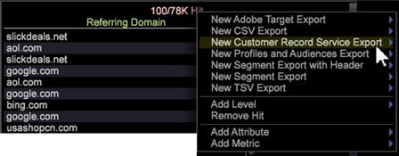

# Exporting to Analytics Core Services{#exporting-to-analytics-core-services}

The Customer Record Service (CRS) export feature lets you export Data Workbench data to the Adobe Analytics Core Services to integrate with other Analytics' capabilities, including Reports & Analytics.

>[!NOTE]
>
>In order for the CRS export feature to work, a visitor's Analytics Visitor ID (AVID) must be based on the Marketing Cloud Visitor ID (MCID). Although MCID may be populated in Data Workbench for a visitor, if the client is in the grace period or the visitor's cookie has not been replaced with MCID, the CRS export will not work for that visitor. For more information, see [Identifying Visitors](https://marketing.adobe.com/resources/help/en_US/reference/datafeeds-visid.html) and [ID Service Grace Period](https://marketing.adobe.com/resources/help/en_US/mcvid/mcvid_grace_period.html).

From a **Detail Table** (right-click **[!DNL Tools > Detail Table]** in a workspace), you can set attribute values and the variables required to integrate with Analytics' Reports & Analytics (using Adobe Pipeline Services).

1. **Right-click the table header and click New Customer Record Service. ** 

   

1. **Name the export file and save. ** The export file edit window will open. 

1. **Open** **Query > CRS Configuration**. 

1. **Right-click CRS Attributes > Add New. ** 
1. **Enter** ***CRS Attributes*** **parameters**.

   Open the new entry and enter or verify values in the *CRS Attributes* section of the export file: 

<table id="table_8156A2C66C0E41D381C31F1082CCA479"> 
 <tbody> 
  <tr> 
   <td colname="col1"> 
<b>Attribute Name</b> 
 </td> 
   <td colname="col2">Name of the <i>Customer Attributes</i> variable displayed in <i>Reports &amp; Analytics</i>. </td> 
  </tr> 
  <tr> 
   <td colname="col1" valign="top"><b>Attribute Type</b> </td> 
   <td colname="col2"> 
This parameter accepts values of (<i>int</i>, <i>string</i>). 
 
Note: If an attribute is <b>not</b> subscribed to in Analytics: 
 
      <ul id="ul_B77BF6FDA3FB4F1BBF9380C2FD938270"> 
       <li id="li_3D099456AF6B4103B227D841C81AB936">The attribute will be created with any valid attribute type supported by Analytics (for this release it is limited to only <i>string</i> and <i>int</i>). </li> 
       <li id="li_EA1DBDB2E6BE49278C6CD6A5503EDC8A">If an invalid attribute type is entered, then you will receive an error stating a failure to subscribe to Analytics. </li> 
      </ul> 
 
If an attribute is <b>already</b> subscribed to in Analytics: 
 
 
      <ul id="ul_16415B639F1C49A5AE9932C128184171"> 
       <li id="li_83C90D44FE5C4D979DEA786660C7F3EC">Make sure to enter the right attribute type for the already subscribed to attribute. </li> 
       <li id="li_02C5024E335C4C59B4F7B0084232CC24">If you enter the wrong type for the attribute, then its behavior will be dependent on Analytics' handling of attribute types. </li> 
      </ul> 
 
 </td> 
  </tr> 
  <tr> 
   <td colname="col1" valign="top"> 
<b>Field Name</b> 
 </td> 
   <td colname="col2">Name of the dimension or metric from which the attribute values are selected. 
Note: The <i><b>Field Name</b></i> under <i>CRS Attributes</i> should be the same as the <b><i>Output Fields</i> &gt; <i>Field Name</i></b> (which is populated automatically based on the attribute selected). If the <i>Field Name</i> is invalid then the export will not run. 
 </td> 
  </tr> 
 </tbody> 
</table>

1. ** Right-click Report Suite > Add New. ** 
1. **Enter the *Report Suite ID***.

   Open the new entry and enter or verify values in the *Report Suite* section of the export file: 

<table id="table_A3279CADB74C441DA2E062E2123CE9D4"> 
 <tbody> 
  <tr> 
   <td colname="col1" valign="top"><b>Report Suite</b> </td> 
   <td colname="col2">ID of the report suite in <i>Reports &amp; Analytics</i> identifying the <i>Customer Attribute</i> variables being exported. 
 
Note: Although <i>Reports &amp; Analytics</i> lets you add to multiple report suites, Data Workbench 6.4 will only export a single report suite identified at <i>index 0</i>. 
The report suite value entered in this field is the report suite ID (and not the name of the report suite). 
 
 
 </td> 
  </tr> 
 </tbody> 
</table>

1. ** Enter *MCID Field* parameter.** 

   | **MCID field** |Name of the dimension in your profile that represents the *Adobe Marketing Cloud I*D. This is a mandatory field and any invalid dimension value entered will not export.  |
   |---|---|

1. **(optional) Enter *Visitor ID Field* parameter.** 

   | **Visitor ID Field** | If the user wishes to send any other custom ID for a visitor in his/her data, this is where they enter the name of the dimension which represents the custom visitor id. This is an optional field an can be left empty.  |
   |---|---|

