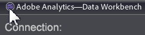

# Data Workbench 6.51 Update{#data-workbench-update}

Data Workbench 6.51 release notes include new features, upgrade requirements, fixed bugs, and known issues.

To view previous features and fixes for past releases, see the [release notes archive](https://marketing.adobe.com/resources/help/en_US/insight/insight_release_notes_prev.pdf).

[New Features](../../home/c-release-notes-insight/c-6-51.md#section-e844b52c18484e99bdda5c361402247d)

[Upgrade Requirements](../../home/c-release-notes-insight/c-6-51.md#section-e1aa5adcf5f24a3da795574364ea196b)

[System Updates](../../home/c-release-notes-insight/c-6-51.md#section-84f8f38e9c424d7788c79146fce5a6fe)

[Fixed Bugs](../../home/c-release-notes-insight/c-6-51.md#section-3c47f9177e9d40d8938a5710399dc88f)

[Known Issues](../../home/c-release-notes-insight/c-6-51.md#section-49ab5451d0c74f36a69ca12621251674)

## New Features {#section-e844b52c18484e99bdda5c361402247d}

Data Workbench 6.51 includes these new features: 

<table id="table_9305F30AEF5D49B2B052D1E7C9570D2C"> 
 <thead> 
  <tr> 
   <th colname="col1" class="entry"><b>DWB 6.51 Features </b> </th> 
   <th colname="col2" class="entry"> Description </th> 
  </tr>
 </thead>
 <tbody> 
  <tr> 
   <td colname="col1" valign="top" align="left"><b>Avro Data Feed</b> rollout </td> 
   <td colname="col2" valign="top" align="left">Report suite hit data will be delivered in a new Apache Avro data source format providing updated features and new variable types for Adobe Analytics Premium (including additional evars, custom events, and solution variables). See <a href="https://marketing.adobe.com/resources/help/en_US/insight/dataset/?f=AVRO-log-file" format="https" scope="external"> Avro Data Feed</a>. </td> 
  </tr> 
  <tr> 
   <td colname="col1" valign="top" align="left"><b>Bar Graph improves display</b> with color gradients overlay </td> 
   <td colname="col2" valign="top" align="left"> 
To improve contrast of elements in the Graph visualization, a gradient of colors can be applied to highlight individual bars using the Cylinder effect or left and right background gradients. 
 
    <ul id="ul_04C17524FE904F1CA6AE9B18F50551A9"> 
     <li id="li_D5F3B808F6BD4413A985EAC72EB89D5D"><b>No Gradient Overlay</b>. Select to show bars without gradient overlay applied. </li> 
     <li id="li_EF26B82D206643419948BD83ACF8A115"><b>Background from Left</b>. Select to show gradation of colors across all bars from left to right. </li> 
     <li id="li_3D5BE49CEC1748F68944AD2ABEFD7B23"><b>Background from Right</b>. Select to show gradation of colors across all bars from right to left. </li> 
     <li id="li_2CA78F34D2F44A29BE8FD53334E0DB24"><b>Cylinder</b>. Select to show gradation of colors from the center of each bar to the edge of each bar. </li> 
    </ul> </td> 
  </tr> 
  <tr> 
   <td colname="col1" valign="top" align="left">Updates to the <b>Insight.cfg</b> edit tree </td> 
   <td colname="col2" valign="top" align="left"> 
The New Layout view is now the default to <a href="https://marketing.adobe.com/resources/help/en_US/insight/client/?f=c_insght_config_param" format="https" scope="external"> edit the Insight.cfg configuration file</a>. 
 
Also, 
     <ul id="ul_9484D81C1F5A48CCBFC77204B60E3650"> 
      <li id="li_574CA325411C4482B759E60F453C15BC">An <b>Undo</b> (Ctrl+Z) feature is provided for all but the required top-level values in the configuration tree. </li> 
      <li id="li_91B8F8F12FA847FDACBB9690B9F97793">When removing elements you are now provided a dialog to confirm actions to avoid erroneous changes. </li> 
     </ul> 
 </td> 
  </tr> 
  <tr> 
   <td colname="col1" valign="top" align="left"> Double-click to close workstation </td> 
   <td colname="col2" valign="top" align="left">Quickly close the workstation (client application) by double-clicking the upper left corner of the title bar. 
 
 </td> 
  </tr> 
  <tr> 
   <td colname="col1" valign="top" align="left"> XML Decoder Enhancements </td> 
   <td colname="col2" valign="top" align="left">You now have the ability to use <i>#value</i> tag in XML Paths to pull the value of an XML element. </td> 
  </tr> 
 </tbody> 
</table>

## Upgrade Requirements {#section-e1aa5adcf5f24a3da795574364ea196b}

**Workstation (client) upgrade requirements:**

To upgrade the client workstation for version 6.51 from version 6.50, you must run the Workstation Setup Wizard to install the workstation executable and supporting files (using the** Upgrade or repair** mode)—or copy or edit files manually on your server. For this upgrade only, the automated upgrade feature in the workstation from the *Software and Docs* profile is turned off (even though the [!DNL Update software = true] is set in the [!DNL Insight.cfg] file on your server).

** Server upgrade requirements: **

Update to the new **[!DNL Adobe SC meta.cfg]** file:

* The [!DNL server\Profiles\Adobe SC\Context\]**[!DNL meta.cfg]** file was renamed to [!DNL server\Profiles\Adobe SC\Context\]**[!DNL Adobe SC meta.cfg]**. 

* Updated [!DNL Base\Context\] **[!DNL meta.cfg]** file.

Replace your server build with the updated files.

## System Updates {#section-84f8f38e9c424d7788c79146fce5a6fe}

These features have been renamed, deleted, or the installation files or folders were restructured in this release:

* **SSL Connectivity Change**. Certificate generation to upgrade key length was modified to 2048 bits and uses SHA256. This eliminates RC4 ciphers by using modern encryption algorithms. 
* Files changed to Read-only.

    * base\context\serverdetails\detailed status.vw 
    * base\menu\admin\detailed status for master.vw 
    * base\menu\admin\detailed status for query.vw 
    * base\workspaces\admin\dataset and profile\detailed status.vw

* **Bookmarks alphabetized**. Right-click in the Bookmark panel and select **Alphabetize**. The bookmarks will align based on alphabetic, case-insensitive characters for each language.

## Fixed Bugs {#section-3c47f9177e9d40d8938a5710399dc88f}

The following are prominent fixes made in Data Workbench 6.51 (since the release of Data Workbench 6.5).

* Previously, **Algorithmic Attribution** coefficients displayed as all zeros when using SGD to converge. This is now fixed.

## Known Issues {#section-49ab5451d0c74f36a69ca12621251674}

* Exporting an Association Table from an [Association Chord](https://marketing.adobe.com/resources/help/en_US/insight/client/?f=associations-chord)visualization that contains *at least one metric* will result in duplicated elements in the rows/columns of the Association Table. To avoid duplicated elements, create a new Association Table and add the desired elements rather than exporting the elements from an Association Chord. 

* If you build an Avro decoder, the default field button won’t work. Please work with your account manager to get the appropriate configuration for your implementation. 
* Upgrading the workstation (client) from DWB 6.50 must be done manually using the Client Setup Wizard in Upgrade mode). And automatic upgrade will not occur (see Upgrade Requirements for the client). 
* Using the Chinese and Japanese install packages for Adobe SC AVRO as a stand-alone might give an error stating [!DNL Undefined Metric: "$Default Metric$"]. No mapping is currently defined for [!DNL $Default Metric$]. However, if you are using the Adobe SC AVRO package along with other packages, such as the Attribution-Premium package, then this error will not occur.

