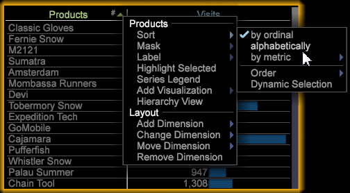
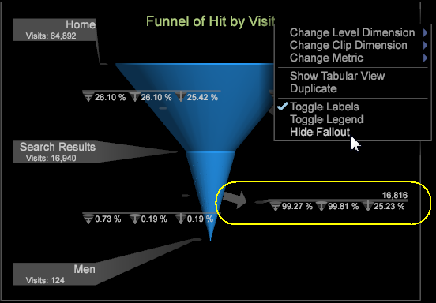

# Data Workbench 6.1 Release Notes{#data-workbench-release-notes}

Data Workbench 6.1 release notes include new features, upgrade requirements, bug fixes, and known issues.

To view previous features and fixes based for each past release, see the [release note archives](https://marketing.adobe.com/resources/help/en_US/insight/insight_release_notes_prev.pdf).

## New Features {#section-1225066ea8f44cf68e42e019d0bca816}

Data Workbench 6.1 includes these new features: 

<table id="table_E28A6D31E7D941F7A0C2048F0F0F7838"> 
 <thead> 
  <tr> 
   <th colname="col1" class="entry"> Features </th> 
   <th colname="col2" class="entry"> Description </th> 
  </tr>
 </thead>
 <tbody> 
  <tr> 
   <td colname="col1"> 64-bit Windows upgrade </a> </td> 
   <td colname="col2"> The data workbench server, report server, and client components are upgraded to run only on 64-bit Windows operating systems. </td> 
  </tr> 
  <tr> 
   <td colname="col1"><a href="http://marketing.adobe.com/resources/help/en_US/insight/client/index.html#Propensity_Scoring" format="http" scope="external"> Propensity Scoring</a> </td> 
   <td colname="col2">Scoring your audience lets you identify customer loyalty and statistically perceive who is likely to convert a sale or interact with a story or campaign. Propensity scoring now includes these visualizations to view models and show the changing correlation of selected metrics. 
 
     <ul id="ul_682E12BBC65F4FB5909BEC3430DB9C13"> 
      <li id="li_F0A5BFA2D0A74445A07F7705D63DE4C2">The <a href="http://marketing.adobe.com/resources/help/en_US/insight/client/index.html#Model_Viewer" format="http" scope="external"> Model Viewer</a> examines a logistic regression model generated with Propensity Scoring, displaying the coefficient weights of each input variable (including the constant term) and their statistical error range. </li> 
      <li id="li_1E223A50AD154DD6A9587CD1024EFD3A"><a href="http://marketing.adobe.com/resources/help/en_US/insight/client/index.html#Propensity_Gain_and_Lift_Charts" format="http" scope="external"> Lift and Gain charts</a> are used to evaluate the potential increase of a scored data model. </li> 
      <li id="li_0B1BF8C77CBC443C8DB4A47FCFD43F41">The <a href="http://marketing.adobe.com/resources/help/en_US/insight/client/index.html#Confusion_Matrix" format="http" scope="external"> Confusion Matrix</a> gives four counts by the combination of Actual Positive (AP), Actual Negative (AN), Predicted Positive (PP), and Predicted Negative (PN). </li> 
      <li id="li_D340802FD6034D5480B71C98226A3C87"> 
Starting with v6.1, you now have a <a href="http://marketing.adobe.com/resources/help/en_US/insight/client/index.html#Propensity_Scoring" format="http" scope="external"> Save option</a> to save propensity scores based on two types: dimensions, or dimensions and metrics. 
 </li> 
      <li id="li_16AEDE7E241C4DE4A946016C37878C49">You can now click Ctrl-Alt and drag and drop to add elements in Propensity Scoring and the <a href="http://marketing.adobe.com/resources/help/en_US/insight/client/index.html#Clustering" format="http" scope="external"> Cluster Builder</a>. Previously to add table elements, you had to drag from the table to the Elements box. </li> 
     </ul> 
 </td> 
  </tr> 
  <tr> 
   <td colname="col1"><a href="../../../home/c-release-notes-insight/c-release-notes-insight-61/c-6-1/c-support-for-chinese.md#concept-e69dac7de1484720ad469d6c208e7541"> Data workbench now in Chinese </a> </td> 
   <td colname="col2">Data workbench now supports Simplified Chinese for the client application. 
Data workbench also supports the <a href="../../../home/c-inst-svr/c-upgrd-uninst-sftwr/c-upgrd-sftwr/c-6-0-to-6-1-upgrade/c-localized-ime.md#concept-86d7602cd6ec416b8d4a518f325e001e"> Input Method Editor (IME)</a> as a secondary text entry process for international languages. 
 </td> 
  </tr> 
  <tr> 
   <td colname="col1"><a href="http://marketing.adobe.com/resources/help/en_US/insight/client/index.html#Syntax_for_Math_Expressions" format="http" scope="external"> Math Functions</a> </td> 
   <td colname="col2"> You can now add Mathematical functions to metrics, math transformations, and worksheet cells to further calculate datasets. </td> 
  </tr> 
  <tr> 
   <td colname="col1"><a href="http://marketing.adobe.com/resources/help/en_US/insight/client/index.html#Statistical_Callouts" format="http" scope="external"> Statistical Callouts </a> </td> 
   <td colname="col2"> Tables now offer a statistics summary call-out for metric columns. The call-out can display the mean, standard deviation, minimum and maximum values, variance, and total count for the column. It can be factored in to any selection and evaluation. </td> 
  </tr> 
  <tr> 
   <td colname="col1"><a href="http://marketing.adobe.com/resources/help/en_US/insight/client/#Binary_Filter_in_the_Correlation_Matrix" format="http" scope="external"> Correlation Matrix filter</a> </td> 
   <td colname="col2">The Correlation Matrix has been updated with a  Binary Filter to let you constrain values for one or both of the correlated metrics, allowing you to better focus your comparison. 
Also, you can now add Dimension elements from a Dimension table by clicking Ctrl + Alt and dragging elements to the matrix column or row to be evaluated. 
 </td> 
  </tr> 
  <tr> 
   <td colname="col1"><a href="../../../home/c-release-notes-insight/c-release-notes-insight-61/c-6-1/c-funnel-hide-fallout.md#concept-cb550a98b11d432482db58183b0b965b"> Hide Fallout label in funnel visualization</a> </td> 
   <td colname="col2">Toggle between displaying and hiding fallout labels in a Funnel visualization by right-clicking the title and selecting  Hide Fallout. </td> 
  </tr> 
  <tr> 
   <td colname="col1"><a href="../../../home/c-release-notes-insight/c-release-notes-insight-61/c-6-1/c-keyboard-shortcuts.md#concept-944ee0fdd5a04a5cbd56acc6c3ab2935"> New keyboard shortcuts </a> </td> 
   <td colname="col2"> Additional shortcut keys have been added for adding and editing workspaces and configuration files. </td> 
  </tr> 
 </tbody> 
</table>

## Sorting Table Columns{#sorting-table-columns}

Sort table columns alphabetically or by ordinals.

To better select elements in a Dimension table, you can order the first column alphabetically or by ordinals by selecting the **[!UICONTROL Sort]** menu option.

The # character will display when a column is sorted by ordinals (the default).

**Select Sort Option**

To change sorting options between ordinal and alphabet, right-click and select **[!UICONTROL Sort]**. Click the arrow to reverse the order.

>[!NOTE]
>
>You can sort other columns by ordinal by clicking the name of the column.

## Hide Fallout Labels in Funnel{#hide-fallout-labels-in-funnel}

Toggle to open fallout labels in a Funnel visualization.

The Funnel visualization identifies where a customer abandons a marketing campaign or diverts from a defined conversion path while interacting with your website or cross-channel campaign. The left side of the Funnel visualization displays the results of a visit or visitors, while the right side displays the "Fallout" of those who abandon a specified path.

When in a **[!UICONTROL Funnel]** visualization, you can right-click the title and select **[!UICONTROL Hide Fallout]** from the menu to hide the fallout labels. 

## Known Issues {#section-ff2180c6871c413480e15fa915c253b9}

* When importing a workspace, an error message is displayed even though the import was successful.

  Workaround: Click OK to ignore the error. The workspace is imported successfully.

**Simplified Chinese Localization Issues**

* The dialog title and message displayed after clicking "Submit" when setting the target in the Scoring visualization are unreadable.

  Workaround: None. 
* When using word wrap in the Worksheet visualization, localized words are not being wrapped correctly. Extra junk characters are being added to the string.

  Workaround: None 
* Unable to launch [!DNL Insight.exe] if the installation directory is named with non-English characters.

  Workaround: Keep default names or rename using only English characters in the folder path to launch executables.

