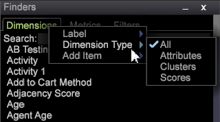

# Finders{#finders}

Use Finder panels in Data Workbench to select metrics, dimensions, and filters. These panels provide search support, sorting options, and drag and drop capabilities.

A Finder panel can be opened in the left sidebar or within a workspace.

<table id="table_3E43DBA0646842898F14F31374F9E39C"> 
 <thead> 
  <tr> 
   <th colname="col1" class="entry"> Dimensions Finder </th> 
   <th colname="col2" class="entry"> Metrics Finder </th> 
   <th colname="col3" class="entry"> Filters Finder </th> 
  </tr>
 </thead>
 <tbody> 
  <tr> 
   <td colname="col1"> 
A list of all dimensions in your query model. 
 </td> 
   <td colname="col2"> 
A list of all metrics in your query model. 
 </td> 
   <td colname="col3"> 
A list of all filters created for your organization. 
 </td> 
  </tr> 
 </tbody> 
</table>

**To open a Finder:**

* Right-click in a workspace and select **[!UICONTROL Tools]** > **[!UICONTROL Finder]**.

  The Finder pane with tabs for Metrics, Dimensions, and Filters will open in the workspace. 

* Right-click in the left sidebar and select **[!UICONTROL Add]** > **[!UICONTROL Finder]**.

  The Finder pane will open in the left panel.

The **Finder** includes the following features: 

<table id="table_072047E919204577AE85789BAE0F4EE8"> 
 <thead> 
  <tr> 
   <th colname="col1" class="entry"> Finder Features </th> 
   <th colname="col2" class="entry"> Details </th> 
  </tr>
 </thead>
 <tbody> 
  <tr> 
   <td colname="col1"><b>Drag and drop</b> </td> 
   <td colname="col2"> 
 You can drag and drop dimensions or metrics from the panel to a visualization in the workspace to change the dimension or add new metrics. 
 
    <ol id="ol_612DC76EC04C4FCE938B20B388C43CE8"> 
     <li id="li_7F73B781141E4B8CAE9800F580F62E44">Hold down the  &lt;Ctrl&gt; and  &lt;Alt&gt; keys and select the dimension or metric from the Finder panel. </li> 
     <li id="li_631D57976F71415AA61F33EBBFDD128A">Drag a new dimension from the pane and drop it to the visualization to change or add dimensions. </li> 
     <li id="li_5329FB82225F46EBBE3A996A641058DE">To add metrics, drag a new metric from the pane and drop it on the metric header of the selected visualization. </li> 
    </ol> 
This will work for all relevant visualizations, including tables, visitor cluster, correlation matrix, scatter plots, and the 2-D bar graph (depending on the axis). 
 </td> 
  </tr> 
  <tr> 
   <td colname="col1"><b>Search</b> </td> 
   <td colname="col2">A  Search box in the Finder panels lets you filter names for Dimensions, Metrics, and Filters. 
    <ul id="ul_0F6F377E9906472E99008EBE7483F689"> 
     <li id="li_75857895EDB045C8B2960393854B257D"> 
Pattern matching (simple glob search). Start typing the name of a required dimension, metric, or filter entity in the Search field and only matching strings contained anywhere in the name will be filtered and displayed in the Finders pane. 
 
For example, enter: 
 <code><b>Search:</b>click</code> 
You could get the following results in the Dimensions Finder: 
 
 
 
Standard pattern matching lets you use the wildcard characters, such as . (dot), "?" , and "*" (star). 
 </li> 
     <li id="li_044F9EC1399B44CD81E1852F85137704"> 
Regular expressions. More complex regular expressions are also supported for added search capability. Add the prefix "re:" before your search term (no spaces) to interpret as a regular expression. 
 
For example, enter: 
 <code><b>Search:</b>re.*ip</code> 
You could get the following results in the Dimensions Finder: 
 
 
 </li> 
    </ul> 
For in-depth search information, see <a href="http://marketing.adobe.com/resources/help/en_US/insight/dataset/c_reg_exp.html" format="http" scope="external"> regular expressions</a>. 
 </td> 
  </tr> 
  <tr> 
   <td colname="col1"><b>Dimension Type</b> </td> 
   <td colname="col2">In the Dimension tab, you can right-click on the tab heading to sort by the type of dimension. 
 
     <ul id="ul_D36B8474730F4859BC7AA015CC1B8EF0"> 
      <li id="li_4AE1D5699D0E45AF880A134F886B8B19">Attributes—Dimensions built based on characteristics of the visitor, products, geography, time, video, and other attributes. </li> 
      <li id="li_0B2A08F8CBE94356AC506F95DC268C47">Clusters—Dimensions built within the cluster builder. </li> 
      <li id="li_4BC3396A680B49A4B6BDAAD066826864">Scores—Dimensions built within the propensity scoring. </li> 
     </ul> 
 </td> 
  </tr> 
  <tr> 
   <td colname="col1"><b>Label</b> </td> 
   <td colname="col2">In each tab, you can right-click and select  Label to rename the Finder pane. 
 
 
The default Dimensions, Metrics, and Filters labels can be changed to a tab name that meets your organization's conventions. 
 </td> 
  </tr> 
  <tr> 
   <td colname="col1"><b>Add Item</b> </td> 
   <td colname="col2">In each tab, you can right-click and select  Add Item to open a table and manually add Dimensions, Metrics and Filters. </td> 
  </tr> 
  <tr> 
   <td colname="col1"><b>Finders bar</b> </td> 
   <td colname="col2">Right-click in the  Finders bar in the left sidebar to open a menu for additional features. 
 
 </td> 
  </tr> 
  <tr> 
   <td colname="col1"><b>Close</b> </td> 
   <td colname="col2">Right-click in the  Finders bar and select  Close to close a Finders pane. </td> 
  </tr> 
  <tr> 
   <td colname="col1"><b>Save</b> </td> 
   <td colname="col2">Save the list locally by right-clicking in the header bar and selecting the  Save option. </td> 
  </tr> 
  <tr> 
   <td colname="col1"><b>Export</b> </td> 
   <td colname="col2">You can export a list of selected dimensions, metrics, or filters from the Finder panel by right-clicking in the Finders bar and selecting  Export from the menu. 
 Add a name and export to Microsoft Excel. 
 </td> 
  </tr> 
  <tr> 
   <td colname="col1"><b>Copy</b> </td> 
   <td colname="col2"> Copy a list of Dimensions, Metrics, or Filters. You can copy as a file or as a graphic in Dark Background, Light Background, or Monochrome. </td> 
  </tr> 
  <tr> 
   <td colname="col1"><b>Minimize</b> </td> 
   <td colname="col2"> Minimize the Finder pane. Only the Finders bar will appear. </td> 
  </tr> 
  <tr> 
   <td colname="col1"><b>Borderless</b> </td> 
   <td colname="col2"> Displays a pane with no border lines for Finders in the workspace (but not in the left sidebar). </td> 
  </tr> 
 </tbody> 
</table>

