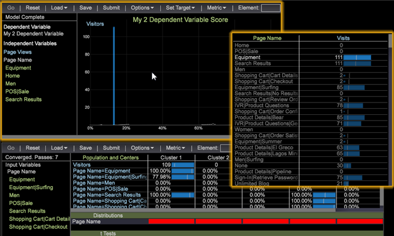

# Data Workbench 6.0.4 Release Notes{#data-workbench-release-notes}

New features introduced in Data Workbench 6.0.4, including bug fixes and known issues.

To view previous features and fixes based for each past release, see the [release note archives](https://marketing.adobe.com/resources/help/en_US/insight/insight_release_notes_prev.pdf).

## New Features {#section-1225066ea8f44cf68e42e019d0bca816}

Data Workbench 6.0.4 includes these new features and visualizations for added reporting capabilities and predictive analysis tools.

**Propensity Scoring visualization**. Data workbench calculates scores for each visitor as an estimated probability that a specified event may happen. The Visitor Scoring visualization allows you to create a score dimension that gives a probability of a specified event for every visitor of interest based on the input variables.



See [Propensity Scoring](../../../home/c-get-started/c-analysis-vis/c-visitor-propensity/c-visitor-propensity.md#concept-2958f4640dd44b9d86ad51c4f6165f40) for additional information about this feature.

## Upgrade Requirements {#section-08bd6fe3da8740fcb19688e8cac6f223}

**Log Source ID must be defined**. Starting in version 6.04, if the Log Source ID is not defined then you will get the following error:

```
Missing Log Souce ID in log processing.cfg. Log Source ID must be  
defined for all log sources.
```

The Recording of Rows per Log Source was added in Data Workbench 6.0 and can be defined in the custom profile Log Processing.cfg by adding a uniquely named Log Source ID. If you have a blank Log Source ID, then you could see Log Processing issues such as incomplete reading of the log source data and other discrepancies.

```
Log Processing.cfg 
Log Sources = vector: 2 items 
  0 = VisualSensor: 
    Compressed = bool: false 
    Log Paths = vector: 1 items 
      0 = Path: \some path\ 
    Log Server = serverInfo:  
      Address = string:  
      Name = string:  
      Port = int: 80 
      Proxy Address = string:  
      Proxy Password = string:  
      Proxy Port = int: 8080 
      Proxy User Name = string:  
      SSL Client Certificate = string: Certificates\\server_cert.pem 
      SSL Server Common Name = string:  
      Use SSL = bool: false 
     
<b>Log Source ID = string: <<i>Name your ID Here</i>></b> 
    Name = string:  
    Recursive = bool: false
```

**Ability to Delegate FSU Resources**

In [!DNL Profiles/<profilename>/dataset/Cluster.cfg], you can now specify separate File Server Units (FSU) for the Normalize and Source List servers. These services are no longer tied to the Master FSU.

>[!NOTE]
>
>If the List Server is not specified, then the List Server will inherit the Normalize Server's configuration settings.

Example in the [!DNL cluster.cfg] file.

```
Cluster = ClusterConfig: 
  Normalize Server = serverInfo: 
    Address = string: normalizeserver.domain.com 
    Port = int: 80 
    Use SSL = bool: false 
  List Server = serverInfo: 
    Address = string: sourcelistserver.domain.com 
    Port = int: 80 
    Use SSL = bool: false
```

## Fixed Bugs {#section-3b4b85a35f534288adf8a5246ef028cc}

* In Data Workbench 6.0, the Correlation Matrix and Cluster Builder did not support Compute in Background. This is now fixed in version 6.0.4. 
* Previously, if you had a selection on the Funnel and removed a step, an access violation could occur. This has been resolved. 
* Fixed a potential locking condition in Segment Export that may cause problems under heavy load conditions.

