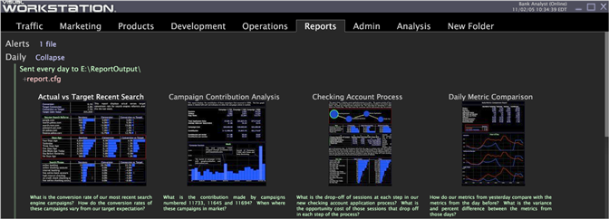

# Reviewing Report Status{#reviewing-report-status}

Information about your Report Server status and report set status.

* [Report Server Status](../../../home/c-rpt-oview/c-admin-rpt/c-rev-rpt-st.md#section-1a84f22439ee4a4ba2b3434e51e82ce0) 
* [Report Set Status](../../../home/c-rpt-oview/c-admin-rpt/c-rev-rpt-st.md#section-8569b94266b74a1f85d2a85106a2aaef)

## Report Server Status {#section-1a84f22439ee4a4ba2b3434e51e82ce0}

**Recommended Frequency:** Only when necessary

[!DNL Report] sends status information to the data workbench server every two minutes regarding the status of the [!DNL Report] Server. This information can be seen under the [!DNL Report Server Status] node in the [!DNL Detailed Status] interface.

**To open the [!DNL Detailed Status] visualization**

1. In data workbench, right-click in a workspace and click **[!UICONTROL Admin]** > **[!UICONTROL Servers]**. 

1. In the [!DNL Servers] interface, right-click the icon of the data workbench server that the [!DNL Report] machine connects to and click **[!UICONTROL Detailed Status.]** 

1. Click **[!UICONTROL Report Server Status]**.

If more than one [!DNL Report] is connected to the data workbench server, an entry appears for each [!DNL Report Server] in the Status vector. The two-minute interval can be overridden by specifying a value in the Status Interval (seconds) parameter in the [!DNL Reporting] node of the [!DNL ReportServer.cfg] file.

For information about the [!DNL ReportServer.cfg] file, see [Configure the Report Set](../../../home/c-rpt-oview/c-work-rpt-sets/t-create-rpt-set/t-config-rpt-set/t-config-rpt-set.md#task-cfb2fd0c28bc48c2acdd582fe0d670d0). For information about configuring [!DNL Report], see [Installing Report](../../../home/c-rpt-oview/c-inst-rpt/c-inst-rpt.md#concept-3b8696a5b7f04ebfaafec7ff55890d91).

For more information about [!DNL Detailed Status], see the Administrative Interfaces chapter of the *Data Workbench User Guide*.

## Report Set Status {#section-8569b94266b74a1f85d2a85106a2aaef}

**Recommended Frequency:** Only when necessary

[!DNL Report] transmits status information for each report set to the Data Workbench server. Basic information, such as when a report set is generated and where it is distributed, displays in data workbench above the report set in green text. While running reports, [!DNL Report] Server outputs a message every two minutes indicating the percentage complete of the current queries. This two-minute interval can be overridden by specifying a value in the Completion Message Interval (seconds) parameter in the [!DNL Reporting] node of the [!DNL ReportServer.cfg] file.

>[!NOTE]
>
>If an error occurred while running a report, the error is indicated in red text below the thumbnail of that report. You can right-click the workspace to display the full error message.

