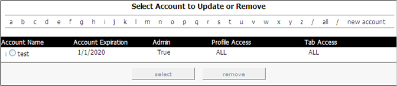

# Viewing Accounts{#viewing-accounts}

Information about viewing your accounts.

In the [!DNL Report Portal], click the **[!UICONTROL Admin]** tab. The [!DNL Admin] page appears listing all individual user and group accounts.

The following information displays for each account:

|  This field . . .  | Indicates . . .  |
|---|---|
|  Account Name  | The name of the individual user or group account. The letter that displays to the left of the user or group name indicates whether this is an individual (i) or group (g) account. Individual accounts enable users to reset their passwords, while groups do not. An administrator is the only person able to reset the password for a group account.  |
|  Account Expiration  |The date, in MM/DD/YYYY format, until which this user or group is allowed to use [!DNL Report Portal].  |
|  Admin  |Whether this user is allowed to create, update, and delete user accounts as well as edit notes associated with each report. A setting of [!DNL True] indicates that this is an admin account.  |
|  Profile Access  |The profiles that this user is allowed to access (for example, ProductSales). If the user is allowed to access all profiles associated with [!DNL Report Portal], “ALL” displays.  |
|  Tab Access  |The tabs that this user is allowed to access (for example, [!DNL Admin]). If the user is allowed to access all tabs in the [!DNL Report Portal], “ALL” displays.  |

