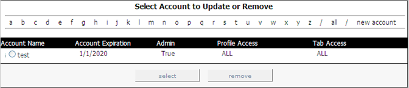
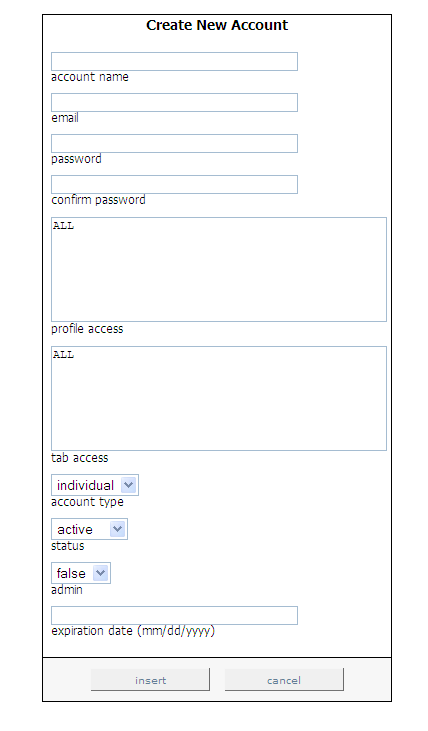

# Adding New Accounts{#adding-new-accounts}

Steps to add new accounts.

1. In the [!DNL Report Portal], click the **[!UICONTROL Admin]** tab. The [!DNL Admin] page appears.

   

1. On the right side of the page, click **[!UICONTROL new account]**. The [!DNL Create New Account] page appears.

   

1. Complete all of the fields on this page as indicated in the following table:

   |  In this field . . .  | Specify . . .  |
   |---|---|
   |  account name  |The name of the account that the user must provide when logging on to [!DNL Report Portal].  |
   |  email  | The email address of the user or group.  |
   |  password  |The password the user must provide when logging on to [!DNL Report Portal].  |
   |  confirm password  |The password the user must provide when logging on to [!DNL Report Portal].  |
   |  profile access  |The profiles that this user is allowed to access (for example, ProductSales). To allow access to multiple profiles, separate the names by commas. If the user is allowed to access all profiles associated with [!DNL Report Portal], type “ALL.”  |
   |  tab access  |The tabs that this user is allowed to access (for example, [!DNL Admin]). To allow access to multiple tabs, separate the names by commas. If the user is allowed to access all tabs in the [!DNL Report Portal], type “ALL.” This field, in conjunction with the account type field, is very useful for defining group access rights.  |
   |  account type  | Whether this account is for an individual or a group. Individual accounts enable users to reset their passwords, while groups do not. An administrator is the only person able to reset the password for a group account.  |
   |  status  | Whether this account is active or inactive. The default value is active. To deactivate a user account, select inactive.  |
   |  admin  | Whether to allow this user to create, update, and delete user accounts as well as edit notes associated with each report. The default setting is false. To make this an admin user, select true.  |
   |  expiration date  |The date, in MM/DD/YYYY format, until which this user is allowed to use [!DNL Report Portal].  |

1. Click **[!UICONTROL insert]**.
