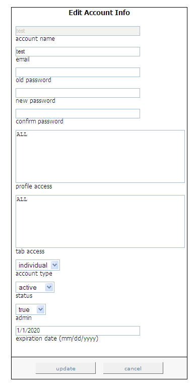

# Editing Existing Users{#editing-existing-users}

Steps to edit existing user accounts.

1. In the [!DNL Report Portal], click the **[!UICONTROL Admin]** tab. The [!DNL Admin] page appears.

   

1. Click the letter representing the first letter of the account name that you want to edit. For example, if you want to edit the account “Marketing,” you would click the letter “M.”

   A list of the account names starting with that letter displays. 

1. Select the account name that you want to edit, then click the **[!UICONTROL select]** button. The [!DNL Edit Account Info] page appears.

   

1. Change only the fields on this page that need to be updated. The following table provides descriptions of each of these fields:

   |  In this field . . .  | Specify . . .  |
   |---|---|
   |  email  | The email address of the user.  |
   |  old password  | The current password, which is needed to proceed when editing an admin account or when resetting the password for a non-admin account.  |
   |  new password  |The new password the user must provide when logging on to [!DNL Report Portal].  |
   |  confirm password  |The new password the user must provide when logging on to [!DNL Report Portal].  |
   |  profile access  |The profiles that this user is allowed to access (for example, ProductSales). To allow access to multiple profiles, separate the names by commas. If the user is allowed to access all profiles associated with [!DNL Report Portal], type “ALL.”  |
   |  tab access  |The tabs that this user is allowed to access (for example, [!DNL Admin]). To allow access to multiple tabs, separate the names by commas. If the user is allowed to access all tabs in the [!DNL Report Portal], type “ALL.” This field, in conjunction with the account type field, is very useful for defining group access rights.  |
   |  account type  | Whether this account is for an individual or a group. Individual accounts enable users to reset their passwords, while groups do not. An administrator is the only person able to reset the password for a group account.  |
   |  status  |Whether this account is active or inactive. The default value is active. To deactivate a user account, select **[!UICONTROL inactive]**.  |
   |  admin  | Whether to allow this user to create, update, and delete user accounts as well as edit notes associated with each report. The default setting is false. To make this an admin user, select true.  |
   |  expiration date  |The date, in MM/DD/YYYY format, until which this user is allowed to use [!DNL Report Portal].  |

1. Click **[!UICONTROL update]**.
