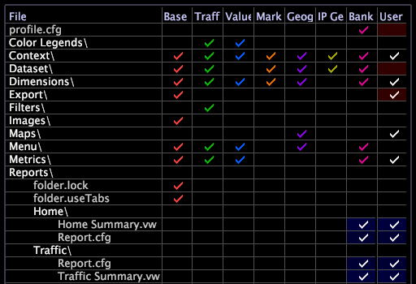

# Customize the Report Portal User Interface{#customize-the-report-portal-user-interface}

Report sets must be configured in a specific way to produce reports that display properly through Report Portal.

The user interface for [!DNL Report Portal] is designed to display a tab for each report set folder that appears in the output directory and is listed in the [!DNL profiles.xml] file, as well as the built-in [!DNL Admin] tab, which must be added to the [!DNL TopNavigation.xml] file to be displayed. For more information about displaying the built-in [!DNL Admin] tab, see [Linking an Output Folder to a Tab in the User...](../../../home/c-rpt-oview/c-install-rpt-port/c-rpt-port-user-inter.md#section-3f6bc47d37ed448e871f4f685f46acee).


* [Ensuring that Your Report Sets are Compatible with Report Portal...](../../../home/c-rpt-oview/c-install-rpt-port/c-rpt-port-user-inter.md#section-2b141e5d198a4bbea455699126c24706) 
* [Linking an Output Folder to a Tab in the User...](../../../home/c-rpt-oview/c-install-rpt-port/c-rpt-port-user-inter.md#section-3f6bc47d37ed448e871f4f685f46acee)

## Ensuring that Your Report Sets are Compatible with Report Portal {#section-2b141e5d198a4bbea455699126c24706}

A report set defines a scheduled job for [!DNL Report]. It consists of two items:

* A folder that defines the collection of workspaces that you want [!DNL Report] to generate as reports. 
* A configuration file ( [!DNL Report.cfg]).

Among other things, the [!DNL Report.cfg] file tells [!DNL Report] when to generate the reports and where to save the output files. Report sets reside in the Reports folder on the data workbench server. A profile can display any number of report sets.

To ensure compatibility with [!DNL Report Portal], your report sets must meet the following requirements:

* The output directory for your report sets must contain a configured [!DNL profiles.xml] file. 
* Each report set must include a top-level report named “*ReportSetName* Summary,” where *ReportSetName* matches the name of the report set. For example, the following [!DNL Profile Manager] shows two report sets, “Home” and “Traffic.” Note that each report set defines a summary report ( [!DNL Home Summary.vw] and [!DNL Traffic Summary.vw], respectively).



In [!DNL Report Portal], the summary report appears on the report set’s tab. The summary report can contain any workspace, window, or visualization you choose.

* The summary report must be the only report in the top-level folder for a report set. All other reports must be placed in subfolders. If you place other reports in the top-level folder, you can not view them through the portal.

## Linking an Output Folder to a Tab in the User Interface {#section-3f6bc47d37ed448e871f4f685f46acee}

To specify the tabs that you want [!DNL Report Portal] to display, you must configure a [!DNL TopNavigation.xml] file for each profile. This file determines which report sets appear as tabs in the user interface for a particular profile, as well as the order of those tabs. The [!DNL TopNavigation.xml] file resides in the \*PortalName*\PortalFiles\Core\TopNav\*profileName* folder.

**To edit the TopNavigation.xml file**

1. On the machine where IIS is running, open the [!DNL TopNavigation.xml] file in a text editor such as Notepad. 
1. Edit the list of `<TopNav>` elements so that it defines the names and order of the report sets whose output you want [!DNL Report Portal] to display, as in the following example: 

   ```
   <?xml version="1.0" encoding="UTF-8" standalone="no" ?>
   <TOPNAV_ELEMENTS>
   <TOPNAV>
       <NAME>Monthly Web</NAME>
     </TOPNAV>
     <TOPNAV>
       <NAME>Weekly Web</NAME>
     </TOPNAV>
   <TOPNAV> 
         <NAME>Admin</NAME> 
     </TOPNAV>
   </TOPNAV_ELEMENTS>
   
   ```

   >[!NOTE]
   >
   >The [!DNL Admin] tab is a built-in tab that provides additional functionality. If you do not include it in the [!DNL TopNavigation.xml] file, this tab does not display and its functionality is not available.

1. In the \*PortalName*\PortalFiles\Core\TopNav\ folder, create a folder for your next profile. 
1. Copy the [!DNL TopNavigation.xml] file from the first profile folder and paste it into the new folder. 
1. Edit the [!DNL TopNavigation.xml] as necessary, then save the file. 
1. Repeat Steps 3-5 for all other profiles available in your portal.

