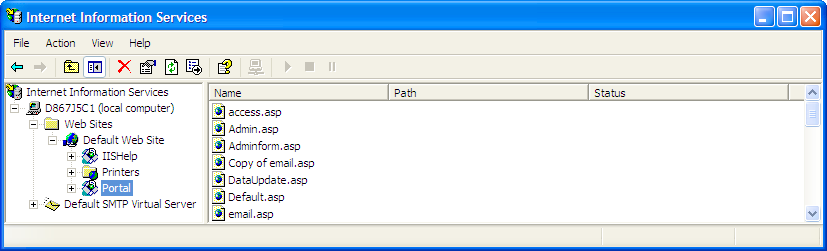

# Mapping Report Portal to a Virtual Directory (IIS 5.0){#mapping-report-portal-to-a-virtual-directory-iis}

Steps to map the Report Portal to a virtual directory (IIS 5.0).

1. On the machine where [!DNL Report Portal] is installed, start the IIS Manager using either **[!UICONTROL Start]** > **[!UICONTROL Control Panel]** > **[!UICONTROL Administrative Tools]** > **[!UICONTROL Internet Information Services]** or **[!UICONTROL Start]** > **[!UICONTROL Administrative Tools]** > **[!UICONTROL Internet Information Services]**. 

1. Select **[!UICONTROL Local Machine]** > **[!UICONTROL Web Sites]** > **[!UICONTROL Default Web Site]**. 

1. Right-click **[!UICONTROL Default Web Site]** and select **[!UICONTROL New]** > **[!UICONTROL Virtual Directory]**. 

1. When the [!DNL Virtual Directory Wizard] opens, click **[!UICONTROL Next]**. 

1. Complete the following steps to define the root virtual directory for [!DNL Report Portal]:

    1. When prompted for an alias, type the name of the [!DNL Report Portal], then click **[!UICONTROL Next]**. For example, if you want to use “Portal” as the name of your [!DNL Report Portal], assign the alias “Portal” to the virtual directory. Click **[!UICONTROL Next]** when finished. 
    
    1. When prompted for the physical path, browse for and select the *< **[!UICONTROL PortalName]**>* **[!UICONTROL \PortalASP]** directory, then click **[!UICONTROL Next]**.

       Example: [!DNL C:\Inetpub\wwwroot\Portal\PortalASP] 
    
    1. When prompted for permissions, verify that the following options are enabled:

        * **[!UICONTROL Read]** 
        * **[!UICONTROL Run scripts (such as ASP)]**

    1. Click **[!UICONTROL Next]**, then click **[!UICONTROL Finish]**. The virtual directory that you created appears under the Default Web Site as shown in the following example.

   

1. Right-click the virtual directory that you just created and select **[!UICONTROL New]** > **[!UICONTROL Virtual Directory]**. 

1. Use the [!DNL Virtual Directory] wizard to create an alias for each of the following physical directories. Doing this creates an appropriately named virtual directory for each of these physical resources.

<table id="table_B2E04423C20F40CAA8EDA3FCBA210AA2"> 
 <thead> 
  <tr> 
   <th colname="col1" class="entry"> Create this alias . . . </th> 
   <th colname="col2" class="entry"> For this physical resource . . . </th> 
  </tr>
 </thead>
 <tbody> 
  <tr> 
   <td colname="col1"> Core </td> 
   <td colname="col2"> 
\<i>PortalName</i>\PortalFiles\Core 
 
Example:  C:\Inetpub\wwwroot\Portal\PortalFiles\Core 
 </td> 
  </tr> 
  <tr> 
   <td colname="col1"> CSS </td> 
   <td colname="col2"> 
\<i>PortalName</i>\PortalFiles\CSS 
 
Example:  C:\Inetpub\wwwroot\Portal\PortalFiles\CSS 
 </td> 
  </tr> 
  <tr> 
   <td colname="col1"> HTC </td> 
   <td colname="col2"> 
\<i>PortalName</i>\PortalFiles\HTC 
 
Example:  C:\Inetpub\wwwroot\Portal\PortalFiles\HTC 
 </td> 
  </tr> 
  <tr> 
   <td colname="col1"> Images </td> 
   <td colname="col2"> 
\<i>PortalName</i>\PortalFiles\Images 
 
Example:  C:\Inetpub\wwwroot\Portal\PortalFiles\Images 
 </td> 
  </tr> 
  <tr> 
   <td colname="col1"> Output </td> 
   <td colname="col2"> 
Physical location of the directory in which  Report Server saves the output for your report sets. The output folder can be located anywhere, can be named anything, and contains a subfolder for each report set. 
 
This must be the same directory that you specify in the Output Root parameter in the  Report.cfg file for a report set. For more information, see <a href="../../../../home/c-rpt-oview/c-admin-rpt/c-config-rpt-files.md#concept-cf4b95344fcb4c8c877db91e5f1d345d"> Configuring Report.cfg Files</a>. 
 
The default location is \<i>PortalName</i>\PortalFiles\Output. 
 
Example:  C:\Inetpub\wwwroot\Portal\PortalFiles\Output 
 
The <i>PortalName</i>\PortalFiles\Output directory contains the  profiles.xml file, which must be moved to the output directory that you specify for this alias. 
 
It is critical that the  Path attribute is set properly. 
 </td> 
  </tr> 
 </tbody> 
</table>

1. When you are finished, verify that IIS displays six new virtual directories. Make sure that the directory structure has one parent folder (with the same name as your portal) and five subfolders as shown below.

   

1. When finished, go to [Edit the Session Configuration File](../../../../home/c-rpt-oview/c-install-rpt-port/t-edit-sess-config-file.md#task-cf11c3a780bd4936afd3f64a6b30afc7) to continue with the installation process.
