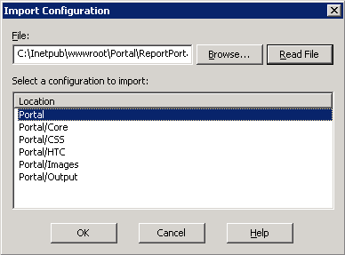
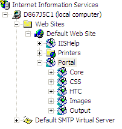
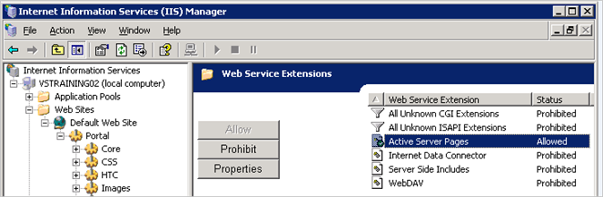

# Mapping Report Portal to a Virtual Directory (IIS 6.0){#mapping-report-portal-to-a-virtual-directory-iis}

Steps to map the Report Portal to a virtual directory (IIS 6.0).

 Mapping the [!DNL Report Portal] to a virtual directory on IIS 6.0 involves three separate tasks:

1. [Edit the configuration file](../../../../home/c-rpt-oview/c-install-rpt-port/c-virtual-dir/c-map-rpt-port-vdir-6.md#section-eaf1c58935074cfa840dac33e1286520) 
1. [Import the configuration file into IIS](../../../../home/c-rpt-oview/c-install-rpt-port/c-virtual-dir/c-map-rpt-port-vdir-6.md#section-9d61f6bfa93846dcb96973fec5573b19) 
1. [Enable Active Server Pages (ASPs) on IIS](../../../../home/c-rpt-oview/c-install-rpt-port/c-virtual-dir/c-map-rpt-port-vdir-6.md#section-a7725ec2afc64ffc854c5bd8c5c31802)

You must complete all three tasks.

## To Edit the Configuration File {#section-eaf1c58935074cfa840dac33e1286520}

1. On the machine where [!DNL Report Portal] is installed, open \*PortalName*\ReportPortalSetup.xml in a text editor such as Notepad. 

1. Use the editor’s find-and-replace feature to globally replace (Replace All) the string "VSVirtualPortalName" with the name of your portal. For example, if you want to use "VisualReportPortal" as the name of your [!DNL Report Portal], you would search for "VSVirtualPortalName" and replace it with "VisualReportPortal." 
1. Locate the following element in this file: 

   ```
   <IIsWebVirtualDir Location= "/LM/W3SVC/1/Root/PortalName/Output" AccessFlags="AccessRead | AccessScript” AppFriendlyName="Output" . . . >
   ```

1. Set this element’s [!DNL Path] attribute to the physical location of the directory in which [!DNL Report Server] saves the output for your report sets.

   The output folder can be located anywhere, can be named anything, and contains a subfolder for each report set.

   >[!NOTE]
   >
   >This must be the same directory that you specify in the Output Root parameter in the [!DNL Report.cfg] file for a report set. For more information, see [Configuring Report.cfg Files](../../../../home/c-rpt-oview/c-admin-rpt/c-config-rpt-files.md#concept-cf4b95344fcb4c8c877db91e5f1d345d).

   The following code sample shows how you would set the [!DNL Path] attribute if your reports were saved to [!DNL E:\VSReport\ReportOutput]:

   ```
   < . . . 
   AppIsolated="2" 
       AppRoot="/LM/W3SVC/1/Root/PortalName/OutputFolder" 
       DirBrowseFlags="DirBrowseShowDate | DirBrowseShowTime |...  
       Path="E:\VSReport\ReportOutput"
   ```

   >[!NOTE]
   >
   >It is critical that the [!DNL Path] attribute is set properly.

1. If you changed the default [!DNL Path] of the [!DNL Output] element, move the [!DNL profiles.xml] file from the *\PortalName*\PortalFiles\Output folder to the output directory that you specified in Step 4. In the example above, you would move [!DNL profiles.xml] to [!DNL E:\VSReport\ReportOutput]. 

1. Verify that the [!DNL Path] attributes for all of the other [!DNL IIsWebVirtualDir] elements are mapped to the correct location by searching for all instances of [!DNL C:\Inetpub\wwwroot] and replacing each with the correct path. 

1. Save the file. If you want to preserve the original file, you can save the configuration file using a new name.

## To Import the Configuration File into IIS {#section-9d61f6bfa93846dcb96973fec5573b19}

1. On the machine where [!DNL Report Portal] is installed, start the IIS Manager using **[!UICONTROL Start]** > **[!UICONTROL Administrative Tools]** > **[!UICONTROL Internet Information Systems (IIS) Manager]**. 

1. Select **[!UICONTROL (local computer)]** > **[!UICONTROL Web Sites]** > **[!UICONTROL Default Web Site]**. 

1. Right-click **[!UICONTROL Default Web Site]** and select **[!UICONTROL New]** > **[!UICONTROL Virtual Directory]** (from file). 

1. Select the **[!UICONTROL ReportPortalSetup.xml]** file and click **[!UICONTROL Read File]**. 

1. Verify that six virtual directories are listed for your [!DNL Report Portal] as shown in the following example.

   

   If you do not see six virtual directories or if you receive an error message, click **[!UICONTROL Cancel]** and examine the configuration file for errors. 

1. Select the first virtual directory in the list (the one that is the parent of the other five) and click **[!UICONTROL OK]**. IIS imports the mappings and add the virtual directories to the Default Web Site.

   Make sure that the resulting directory structure has one parent folder (with the same name as your portal) and five sub-directories as shown in the following example.

   

1. Click each virtual directory to ensure that IIS can locate the physical directory it represents. If IIS displays an error, right-click the virtual directory name and verify that the [!DNL Local Path] field points to the correct physical directory.

## To Enable Active Server Pages (ASPs) on IIS {#section-a7725ec2afc64ffc854c5bd8c5c31802}

To use [!DNL Report Portal], ASPs must be enabled on IIS. (By default, ASPs are disabled when IIS 6.0 is installed.) Use the following procedure to verify that ASPs are enabled on your IIS.

1. In the IIS Manager window, select **[!UICONTROL (local computer)]** > **[!UICONTROL Web Service Extensions]**. 
1. Verify that the [!DNL Active Server Pages] extension is set to [!DNL Allowed].

   

1. If their Status is Prohibited, select **[!UICONTROL Active Server Pages]** and click **[!UICONTROL Allow]**. 
1. Close IIS Manager.

