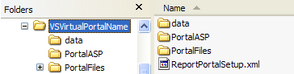

# Install the Report Portal Application Files{#install-the-report-portal-application-files}

Report Portal is made up of a set of application server pages (ASPs) and supporting files.

To install the [!DNL Report Portal], you must extract these files from the distribution file that you received from Adobe and install them on the machine where Microsoft IIS is running.

**To Install the [!DNL Report Portal] application files** 

1. If you have not already done so, download the installation package (.zip file) for the [!DNL Report Portal] from the Adobe FTP site.
1. On the machine where IIS is running, extract the files in the installation package to any location. This step installs the following subfolders and files in the VSVirtualPortalName folder.

   |  Folder or File  | Description  |
   |---|---|
   |  [!DNL \data\users.mdb]  |Database containing the list of authorized [!DNL Report Portal] users.  |
   |  [!DNL \PortalASP\]  |Folder containing the ASP files that make up [!DNL Report Portal].  |
   |  [!DNL \PortalFiles\]  |Folder containing five subfolders (Core, CSS, HTC, Images, and Output) that contain supporting files used by [!DNL Report Portal].  |
   |  [!DNL ReportPortalSetup.xml]  |Configuration file you use to define the virtual directories associated with [!DNL Report Portal] (used with IIS 6.0 only).  |

   The directory looks like the following example:

   

   >[!NOTE]
   >
   >The name of the directory may differ from the name shown in the example.

1. Rename the VSVirtualPortalName (or other name) folder to what you want to use as the root virtual directory of your [!DNL Report Portal] (hereafter referred to as *PortalName*). For more information about virtual directories, see the next section.
