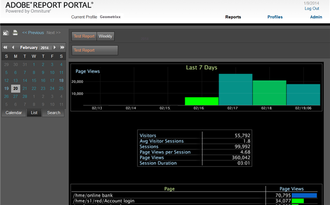

# Opening the Report Portal{#opening-the-report-portal}

Steps to open the Report Portal.

If you have more than one profile available, you can select the appropriate profile from the drop-down box. If you have only one profile, you will not see a drop-down box. If you have only one profile and authentication is disabled, you are sent directly to the [!DNL Report Portal] home page. 

1. From your web browser, open the [!DNL Report Portal] using the following URI format:

   http://*ServerAddress*/*PortalName* 
   Example: [!DNL http://dataworkbench/ReportPortal]
1. If you have more than one profile available, select a profile from the **[!UICONTROL Profile]** drop-down menu.
1. If [!DNL Report Portal] prompts you for log-in credentials, enter an account name and password, then click **[!UICONTROL login]**. The [!DNL Report Portal] will open.

   

<table id="table_E68190C670684FA798B41702FC911827"> 
 <tbody> 
  <tr> 
   <td colname="col1"> Report buttons </td> 
   <td colname="col2"> 
Select reports by clicking a button above the visualization pane. 
 </td> 
  </tr> 
  <tr> 
   <td colname="col1"> Calendar </td> 
   <td colname="col2"> 
Click the  Calendar  button in the left pane, then click a to view the reports for the selected day. 
 </td> 
  </tr> 
  <tr> 
   <td colname="col1"> List </td> 
   <td colname="col2"> 
Click the  List  button in the left pane to view dates listed by date. 
 </td> 
  </tr> 
  <tr> 
   <td colname="col1"> Search </td> 
   <td colname="col2"> To find specific reports, click the  Search  button to open the <a href="../../../home/c-rpt-oview/c-search-adv.md#concept-083b751e28b645ceaa4d9784d21f78ca"> Advanced Search </a> feature. </td> 
  </tr> 
 </tbody> 
</table>
