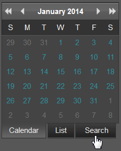
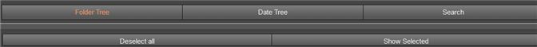

# Advanced Search in the Report Portal{#advanced-search-in-the-report-portal}

The Report Portal provides a search feature to find reports based on a tree view of folders, tree view of report dates, and an ad hoc search.

1. Click the **[!UICONTROL Search]** tab in the left pane of the Report Portal.

   

   A new web page will open displaying the **[!UICONTROL Search]** page with the **[!UICONTROL Folder Tree]** option as the default view.

   

1. Select other view options from the buttons displayed at the top of the page.

<table id="table_02610040A3284C07B62A6E70C0421573"> 
 <thead> 
  <tr> 
   <th colname="col1" class="entry"> Search button </th> 
   <th colname="col2" class="entry"> Description </th> 
  </tr> 
 </thead>
 <tbody> 
  <tr> 
   <td colname="col1"> 
Folder tree 
 </td> 
   <td colname="col2"> 
Select reports based on the custom hierarchy of report folders. These folders are defined and organized as a <a href="../../home/c-rpt-oview/c-work-rpt-sets/c-work-rpt-sets.md#concept-a5f078668e1245e684cb2a778c8803d5"> report set</a>. 
 </td> 
  </tr> 
  <tr> 
   <td colname="col1"> 
Date tree 
 </td> 
   <td colname="col2"> 
Select folders based on a hierarchy of dates defined by Report Server. The reports are organized based on the date (year/month/day) they were run. 
 </td> 
  </tr> 
  <tr> 
   <td colname="col1"> 
Search 
 </td> 
   <td colname="col2"> 
Perform ad hoc searches across all of your reports. If you know the complete name of the report, you can enter it directly into the search box. 
 
In addition: 
 
    <ul id="ul_EAE30AAA865942078D0C6C0AE527C07C"> 
     <li id="li_F5213977442F4B89A62CA6BC315F95BE">Type a &lt;space&gt; key to see a drop-down list of beginning characters or names for all existing reports. </li> 
     <li id="li_C28799438777471290B424CAFFCAF810">Enter the first name of the report and type a &lt;space&gt; key to see a drop-down list allowing you to auto-fill the name for an existing report. </li> 
    </ul> </td> 
  </tr> 
  <tr> 
   <td colname="col1"> 
Deselect all 
 </td> 
   <td colname="col2"> Click to clear all selected reports. </td> 
  </tr> 
  <tr> 
   <td colname="col1"> 
Show selected 
 </td> 
   <td colname="col2">Click to display any reports selected in the Folder tree or Date tree views. The Report Portal will open in a new window and display each report as .png file. If multiple reports are selected, then each individual report can be selected from a tab at the top of the page. 
Click the  Print button on this page to print the selected report or click  Download to store locally. 
 </td> 
  </tr> 
 </tbody> 
</table>
