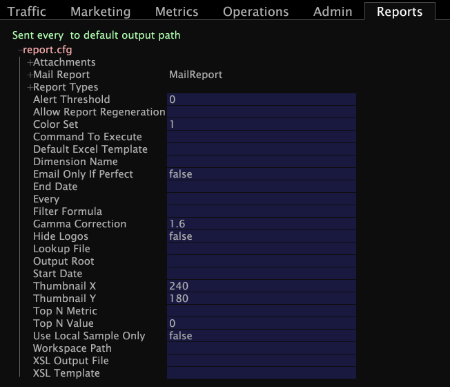

# Configure the Report Set{#configure-the-report-set}

After you have created and saved the workspaces within your report set folder, you must create a new Report.cfg file.

You must specify in the [!DNL Report.cfg] file for the report set when and how the reports are to be generated and distributed.

**To create a new Report.cfg** 

1. In data workbench, open the [!DNL Profile Manager] by right-clicking within a workspace and clicking **[!UICONTROL Admin]** > **[!UICONTROL Profile]** > **[!UICONTROL Profile Manager]**.
1. Click **[!UICONTROL Reports]** to open the [!DNL Reports] folder.
1. Click the folder for your report set.
1. In the [!DNL User] column for your report set folder, right-click and select **[!UICONTROL Create]** > **[!UICONTROL Report]**. A new [!DNL Report.cfg] file appears in the [!DNL File]column.
1. In the [!DNL User] column for the new [!DNL Report.cfg] file, right-click the check mark for the [!DNL Report.cfg] file, then click **[!UICONTROL Open]** > **[!UICONTROL from the workbench]**.

   

1. Edit the configuration parameters as desired. For information about these parameters, see [Report.cfg Parameters](../../../../../home/c-rpt-oview/c-rpt-param-ref/c-rpt-param.md#concept-838e59d72d3f4cb29ee15f5c7eb0ceff).

   >[!NOTE]
   >
   >The sample [!DNL Report.cfg] shown in this example contains only the parameters included in the [!DNL Report.cfg] file by default. If you need to add additional parameters to a [!DNL Report.cfg] file, you must do so using a text editor. For steps to do so, see [Editing Existing Report.cfg Files](../../../../../home/c-rpt-oview/c-work-rpt-sets/c-edit-ex-rpt-files/c-edit-ex-rpt-files.md#concept-96fd57159f454defa09bd18655a12887).

1. Save the file by right-clicking **[!UICONTROL Report.cfg (modified)]** at the top of the file and clicking **[!UICONTROL Save as Reports\]***< **[!UICONTROL ReportSetName]**>* **[!UICONTROL \Report.cfg]**.
1. Close the file.
1. In the [!DNL Profile Manager], right-click the check mark in the [!DNL User] column for the new [!DNL Report.cfg] file and select **[!UICONTROL Save to]***< **[!UICONTROL profile name]**>*.
