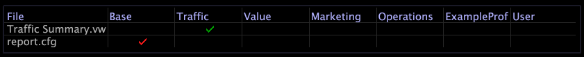

# Create a New Folder for the Report Set{#create-a-new-folder-for-the-report-set}

Steps to create a new report set folder.

1. In data workbench, open the [!DNL Profile Manager] by right-clicking within a workspace and clicking **[!UICONTROL Admin]** > **[!UICONTROL Profile]** > **[!UICONTROL Profile Manager]**.
1. Click **[!UICONTROL Reports]** to open the [!DNL Reports] folder.

   

1. In the [!DNL User] column for the folder in which you want to create the new report set, right-click and select **[!UICONTROL Create]** > **[!UICONTROL Folder]**. A folder named New Folder appears in the [!DNL File] column for [!DNL Reports].
1. Right-click in the **[!UICONTROL User]** column for the new folder, click in the **[!UICONTROL Dir]** parameter, then type the new name of the folder.
