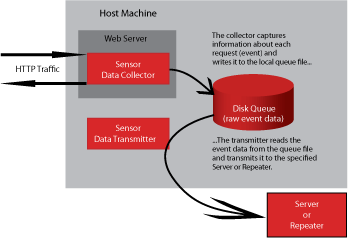

# What are Basic Components{#what-are-basic-components}

Sensor consists of three main components: Data Collector, Disk Queue, and Data Transmitter.

  

## Data Collector {#section-f970eaff30364a3c8106d5ec9c1b5caa}

The data collector (collector) is an NSAPI, ISAPI, J2EE filter servlet, or Apache module that executes within the web server process.

It captures the raw event data about each HTTP request that the web server processes and deposits that information into the disk queue. If you run multiple instances of a web server on the same machine, each instance loads its own instance of the collector module; however, all instances of the collector write their event data to the same disk queue.

## Disk Queue {#section-41aac77ab30e48478d1b31eac288df05}

The disk queue (queue) is a fault-tolerant, FIFO (first in, first out) memory-mapped queue file that buffers the raw event data that Sensor collects, providing temporary storage for collected event data on the web server where it is installed.

To prevent the queue from expanding without constraint (and thereby consuming all available disk space), the queue is maintained in a fixed-size file, meaning that it holds only as much event data as it has been given capacity to hold. The size of the queue file is configured in the QueueSize parameter of the Sensor configuration file, txlogd.conf, when the Sensor is installed. For information about the txlogd.conf parameters, see Sensor Txlogd.conf File Parameters.

Once established, the physical length of the file does not grow or shrink. The collector simply deposits new event data into the queue and the transmitter pulls events from it. If the collector reaches the end of the file, it stops writing to the queue file.

Generally, the transmitter pulls events from the queue as quickly as the collector deposits them. However, if the connection between the transmitter and Insight Server is slow or unavailable, the queue can fill with untransmitted events. In this event, the collector stops collecting data until the transmitter draws down the queue. Information about requests that the web server processes during this time is permanently lost.

**Determining the Queue Size**

Before you install Sensor, you must determine how large the queue needs to be. To prevent permanent data loss, it is important to create a queue that is large enough to accommodate the number of events that could accumulate during longest likely outage of the connection to the Insight Server (that is, sufficient storage for several days of peak activity). The queue must be configured to hold enough event data so that system administrators have time to restore network accessibility to the target Insight Server, or repair or replace the Insight Server without losing any data. If the Sensor has failed and a valid and accessible queue file is not available to hold the event data, subsequent data is lost.

>[!NOTE]
>
>It is important that the administrators of each machine on which Sensor runs understand the unique nature of the local queue file to ensure that they do not treat it as an ordinary log file that can be deleted, archived, or compressed.

Adobe recommends that the queue be configured to hold at least ten (10) peak days of event data that is produced by the server where the Sensor is installed. That is, take the amount of event data from any peak day in the last year and multiply it by ten.

This recommendation assumes the following:

* Your company’s Information Technology team is monitoring each Sensor in the manner detailed in Administering Sensor, of this guide and is doing so at least once per day. If this is not the case, this period should be extended appropriately. 
* Your company’s Information Technology team is able to restore network accessibility or replace or repair any installed Insight Servers within 72 hours. If this is not the case, this period should be extended appropriately. 
* The configuration of Sensor remains the same. 
* No external events (for example, a large marketing campaign) will cause the amount of event data being generated by the web servers to increase significantly.

Your choice of queue size depends largely upon the desired level of system monitoring in light of your company’s practices and policies regarding response times and weekend/holiday system administration. As larger queue sizes are better, Adobe recommends that your company make the queue as large as possible.

>[!NOTE]
>
>Larger queue file sizes have no impact on performance.

For further recommendations about sizing the queue, contact Adobe Consulting Services.

## Data Transmitter {#section-2dc03d37d73b4cc6bdd5af6b346350d4}

The transmitter is an independent process (for example, a daemon on a UNIX-based computer or a service on a Windows computer) that executes on the same machine as the web server.

The transmitter reads the event data from the disk queue, compresses it, and sends it via HTTP/S to the Insight Server that you have specified, where it is processed and stored in **.vsl** files. 
