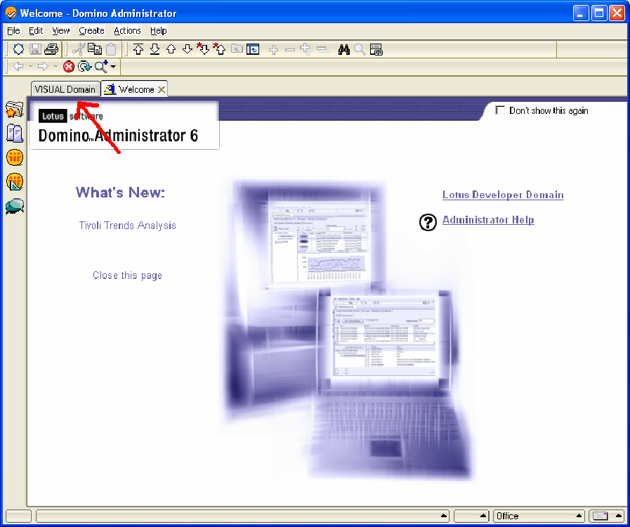
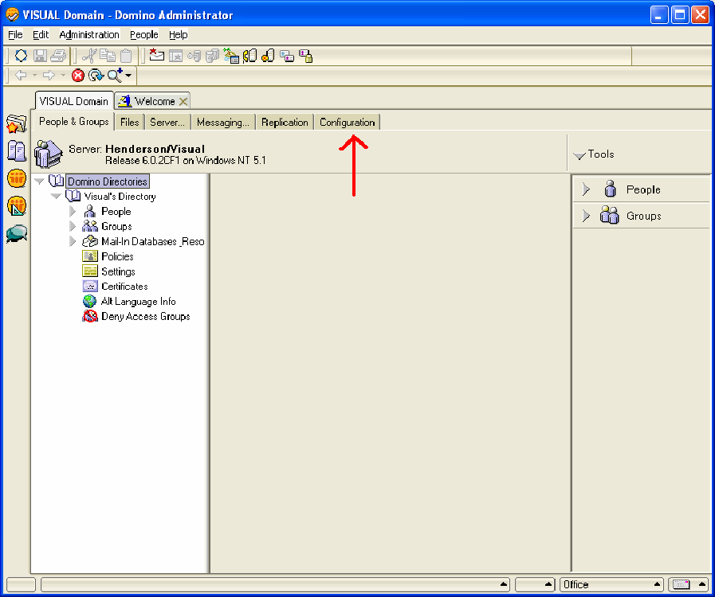
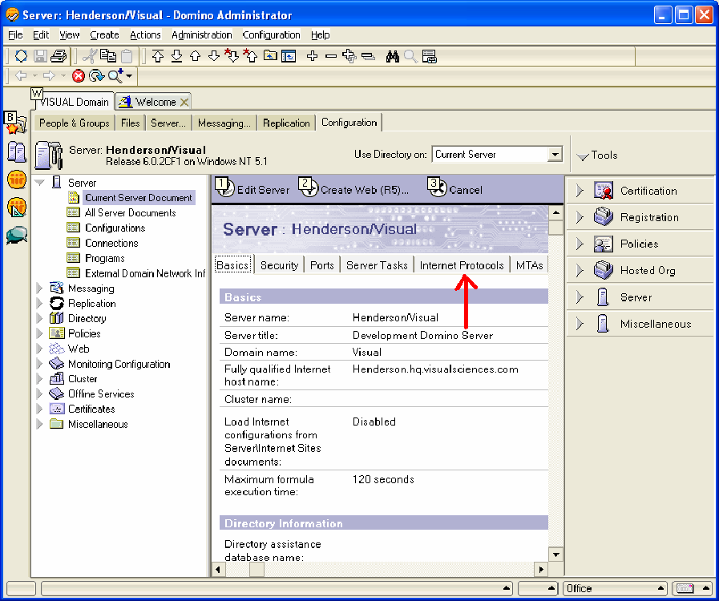
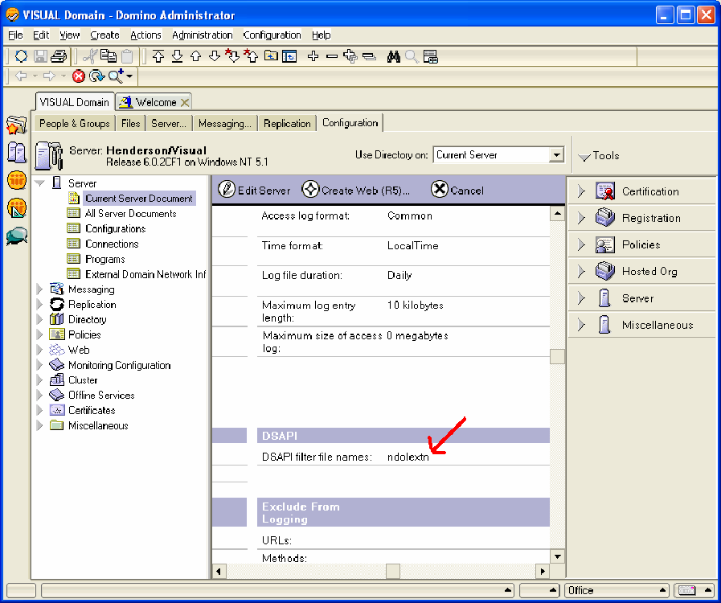
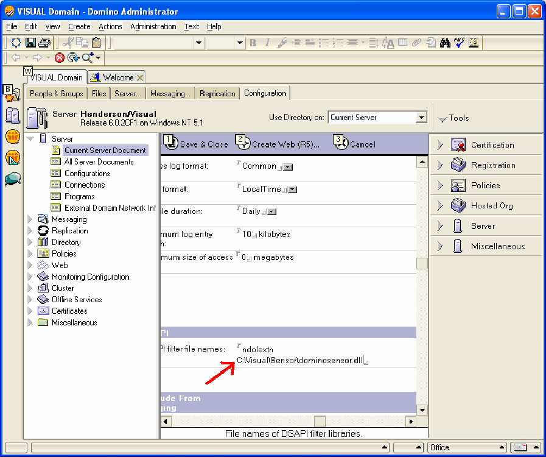
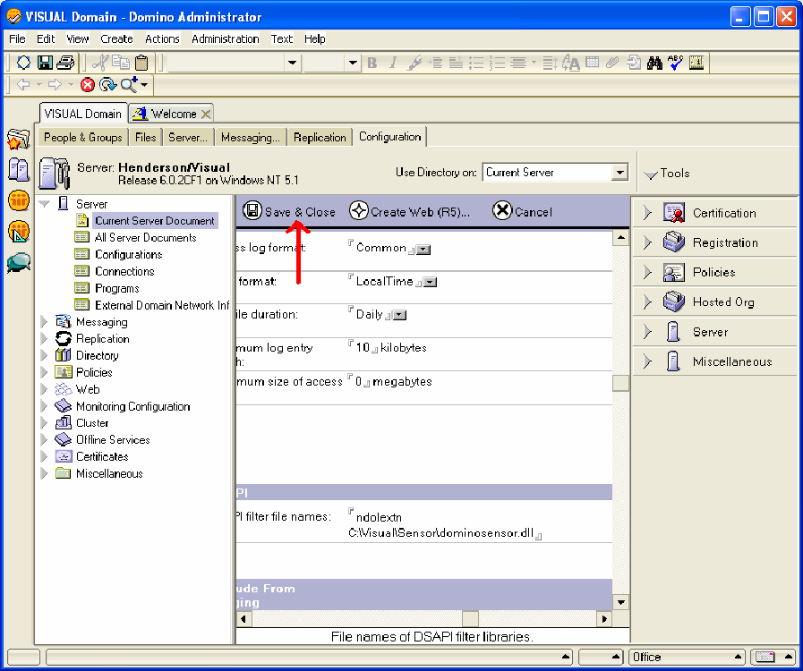

# Lotus Domino Server on Windows Server 2000 or Later{#lotus-domino-server-on-windows-server-or-later}

Instructions about how to install and configure Sensor for Lotus Domino Server 6 for Windows 3.1 or later running under Microsoft Windows Server 2000 or later.

The program files for Sensor are packaged in an installation file that you obtain from the Adobe download site. If you do not already have the Sensor installation file for your particular web server, download it (or obtain it from your Adobe representative) before you begin the following procedures.

To install and configure Sensor, you must perform the following steps:

## Install the Program Files {#section-2f3e85083b4f4aa989a85997330e86ae}

1. On your Lotus Domino machine, create a directory to install the Sensor program files. Keep in mind that your disk queue also resides in this directory, so be sure the device you choose has sufficient space to hold a queue of the size you need.

   ```
   C:\VisualSensor
   ```

1. Extract the contents of the installation file into the Lotus Domino directory. During this step, Sensor installs the following files: 

<table id="table_ABFF5F92271B4F3CB0AC68DAB6A5709F"> 
 <thead> 
  <tr> 
   <th colname="col1" class="entry"> File </th> 
   <th colname="col2" class="entry"> Description </th> 
  </tr> 
 </thead>
 <tbody> 
  <tr> 
   <td colname="col1"> EventMessages.dll </td> 
   <td colname="col2"> Event Viewer messages </td> 
  </tr> 
  <tr> 
   <td colname="col1"> stchatlog.dll </td> 
   <td colname="col2"> The collector module </td> 
  </tr> 
  <tr> 
   <td colname="col1"> <p>TestExperiment.xls </p> </td> 
   <td colname="col2"> <p>An Excel spreadsheet file that architects can use to configure a controlled experiment </p> <p>Sensor does not use this file. </p> </td> 
  </tr> 
  <tr> 
   <td colname="col1"> trust_ca_cert.pem </td> 
   <td colname="col2"> The certificate used to validate the digital certificate that Insight Server presents during the connection process </td> 
  </tr> 
  <tr> 
   <td colname="col1"> TXLog.exe </td> 
   <td colname="col2"> The transmitter program </td> 
  </tr> 
  <tr> 
   <td colname="col1"> <p>txlogd.conf </p> </td> 
   <td colname="col2"> The Sensor configuration file </td> 
  </tr> 
 </tbody> 
</table>

>[!NOTE]
>
>The installation package contains a spreadsheet file called TestExperiment.xls. This spreadsheet is a tool that architects use to configure a controlled experiment. Sensor itself does not use this file, so it is not necessary to install the file on the machine where Sensor is running (although you can choose to do so). You might want to, instead, copy the file to a location where your architects can access it or simply extract the file from the installation package as needed. For more information about controlled experimentation, see the Insight Controlled Experiments Guide.

## Configure the Lotus Domino Server {#section-2e2f1875a5304cdfa2cbcd0680683cfd}

Steps to configure the Lotus Domino Server.

1. Log in to the Lotus Domino Administrator and click **[!UICONTROL Domain]**.

   

1. In the Lotus Domino Administrator, click **[!UICONTROL Configuration]**.

   

1. Expand the Server node and click **[!UICONTROL Current Server Document]**.

   

1. Click **[!UICONTROL Current Server Document]**, then click **[!UICONTROL Internet Protocols]**.

   

1. On the HTTP tab, under the DSAPI section, double-click after the word [!DNL ndolextn].

   

1. Press **[!UICONTROL Enter]** and type in the path to the [!DNL dominosensor.dll] file.

   

1. Click **[!UICONTROL Save & Close]**. 

   

## Edit the Sensor Configuration File {#section-de0eb4a646394b61abb6cd5a2b706de0}

The txlogd.conf file contains the configuration parameters for Sensor.

You must edit this file to specify, among other things, the size and location of the disk queue file, the address of the Insight Server, and the ID that will be attached to the event data produced by this sensor.

The configuration file contains required parameters and optional parameters.

* **Required parameters** are settings that you must specify when you install Sensor. Without these settings, Sensor does not run successfully. 
* **Optional parameters** are settings that default to pre-defined values (which you can modify) or enable optional features.

**To edit the Sensor configuration file**

* Open the `<Sensor directory>/txlogd.conf` file in a text editor and set the required parameters as well as any desired optional parameters. 
* Save and close the file.

## Start the Transmitter and Create the Disk Queue {#section-55630de65f264274aefd771da2002852}

After you configure the txlogd.conf file, you can start the transmitter program, register it as a Windows service, and create the disk queue.

1. From the Start menu in Windows, select **Accessories** > **Command Prompt**. 

1. In the command prompt window, navigate to the directory in which you installed Sensor and execute the following command:

   ```
   txlog /regserver
   ```

   This command starts the transmitter, creates the disk queue, and registers Sensor as a Windows service. 

1. To confirm that the transmitter is running correctly, click **Start > Control Panel > Administrative Tools > Services**. 

   >[!NOTE]
   >
   >This command sequence might vary depending on which version of Windows you are using.

    1. In the service list, locate the entry for Sensor and confirm that its status is Started and its startup type is Automatic. 
    1. Close the Services control panel.

1. To check whether transmitter experienced any errors during start-up, click Start > Control Panel > Administrative Tools > Event Viewer to open the Event Viewer. 

   >[!NOTE]
   >
   >This command sequence might vary depending on which version of Windows you are using.

    1. In the left pane of the Event Viewer window, select the Applications log. 
    1. In the right pane, look for events with “Adobe” in the Source column. 
    1. If you find an error from “Adobe,” double-click the error to display the Event Properties window. This window provides detailed information about the error.

1. When you finish examining the Applications log, close the Event Viewer. 
1. Verify that the transmitter has created the disk queue ( [!DNL Diskq2000.log]) in the directory where you installed the Sensor program files and that it is the size that you specified in the [!DNL QueueSize] parameter in the [!DNL txlogd.conf] file.

   If the queue has not been created correctly:

    1. Examine the txtlogd.conf file and verify that the QueueSize parameter is set correctly. 
    1. Check that the device on which you installed Sensor has sufficient space available to hold a file of the size specified in the QueueSize parameter. 
    1. Using the Services control panel in Windows, stop the transmitter. 
    1. Delete the queue file. 
    1. Re-register Sensor as a Windows service: from the Start menu in Windows, select Accessories > Command Prompt. In the command prompt window, navigate to the directory in which you installed Sensor and execute the following command:

       ```    
       txlog /regserver
       ```

       The transmitter is designed to run continuously. If you restart the machine, the transmitter restarts automatically. If you need to start and stop the transmitter manually, you can do so using the Services control panel in Windows.
