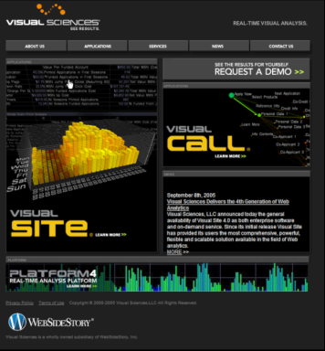

# Validating the Experiment{#validating-the-experiment}

After you have deployed your experiment, you should validate that the experiment is working properly.

As discussed in [Modifying the ExpCookieURL Paramter (Optional)](../../home/c-undst-ctrld-exp/t-en-ctrld-exp/c-mod-expckurl-prm.md#concept-215bf86bab4e4ec0b0cc803ec48a8fcf), the page specified in the ExpCookieURL parameter in the [!DNL Sensor] configuration file can be used to place yourself in a specific experiment group.

The default virtual page is [!DNL /setcookie.htm], but you must use the value that you set in the ExpCookieURL parameter.

## Requesting the Test Page {#section-8aed3b48d47f4e6c8869c0216f8781b1}

To test a specific experiment group for your website, your browser must be configured to accept cookies and you must not already have a cookie for this website.

Each time you want to test a new group, make sure to clear your cookies for the website.

To place yourself into a specific group within a specific experiment, request the test page with a query string in the following form:

[!DNL http://] *< [!DNL sitename/?Experiment Name=Group Name]>*

For example:

[!DNL http://www.omniture.com/setcookie.htm?New_Homepage=index2]

When the virtual URL request is sent to the server, [!DNL Sensor] identifies you as a member of the specified group within the specified experiment and then redirects you to the root of the website. You now can navigate to the appropriate location on the website to validate whether the correct content displays for that experiment and group.

If you were to type the following into your browser, the browser would display the home page of the website and place you into the index2 group within the New_Homepage experiment:

[!DNL http://www.omniture.com/setcookie.htm?New_Homepage=index2]

When visitors in the index2 group request the home page, the “Request a Demo” graphical link displays higher on the page, as in the following graphic:

