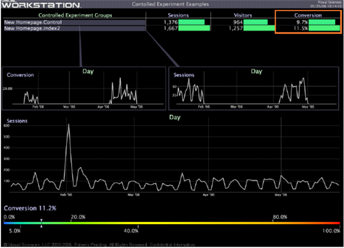
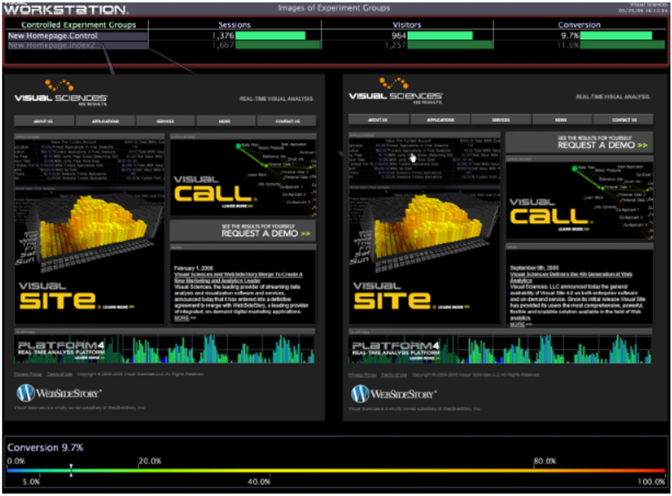

# Evaluating the Experiment{#evaluating-the-experiment}

After running the experiment until the required minimum number of visitors have participated in the experiment, you can be assured of sufficient statistical confidence to evaluate the results of your experiment.

Using [!DNL Insight], compare whichever metrics or key performance indicators were defined as part of the hypothesis to determine whether the experiment was a success (that is, the hypothesis was validated with the specified confidence.)

In our example experiment, our hypothesis is proven correct if the Visitor Conversion increases by at least 1.5%, which is the success criterion we defined earlier.

The following workspace example shows that the Conversion for the index2 test group was actually 1.8% higher than for the control group, proving our hypothesis.

* [Summarizing the Experiment Results](../../../home/c-undst-ctrld-exp/c-vw-rslts/c-ev-exp.md#section-24a496c080a04e929764094acb00bab7) 
* [Taking Action Based on the Results](../../../home/c-undst-ctrld-exp/c-vw-rslts/c-ev-exp.md#section-1623e26ced524fd9beab48ac1f9165d9) 
* [Monitoring Your Actions](../../../home/c-undst-ctrld-exp/c-vw-rslts/c-ev-exp.md#section-1954311950c34637800cbd7c0711983f)

## Summarizing the Experiment Results {#section-24a496c080a04e929764094acb00bab7}

Using [!DNL Insight], you can create detailed reports to summarize and illustrate the results of your experiment.

You then can use your reports, as shown in the following example, to make recommendations based on the results, which are backed up by the visual information you have provided in your reports:

## Taking Action Based on the Results {#section-1623e26ced524fd9beab48ac1f9165d9}

After the results are clear, you are ready to act on those results by making production-level changes to the tested pages, applying these same changes to other areas of your website, and making sure to completely document the test, its results, and the changes that you have made.

## Monitoring Your Actions {#section-1954311950c34637800cbd7c0711983f}

After the controlled experiment is complete and you have implemented the appropriate changes, make sure to continue to monitor the changes that you made by, for example, viewing validation metrics, creating control charts, and providing dashboard metrics.

Always be prepared to re-test your hypothesis if you think the changes that you tested and made are not bearing out the original results.
