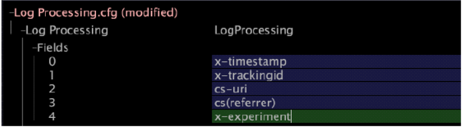

# Modifying Log Processing.cfg{#modifying-log-processing-cfg}

You must add the x-experiment field to the Log Processing.cfg file, which is used to create an extended dimension.

 See [Modifying Transformation.cfg](../../../home/c-undst-ctrld-exp/c-vw-rslts/t-mod-trfmtn.md#task-d61b02853a82492c9a76e3c5fe8a3fb6).

**To modify Log Processing.cfg** 

1. In [!DNL Insight], open the [!DNL Profile Manager] by right-clicking within a workspace and clicking **[!UICONTROL Admin]** > **[!UICONTROL Profile Manager]**, or by opening the Profile Management workspace on the [!DNL Admin] tab.
1. In the [!DNL Profile Manager], click **[!UICONTROL Dataset]** to show its contents.
1. Right-click the check mark next to [!DNL Log Processing.cfg] and click **[!UICONTROL Make Local]**. A check mark for this file appears in the [!DNL User] column.
1. Right-click the newly created check mark and click **[!UICONTROL Open]** > **[!UICONTROL in Insight]**. The [!DNL Log Processing.cfg] window appears.
1. Click **[!UICONTROL Fields]** to show its contents.
1. Right-click the last field in the current list and click **[!UICONTROL Add new]** > **[!UICONTROL Field]**.
1. Type x-experiment in the newly created field, as shown in the following example:

   

1. Right-click **[!UICONTROL (modified)]** at the top of the window and click **[!UICONTROL Save]**.
1. In the [!DNL Profile Manager], right-click the check mark for [!DNL Log Processing.cfg] in the [!DNL User] column, then click **[!UICONTROL Save to]** > *< **[!UICONTROL profile name]**>* to save the locally made changes to the working profile.

   >[!NOTE]
   >
   >The dataset begins reprocessing immediately.

   For more information about Log Processing and Fields see the *Dataset Configuration Guide*.
