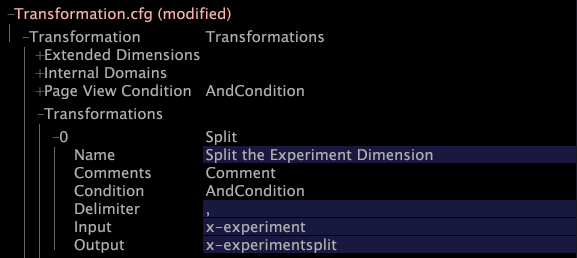
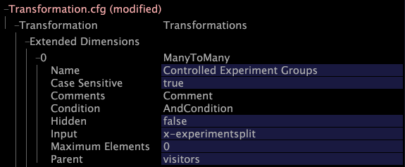

# Modifying Transformation.cfg{#modifying-transformation-cfg}

Now that the x-experiment field is available, you must create an extended dimension to include the x-experiment field in your dataset, which allows you to view your results in Insight.

To do so, you must add a new dimension to the [!DNL Transformation.cfg] file.

If you plan to run multiple experiments, you also must add a new Split transformation to the [!DNL Transformation.cfg] file. This Split transformation separates the different experiment and group names so that the information is easier to interpret. To avoid reprocessing your data again if you were to need to add additional experiments at a later date, Adobe recommends that you add the Split transformation even if you are not currently planning to run multiple experiments.

The following procedure includes the creation of both the new Split transformation and the extended dimension. If you do not want to add the Split transformation, simply skip steps 5-7.

**To modify Transformation.cfg** 

1. In [!DNL Insight], open the [!DNL Profile Manager] by right-clicking within a workspace and clicking **[!UICONTROL Admin]** > **[!UICONTROL Profile Manager]**, or by opening the Profile Management workspace on the [!DNL Admin] tab.
1. In the [!DNL Profile Manager], click **[!UICONTROL Dataset]** to show its contents.
1. Right-click the check mark next to [!DNL Transformation.cfg] and click **[!UICONTROL Make Local]**. A check mark for this file appears in the [!DNL User] column.
1. Right-click the newly created check mark and click **[!UICONTROL Open]** > **[!UICONTROL in Insight]**. The [!DNL Transformation.cfg] window appears.
1. Click **[!UICONTROL Transformation]** to show its contents.
1. Right-click **[!UICONTROL Transformations]** and click **[!UICONTROL Add new]** > **[!UICONTROL Split]**.
1. Complete the new split on comma transformation as shown in the following example:

   

   >[!NOTE]
   >
   >You can enter any value in the Name field.

1. Right-click **[!UICONTROL Extended Dimensions]** and click **[!UICONTROL Add new]** > **[!UICONTROL ManyToMany]**.
1. Complete the new dimension as shown in the following example:

   
   
   >[!NOTE]
   >
   >* You can enter any value in the Name field. 
   >* If you did not include the Split transformation, you must type “x-experiment” in the [!DNL Input] field. 

1. Right-click **[!UICONTROL (modified)]** at the top of the window and click **[!UICONTROL Save]**.
1. In the [!DNL Profile Manager], right-click the check mark for [!DNL Transformation.cfg] in the [!DNL User] column, then click **[!UICONTROL Save to]** > **[!UICONTROL profile name]** to save the locally made changes to the working profile.

   >[!NOTE]
   >
   >The dataset begins retransforming immediately.

   For more information about [!DNL Transformation.cfg] and extended dimensions, see the *Dataset Configuration Guide*. 
