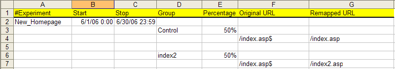
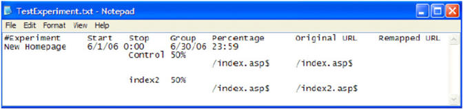

# Configuring and Deploying the Experiment{#configuring-and-deploying-the-experiment}

After you have defined your objective, hypothesis, and experiment details as well as created your test content, you must configure Sensor to deploy the controlled experiment.

## Configuring the Experiment Configuration File {#section-037fe7dea9c94aee9cdc354dafdb7c03}

To configure the experiment, you must complete the experiment configuration spreadsheet provided by Adobe (named [!DNL TestExperiment.xls] by default). This file configures [!DNL Sensor] to perform the experiment and is the Excel version of the text file that you specified in [Modifying the ExpFile Parameter](../../../home/c-undst-ctrld-exp/t-en-ctrld-exp/c-mod-expfile-prm.md#concept-25232b386a654870becc789d4f1fcc28).

This file can contain information about multiple experiments, which can run at the same or at different times and use different groups and percentages, but these experiments are not correlated in any way.

Users are placed into a group for each experiment listed in the file that is configured to be running at this time.

>[!NOTE]
>
>Each experiment is independent of all other experiments. Changes you make to one experiment do not affect any other experiment, and although visitors may be in multiple experiments, the results do not relate to one another. If you think a correlation exists between the changes in multiple experiments, you must create a new experiment that tests these changes together.

**To configure your experiment**

You should complete this file before the experiment begins and not modify the information while the experiment is running.

>[!NOTE]
>
>Any experiment is promptly invalid if the definition of the experiment changes after the experiment has begun.

1. If you have administrator access to your web or application servers, navigate to the [!DNL Sensor] installation folder on any [!DNL Sensor] machine in your web cluster to access the [!DNL TestExperiment.xls] file. If you do not have administrator access, contact your Adobe account manager to request the [!DNL TestExperiment.xls] file. 

1. Open the [!DNL TestExperiment.xls] file (you can rename this file if desired) and complete the following fields:

<table id="table_FDD6AE631C614F97AD7AE8829E53CCAC"> 
 <thead> 
  <tr> 
   <th colname="col1" class="entry"> Field </th> 
   <th colname="col2" class="entry"> Description </th> 
  </tr> 
 </thead>
 <tbody> 
  <tr> 
   <td colname="col1"> Experiment </td> 
   <td colname="col2"> 
A descriptive name for the experiment. Each experiment name must be unique and cannot contain spaces. 
 
Experiment names are used when displaying the results of experiments in  Insight . The names appear as the first half of the element names in the controlled experiment dimension. The second half of the element name is the group name from the Group field in this file. Each group is named in the following format using the experiment name followed by the group name: 
 
<i>ExperimentName.Group Name</i> 
 
For example:  New_Homepage.Control  
 </td> 
  </tr> 
  <tr> 
   <td colname="col1"> Start </td> 
   <td colname="col2"> 
The date and time that you want the experiment to begin. If you do not enter values, the experiment begins immediately after the file is deployed. 
 
Format: MM/DD/YYYY H:MM 
 
    <ul id="ul_FB8B50C688584683AC2226FCBED40AF9"> 
     <li id="li_223EF962CFC64454965444E66284F670">If you leave the start and stop times empty, the experiment runs indefinitely. </li> 
     <li id="li_0544C9A98635418CAECD85B67F345772">You can predefine start and stop times well in advance; therefore, you can configure all of your experiments for the next year at once if desired. </li> 
     <li id="li_BDFBB74B1D134E57B37DC5C3457AA1A9">Start and stop times are based on the system time of the web server. If that clock changes for any reason, your experiment may start or stop unexpectedly. </li> 
     <li id="li_3295FE5B2AC64B6CA90CC7F31B808EB9">If you would like to add an experiment as a configuration file entry but do not want the experiment to run in the near future, you can comment out the experiment information using the number sign “#” or define start and stop times in the past. </li> 
    </ul> </td> 
  </tr> 
  <tr> 
   <td colname="col1"> Stop </td> 
   <td colname="col2"> 
The date and time that you want the experiment to end. When the stop date and time occurs,  Sensor  will stop sending the cookie values identified as a test group to the test URIs and will send all cookies to the control group URIs. 
 
Format: MM/DD/YYYY H:MM 
 
See the notes for the  Start  field. 
 </td> 
  </tr> 
  <tr> 
   <td colname="col1"> Group </td> 
   <td colname="col2"> 
A descriptive name for each group of visitors in the experiment. Group names cannot contain spaces. 
 
Group names are used when displaying the results of experiments in  Insight . For more information, see the Experiment field description. 
 
A control group can be implicitly or explicitly defined based on the value entered in the Percentage field. 
 
 
Note:  To meet the number of visitors needed during the defined time period for the experiment to be statistically valid, you may need to either decrease the confidence level or increase the time period. For example, if your time frame is five days, your confidence level is 98%, and your number of visitors needed exceeds the number expected for that time period, you need to either increase the time period or decrease the confidence level until the number of visitors expected exceeds the number needed to run a statistically valid experiment. 
 
 </td> 
  </tr> 
  <tr> 
   <td colname="col1"> Percentage </td> 
   <td colname="col2"> 
The percentage of website visitors to include in each defined group. These values can be expressed as either percentages or decimal values. In addition, both values must be either greater than or less than one. 
 
For example: 
 
33.3% and 66.7% 
 
.99 and .01 
 
If the sum for all groups is less than 100, the undefined excess defaults to a control group. 
 </td> 
  </tr> 
  <tr> 
   <td colname="col1"> Original URL </td> 
   <td colname="col2"> 
The URI of the content to be remapped, followed by $. This value is case-sensitive. 
 
Format: index.asp$ 
 
Original URIs can be specified using a dollar sign ($) at the end of the URI to denote that an exact match of the file name is required. For example, the expression  /product/product_view.asp$  matches that exact page only, while  /product  matches any page in the  /product  directory and could be used to remap that entire sub-tree. Original URL entries that do not specify the $ character at the end of the file name are ignored by the experiment unless the ExpPartialMatch parameter has been set to “on.” For more information about this parameter, see <a href="../../../home/c-undst-ctrld-exp/t-en-ctrld-exp/c-mod-expplmth-prm.md#concept-9c817c4c49b74287b0f70d6a1a37655e"> Modifying the ExpPartialMatch Parameter (Optional) </a>. 
 
The controlled experiment functionality ignores any query strings appended to the URI stem. For example, the page 
 
  /product/product_view.asp?productid=53982  is not a valid URI, but the page  /product/product_view.asp  is a valid URI. 
 </td> 
  </tr> 
  <tr> 
   <td colname="col1"> Remapped URL </td> 
   <td colname="col2"> 
The URI of the alternate content. 
 
Format: index2.asp 
 
See the notes for the Original URL field. 
 </td> 
  </tr> 
 </tbody> 
</table>

   The following is an example of a completed [!DNL TextExperiment.xls] spreadsheet:

   

   >[!NOTE]
   >
   >Do not modify the column positions in the spreadsheet.

   This example indicates that the “New_Homepage” experiment starts on June 1, 2006, ends on June 30, 2006, and contains a control group with 50% of the visitors and a test group with 50% of the visitors, who see different content for one URI.

   >[!NOTE]
   >
   >Although the sample file above has an explicit control group defined, it is not necessary to explicitly define a control group — the experiment automatically creates the control group. If the sum of the percentages for all groups in an experiment is less than 100%, an implicit control group is assigned to users that do not fall into one of the explicit groups.

1. To insert comments to provide additional information about specific experiments, begin the cell with a number sign (#) and follow with your comments. Comments can be inserted anywhere in the file. 
1. After you have completed the variables in the experiment configuration spreadsheet, save the changes, then save the file in tab-delimited text format ( [!DNL *.txt]) using the name that you specified in the ExpFile parameter in the [!DNL Sensor] configuration file. See [Modifying the ExpFile Parameter](../../../home/c-undst-ctrld-exp/t-en-ctrld-exp/c-mod-expfile-prm.md#concept-25232b386a654870becc789d4f1fcc28).

   The following is an example of an experiment configuration text file:

   

   >[!NOTE]
   >
   >Because of the tabs required in this file, do not edit the experiment configuration text file by hand. If you need to make changes to the file, make the changes in the experiment configuration Excel file and re-save the file as a tab-delimited text file.

If you have defined Start and Stop times, there is no reason to ever delete an experiment from the experiment configuration file. Keeping all of your experiments listed in the experiment configuration file is actually a good way to keep a record of how you defined each of your experiments.

## Deploying the Configuration File and Test Content {#section-34ff29649f584b93bc6129b75084b37c}

You must deploy the experiment configuration file to each machine in your web cluster that is running a [!DNL Sensor] and serving the pages involved in the experiment. You can do so using either a manual procedure or your existing content management system.

**To deploy your test content**

* On each application or web server running a [!DNL Sensor] that is serving pages involved in the experiment, use your existing publishing process to deploy the test content to the appropriate location.

  For example, if you want to publish the test group page [!DNL index2.asp] to the test folder for your website ( [!DNL mysite.com]), you would publish the file to [!DNL www.mysite.com/test].

  >[!NOTE]
  >
  >Do not link to any of your test files directly from a page on your website. Doing so invalidates your test results and your index scores.

**To deploy your experiment**

* On each application or web server running a [!DNL Sensor] that is serving pages involved in the experiment, place the experiment configuration text file in the directory that you specified in the ExpFile parameter in the [!DNL Sensor] configuration file. See [Modifying the ExpFile Parameter](../../../home/c-undst-ctrld-exp/t-en-ctrld-exp/c-mod-expfile-prm.md#concept-25232b386a654870becc789d4f1fcc28).

[!DNL Sensor] randomly selects website visitors for each group based on the percentages that you defined in the file and serves the test or control group content to them as appropriate.
