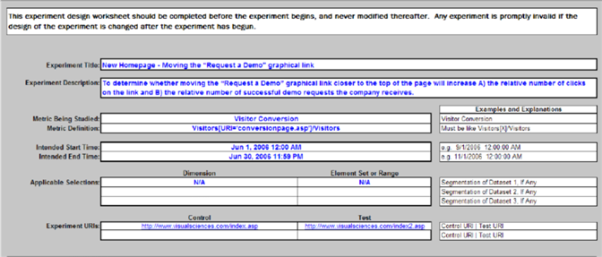
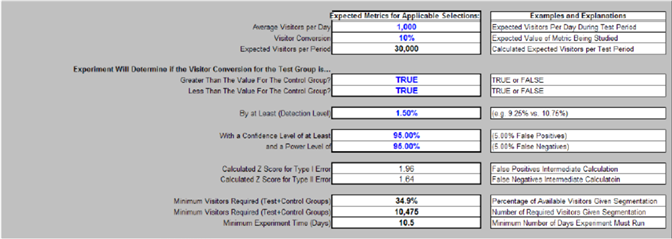
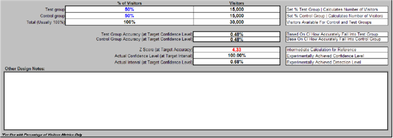
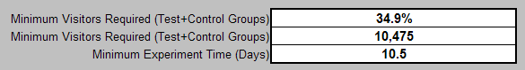
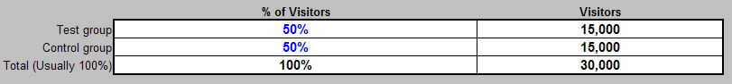

# Experiment Design Spreadsheet{#experiment-design-spreadsheet}

This file functions not only as a worksheet but also as a record of your decisions about the experiment.

If you need help designing your experiment, you can use the experiment design spreadsheet (named VS Controlled Experiment Design.xls by default) provided by Adobe.

The experiment design spreadsheet can provide useful statistical inferences only when the metric in question is defined as a percentage of visitors that meet some criteria. That is, it is useful only when testing a visitor-based metric hypothesis.

**To design your experiment using the experiment design file** 

1. If you have administrator access to your web or application servers, navigate to the [!DNL Sensor] installation folder on any [!DNL Sensor] machine in your web cluster. If you do not have administrator access, contact your Adobe account manager to request the file.
1. Open the VS Controlled Experiment Design.xls file. (You can rename this file if desired.)

   The spreadsheet on the following page is an example of how you would complete the spreadsheet when preparing to test the example hypothesis used throughout this guide.

   

   

   

1. Enter text or values for all of the fields in blue in this file, which are described in the following table. The calculated fields are defined in the second table.

<table id="table_C343F7A4BF3D4E0E9A5E9739EC7C2E10"> 
 <thead> 
  <tr> 
   <th colname="col1" class="entry"> In this field… </th> 
   <th colname="col2" class="entry"> Specify </th> 
  </tr> 
 </thead>
 <tbody> 
  <tr> 
   <td colname="col1"> Experiment Title </td> 
   <td colname="col2"> A descriptive name for your experiment. </td> 
  </tr> 
  <tr> 
   <td colname="col1"> Experiment Description </td> 
   <td colname="col2"> A textual description of the experiment. </td> 
  </tr> 
  <tr> 
   <td colname="col1"> Metric Being Studied </td> 
   <td colname="col2"> 
The name of the metric on which the experiment is based. 
 
Example: Visitor Conversion 
 </td> 
  </tr> 
  <tr> 
   <td colname="col1"> Metric Definition </td> 
   <td colname="col2"> 
The definition of the metric on which the experiment is based. 
 
Format: Visitors[X]/Visitors 
 
Example:  Visitors[URI='conversionpage.asp']/Visitors
 </td> 
  </tr> 
  <tr> 
   <td colname="col1"> Intended Start Time </td> 
   <td colname="col2"> The date and time you want the experiment to begin. </td> 
  </tr> 
  <tr> 
   <td colname="col1"> Intended End Time </td> 
   <td colname="col2"> The date and time you want the experiment to end. </td> 
  </tr> 
  <tr> 
   <td colname="col1"> Applicable Selections </td> 
   <td colname="col2"> (Optional) The dimension name and element set or range by which you want to further segment the dataset. </td> 
  </tr> 
  <tr> 
   <td colname="col1"> Experiment URIs </td> 
   <td colname="col2"> The URIs involved in your hypothesis. You define the current URIs for the control group and the alternate URIs that you have created or will create for the test group(s). </td> 
  </tr> 
  <tr> 
   <td colname="col1"> Expected Metrics for Application Selections </td> 
   <td colname="col2"> Heading for the metric values that you expect for your website. </td> 
  </tr> 
  <tr> 
   <td colname="col1"> Average Visitors per Day </td> 
   <td colname="col2"> The average number of visitors to your website per day. </td> 
  </tr> 
  <tr> 
   <td colname="col1"> Visitor Conversion </td> 
   <td colname="col2"> The average visitor conversion rate for your website. </td> 
  </tr> 
  <tr> 
   <td colname="col1"> Experiment Will Determine if the metric name for the Test Groups is … </td> 
   <td colname="col2"> Heading for how the metric values should be compared. </td> 
  </tr> 
  <tr> 
   <td colname="col1"> Greater Than The Value For the Control Group? </td> 
   <td colname="col2"> Set this field to True if you want the ability to conclude that the test group’s metric increased during the experiment. Set this field to False to reduce the number of visitors needed to draw conclusions. Adobe recommends that you set it to True. </td> 
  </tr> 
  <tr> 
   <td colname="col1"> Less Than The Value For the Control Group? </td> 
   <td colname="col2"> Set this field to True if you want the ability to conclude that the test group’s metric decreased during the experiment. Adobe recommends that you set it to True. </td> 
  </tr> 
  <tr> 
   <td colname="col1"> By at Least (Detection Level) </td> 
   <td colname="col2"> The percentage by which you want the metric for the test group to be higher or lower than that for the control group. </td> 
  </tr> 
  <tr> 
   <td colname="col1"> With a Confidence Level of at Least </td> 
   <td colname="col2"> The desired confidence level for the test group values. The confidence level determines the number of false positives to measure the probability that the stated expectation is true. </td> 
  </tr> 
  <tr> 
   <td colname="col1"> and a Power Level of </td> 
   <td colname="col2"> The desired power level for the test group values. The power level determines the number of false negatives. </td> 
  </tr> 
  <tr> 
   <td colname="col1"> % of Visitors </td> 
   <td colname="col2"> Heading for the percent of visitors values. </td> 
  </tr> 
  <tr> 
   <td colname="col1"> Test Group </td> 
   <td colname="col2"> Percent of visitors you want to include in the test group. You can play with this number until the value in the Total (Usually 100%) field in the Visitors section is equal to or greater than the value in the Minimum Visitors Required (Test+Control Groups) field, both of which are described in the following table. </td> 
  </tr> 
  <tr> 
   <td colname="col1"> Control Group </td> 
   <td colname="col2"> Percent of visitors you want to include in the control group. </td> 
  </tr> 
  <tr> 
   <td colname="col1"> Other Design Notes </td> 
   <td colname="col2"> Any notes that you want to save for future reference. </td> 
  </tr> 
 </tbody> 
</table>

   The remaining fields are calculated based on the values that you entered and are described in the following table.

   |  Field  | Description  |
   |---|---|
   |  Expected Metrics for Application Selections  | Heading for the metric values that you expect for your website.  |
   |  Expected Visitors per Period  | This field is normally automatically calculated by the spreadsheet. It relies on the assumption that on most days the website receives many more new visitors than return visitors. If this is not the case, this cell’s calculation should be overwritten with the actual number of visitors expected during the experiment.  |
   |  Calculated Z Score for Type I Error  | The Z score for a false positive result. This is an intermediate statistical calculation.  |
   |  Calculated Z Score for Type II Error  | The Z score for a false negative result. This is an intermediate statistical calculation.  |
   |  Minimum Visitors Required (Test+Control Groups)  | Minimum number of visitors needed in your experiment to meet your specified confidence level, power level, and Z score, expressed as a percentage of the value in the Expected Visitors per Period field.  |
   |  Minimum Visitors Required (Test+Control Groups)  | Minimum number of visitors needed in your experiment to meet your specified confidence level, power level, and Z score. This value must be less than or equal to the value in the Total (Usually 100%) field in the Visitors section.  |
   |  Minimum Experiment Time (Days)  | Minimum number of days you need to run your experiment to meet your specified confidence level, power level, and Z score. This calculated number is subject to the same issues as discussed in the Expected Visitors per Period field. In the case of a website with many returning visitors, the Minimum Experiment Time (Days) field is the expected number of days it takes to see a number of unique visitors equal to the value in the Minimum Visitors Required field.  |
   |  Visitors  | Heading for the visitors values.  |
   |  Test Group  | Number of visitors needed in the test group.  |
   |  Control Group  | Number of visitors needed in the control group.  |
   |  Total (Usually 100%)  | Total number of visitors needed for the experiment. This value must be equal to or greater than the value in the Minimum Visitors Required (Test+Control Groups) field.  |
   |  Test Group Accuracy (at Target Confidence Level)  | Percentage indicating that there is a chance equal to the specified confidence level that the measured value of the metric calculated for the test group will be within this percentage of its true value.  |
   |  Control Group Accuracy (at Target Confidence Level)  | Percentage indicating that there is a chance equal to the specified confidence level that the measured value of the metric calculated for the control group will be within this percentage of its true value.  |
   |  Z Score (at Target Accuracy)  | Number of standard deviations a given value is from the test mean.  |
   |  Actual Confidence Level (at Target Interval)  | The confidence level achieved for the experiment. The confidence level measures the probability of the stated expectation to be true.  |
   |  Actual Interval (at Target Confidence Level)  | The confidence interval achieved for the experiment, which provides an estimated range of values that is likely to include an unknown population parameter. This range is calculated from a given set of sample data.  |

   You need to look at the value in the Minimum Visitors Required (Test+Control Groups) field . . .

   

   and compare it to the value in the Total field in the [!DNL Visitors] column.

   

   For your experiment to be statistically valid, the value in the Total (Usually 100%) field must be equal to or greater than the value in the Minimum Visitors Required (Test+Control Groups) field.

   Given the inputs provided, what the example worksheet shows you is that 10,475 visitors need to participate in this experiment to achieve the entered 95% confidence rate (which is the minimum suggested confidence for any controlled experiment, although you can increase this number). The experiment as currently designed includes 30,000 visitors, which is well over the minimum number of visitors required.

   If you keep the number of days the same, you could increase the confidence level as long as the total number of visitors continues the meet or exceed the required minimum. 

1. Save the file for your records and then use the information from the file to configure the experiment using the experiment configuration spreadsheet. For more information about this spreadsheet, see [Configuring and Deploying the Experiment](../../home/c-undst-ctrld-exp/t-crt-ctrld-exp/c-cnfg-dply-exp.md#concept-50f1de0242904698937bb72b3ea1b429).
