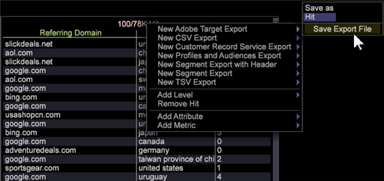
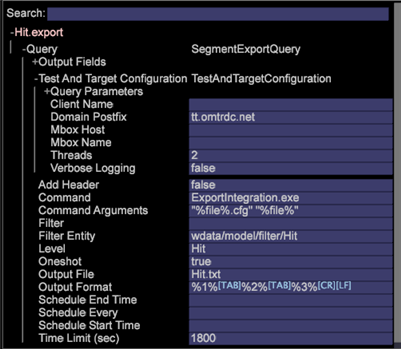
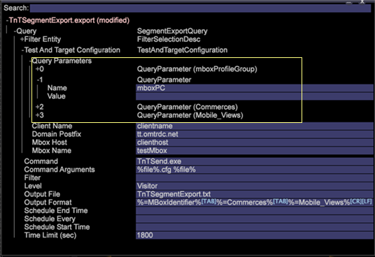

# Data Workbench Integration with Adobe Target

Integration of Adobe Data Workbench with Adobe Target became easier with Data Workbench features to export data segments and automatically populate export files.

Adobe Data Workbench provides closed-loop integration with Adobe Target for sharing data and generating reports. Within Data Workbench you can analyze populations for meaningful segments using all of the data available, including off-line conversions through channels such as phone, a store, and so on.

For example, a visitor looks for shoes on your website but doesn't convert. Rather, the visitor downloads a coupon for 20 percent off their next purchase and then purchases a shirt in your store. Using Data Workbench, you can gather that data then push that profile data back to Target to show that the visitor purchased a shirt off-line. You can then target a campaign offering a necktie to that visitor, when normally Target might try to re-market shoes to that visitor.

## Set up Data Workbench with Adobe Target

1. Right-click the header in the [!UICONTROL Detail Table] window.

    

1. Select **[!UICONTROL New Target Export]** and enter the name of a new export file under the **[!UICONTROL Save As]** command in the menu.

1. Click **[!UICONTROL Save Export File]**.

    An export template window will open.

    All Adobe Target information gets populated automatically. It builds up the parameter list based on what you put in the segment export. When complete, Data Workbench will send the data to the Adobe Target server.

    **Note:** The Template file should be configured by the [!UICONTROL Profile Architect]. The [!UICONTROL Client Name], [!UICONTROL Domain Postfix], [!UICONTROL Mbox Host], and [!UICONTROL Mbox Name] need to be entered. If you have multiple sites, then fill out multiple templates and save them to the server. The templates from Profile Manager are located in `Context\FileNew\Detail Table\Export\Copy`.

    

1. Specify the [!UICONTROL mboxPC] query parameter.

    If the name of the Data Workbench attribute is something other than [!UICONTROL mboxPC], you must edit the appropriate Query Parameter and rename it to _mboxPC_.

    

    When you save the export file to the server the export will begin. When completed, the [!UICONTROL TnTSend.exe] application will launch and begin sending data to the Target account.

## Configuring Data Workbench for Target

Complete the following tasks in Adobe Target:

Data Workbench is passing user profiles to Adobe Target. To configure for export to Target, you need to set up and enable its API and provide the **[!UICONTROL clientname]** and **[!UICONTROL domain postfix]** parameters for the export configuration file (`export.cfg`).

A new boolean option called **[!UICONTROL Oneshot]** has been added to segment export files. This option is included in the template file distributed with the new profile. If [!UICONTROL Oneshot] is set to _true_, then the `.export` file will be renamed to `.export.done-TIMESTAMP` after the export is completed, ensuring that the segment will never be exported more than once. This is important when exporting to Adobe Target.

**Note:** A call from Data Workbench to Adobe Target counts as an [!UICONTROL mbox] call, requiring one call for each profile sent. Consequently, costs increase if multiple calls are required between the two solutions.

An incomplete configuration produces the following error message in the log:

```
TNT-040615-133212-Adobe-Target-Product-Test.log:
TnT Configuration left out these empty fields:
ClientName,MboxHost,MboxName
```

## Configuring Adobe Target for Data Workbench

Within Adobe Target, no special configuration is needed for a customer to send profile data. The profile information for a user is typically passed in the regular [!UICONTROL mbox] request, and the servers will make the profile parameters available for a targeted campaign setup as standard functionality without any additional setup.

Adobe Target has Data Workbench integration built in, which can be enabled from the Super-user Client Details page. Enabling the option will surface segments that are shared from Data Workbench within Adobe Target to make it available for targeting.

## Set HTTP log reporting in ExportIntegration.exe

Reduce long reporting to [!UICONTROL HTTP.log] when using [!UICONTROL ExportIntegration.exe] to export Adobe Target integration files.

A new [!UICONTROL httpLoggingEI.cfg] configuration file (located at `server\Admin\Export\httpLoggingEI.cfg`) lets you reduce verbose logging to the [!UICONTROL HTTP.log] file for when exporting data using [!UICONTROL ExportIntegration.exe]. This allows you to stop verbose request/response logging.

Verbose logging is already captured in [!UICONTROL TnTSend.log] files.

_True_ sets verbose logging, and _False_ stops verbose logging to [!UICONTROL HTTP.log] file.

In the False setting, only a warning message will sent to the [!UICONTROL HTTP.log] file (Info content not sent).
