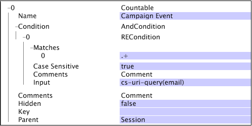
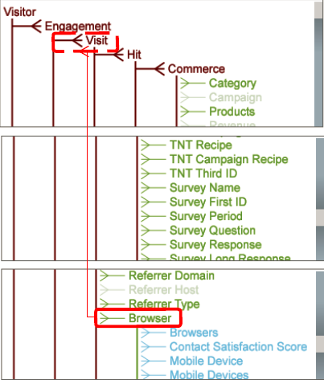
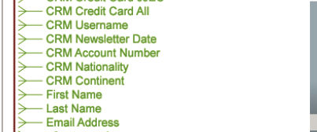
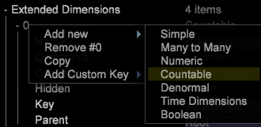
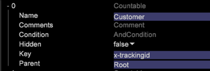

# Schema Design Countable Structures{#schema-design-countable-structures}

Explanation of Countables in Dataworkbench (DWB) for designing and implementing the schema.

## Understanding Countable in Data Workbench {#section-6e6b8d1c17634d669e62c91a80a0bc62}

At the highest level are countable dimensions. Countable dimensions serve two major functions. First, they are dimensions whose elements you want to count. In other words, countables answers the questions like:

* How many visitors visited your homepage?

* How many visits came from Google.com?

`<discoiqbr>`Countable dimensions are typically used to create sum metrics, which return the count, or sum, of all the elements of the dimension. You can define countable dimensions to count instances such as reservation bookings or product orders. For example, you could define the countable dimension orders whose elements (log entries corresponding to orders from your online store) could be counted. If you want to show a count of orders within a visualization, you would define the orders sum metric, which can be evaluated over a dimension or have filters applied to it.

Countable dimensions can be parents of other dimensions or children of other countable dimensions.

Although your root countable dimension does not have to be associated with the tracking IDs in the data, Adobe recommends that you configure your dataset's root countable dimension to use the tracking ID field (x-trackingid) as it's Key. As a result, each element of the root countable is associated with a unique value of x-trackingid, and all of the data about each element is grouped together.

Countable dimensions are defined by the following parameters: 

<table id="table_5E00B72CFDD645368ADCC25AB9B5E53D"> 
 <thead> 
  <tr> 
   <th colname="col1" class="entry"> Parameter </th> 
   <th colname="col2" class="entry"> Description </th> 
   <th colname="col3" class="entry"> Default </th> 
  </tr>
 </thead>
 <tbody> 
  <tr> 
   <td colname="col1"> Name </td> 
   <td colname="col2"> Descriptive name of the dimension as appears to the user in data workbench. The dimension name cannot include a hyphen (-). </td> 
   <td colname="col3"> </td> 
  </tr> 
  <tr> 
   <td colname="col1"> 
Comments 
 </td> 
   <td colname="col2"> 
Optional. Notes about the extended dimension.
     
      
 </td> 
   <td colname="col3"> </td> 
  </tr> 
  <tr> 
   <td colname="col1"> 
Condition 
 </td> 
   <td colname="col2"> 
The conditions under which the input field contributes to the creation of the countable dimension. If specified, a condition restricts the set of log entries visible to the dimension and all of its children in the dataset schema. 
 </td> 
   <td colname="col3"> </td> 
  </tr> 
  <tr> 
   <td colname="col1"> Hidden </td> 
   <td colname="col2"> Determines whether the dimension appears in the data workbench interface. By default, this parameter is set to false. If, for example, the dimension is to be used only as the basis of a metric, you can set this parameter to true to hide the dimension from the data workbench display. </td> 
   <td colname="col3"> false </td> 
  </tr> 
  <tr> 
   <td colname="col1"> Key </td> 
   <td colname="col2"> 
Optional. The name of the field to use as the key. If you define this parameter, an element of the countable dimension exists for every combination of an element of the countable dimension's parent and a distinct value of the field specified as the key. 
 
Each element of the countable dimension is required to relate to a contiguous set of log entries. Therefore, if the log entries are not ordered by the key, an element of the countable dimension is created each time the key field changes. To prevent this situation, Adobe recommends that you use a unique key which is contiguous in time order. 
 </td> 
   <td colname="col3"> </td> 
  </tr> 
  <tr> 
   <td colname="col1"> Parent </td> 
   <td colname="col2"> 
 The name of the parent dimension. Any countable dimension can be a parent dimension. To make a dimension the top-level dimension in the dataset's schema, set the parameter to "root." The defined dimension becomes the root countable dimension for the dataset. For example, if you are working with Site, the Visitor dimension is the root countable dimension for your dataset. 
 
Note: Although your root countable dimension does not have to be associated with the tracking IDs in the data, Adobe recommends that you configure your dataset's root countable dimension to use the tracking ID field (x-trackingid) as its Key. As a result, each element of the root countable is associated with a unique value of x-trackingid, and all of the data about each element is grouped together. If you would like to configure your dataset differently, contact Adobe. 
 </td> 
   <td colname="col3"> </td> 
  </tr> 
 </tbody> 
</table>

This example illustrates the definition of a countable dimension using event data collected from website traffic. The countable dimension counts the web campaign events within a given session. The assumption is that all email campaign resources are requested from the web server with "email=" as part of cs-uri-query. In the example, the number of times that the visitor responds to an email campaign during a given session is of interest, not the actual value of the cs-uri-query(email) field. 

The second major function of countables is that they form the backbone of your dataset schema structure. Your data schema and all other dimensions are organized to be grouped under, and belong to a countable. In other words, if we consider dimensions as "categories", then countables are the way we organize these "categories" into groups. 
When dimensions are grouped under a countable dimension, they are said to be at the "level" of the countable dimension. For example, in the figure below you can see that 'Email Address' is at the Visitor level and "Browser" is at the Visit level. "Parent" and "child" refer to the relationship between the countable and the dimensions grouped below it. For example, Visitor is a "parent" of Email address. Conversely, Email address is a "child" of Visitor.  

## Creating Countable in Data Workbench {#section-491f3e8e4fbc429e95d6c97f012a208e}

Perform the following steps to create the Countable in Dataworkbench:

1. Open Profile Manager 
1. Under Transformation folder, create a config file and open it in workstation. 
1. Under Extended Dimensions, right click and choose Add new -> Countable as shown below: 

1. Enter Name for new Countable. In the example below, Customer Countable is defined. If it is the Highest level Countable, then in the Parent write Root. 

   If the Countable is not the top level one, then in the parent field give the name of the Parent Countable. In the example below, Engagement Countable is created and the Parent for this countable is Customer. 

For additional information on the DWB architecture for schema design, countable structures, and offline data feed configurations, see the [Dataset Schema Interface](https://marketing.adobe.com/resources/help/en_US/insight/client/c_dtst_sch_intrf.html) and [Dimensions and Metrics Reference](https://marketing.adobe.com/resources/help/en_US/insight/insight_sc_implementation.pdf). 
