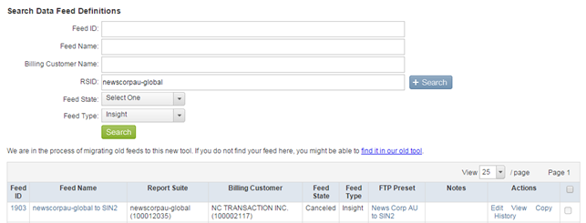
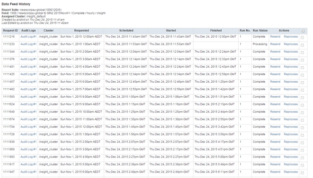

# Validating Historical Data Feeds{#validating-historical-data-feeds}

A quick guide for the minimum steps required to validate and set up historical data feeds.

## Validation Steps for Consistency of Data Feeds {#section-777b2c627a354627a02feb9461e23038}

1. Login to *drteeth* (https://oasis.omniture.com/drteeth/) 
1. Go to SiteCatalyst Admin -> Data Feed Definition(new) 
1. Jump to server location (Ex. Dallas, London..) Depending on where your organization is located. 
1. Provide RSID and select feed type Insight and click on *search*.

   

1. Identify the actual feed name for your client. 
1. Click on History in the Actions Section. 

   Check the status field for any errors and In case some feed is in error state, select the feed and click reprocess. If the error occurred for multiple requests then send an email to *`dataworkbench@adobe.com`* with Feed ID and Report Suit details to reprocess. 

1. Post-validation checks the logs in the raw folder of the NAS location.

