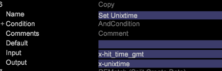
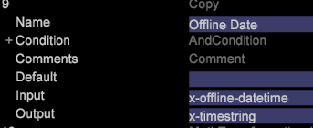
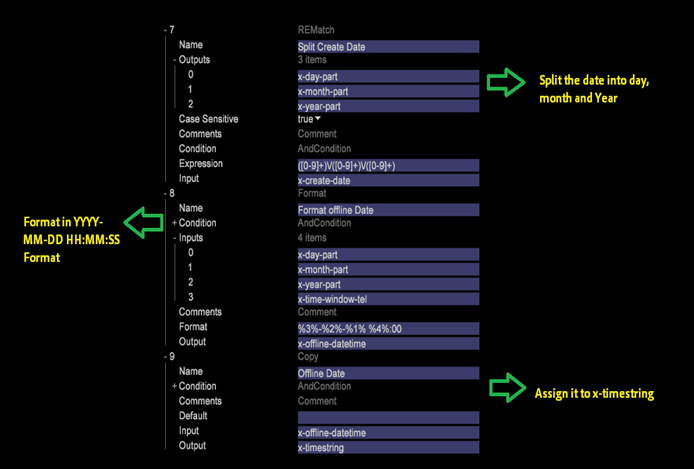

# Setting up Event Time{#setting-up-event-time}

This section explains how to create timestamps for a Data Workbench dataset.

## Understanding the Event Time {#section-e10ef2b5b6244dc5b215836e3c77d663}

Event Time is the date and time at which the request (or event) occurs.

Usually, for online data, *x_hit_time_gmt* is used as timestamp field. The time of the call can be used as the timestamp for offline data (such as call center data). This is a mandatory field and all the data sources should have one field in it that can be used as timestamp. This information should be provided by your organization.

In DWB, the following predefined variables capture the timestamp: 

<table id="table_C24BD56CEB4E42F68D645EBB65585D16"> 
 <tbody> 
  <tr> 
   <td colname="col1"><i>x-timestamp</i> </td> 
   <td colname="col2"> 
 The date and time (GMT) at which the request was received by the server. The time is expressed as the number of 100 nanoseconds since January 1, 1600. 
 
Example: 127710989320000000 would be the <i>x-timestamp</i> value for 11:28:52.0000000 on Tuesday,September 13, 2005. 
 </td> 
  </tr> 
  <tr> 
   <td colname="col1"><i>x-timestring</i> </td> 
   <td colname="col2"> <i>x-timestamp</i> in the format YYYY-MM-DD HH:MM:SS.mmm. </td> 
  </tr> 
  <tr> 
   <td colname="col1"><i>x-unixtime</i> </td> 
   <td colname="col2"> <i>x-unixtime</i> is the epoc time which represent the number of seconds since January 1st, 1970, at 00:00:01. </td> 
  </tr> 
 </tbody> 
</table>

Based on the format of date field, x-timestamp or x-unixtime or x-timestring is used. For example, if the incoming data is in the format YYYY-MM-DD, then x-timestring is to be used.

The timestamp is defined in one of the formats and DWB internally generates the other two formats. Also, these are pre-defined DWB fields and the same name should not be used for any other field.

## Time Zones Defined in DWB {#section-3cdd12254342442b917376661e1d9c9f}

If the date field contains any of the below mentioned time zones, DWB considers the entire row in that particular timezone. For example, one file has the date defined as 2015-01-01 00:00:00 gmtand another file has the value as 2015-01-01 00:00:00 cst, then the first file's date will be considered in GMT timezone whereas the second file's date will be in CST timezone. 

|  Code  | Time Zone  |
|---|---|
|  gmt  | Greenwich Mean  |
|  est  | Eastern Standard  |
|  edt  | Eastern Daylight  |
|  cst  | Central Standard  |
|  cdt  | Central Daylight  |
|  mst  | Mountain Standard  |
|  mdt  | Mountain Daylight  |
|  pst  | Pacific Standard  |
|  pdt  | Pacific Daylight  |

>[!NOTE]
>
>DWB only processes the Time Zones mentioned above.

## Setting Custom Time Zones {#section-7c351921f22b439b81c73f40d5b47536}

DWB does not process the offset in the Time Zone. To consider the offset in Time Zone, the data should be formatted in that offset Time Zone.

Example: to consider the date format in CST time zone, the data should come in YYYY-MM-DD HH:MM:SS UTC +/-HHMM format from the client.

2015-10-18 05:00:00 UTC -0200

## How to set Event Time/Timestamp {#section-81507080f0b44ae6b83d3650ba019812}

Based on the date field format, *x-timestamp, x-unixtime* or *x-timestring* variable is used. In the example below, since the *x-hit_time_gmt* comes in unix epoc format, *x-unixtime* is used.

In the DWB [!DNL foundation.cfg] file (or any other configuration file under the Dataset log processing folder), use the Copy transformation to set the Event Time as shown:

Based on the date field format, x-timestamp, x-unixtime or x-timestring variable is used. In the example below, since the x-hit_time_gmt comes in unix epoc format, x-unixtime is used.

In the insight foundation.cfg (or any other config under Datasetà log processing folder), use the Copy transformation to set the Event Time as shown below: 

If the date in is YYYY-MM-DD HH:MM:SS.mmm format, x-timestring is used. Example: If the date field is in the format other than defined in DWB say YYYY/MM/DD, then first format it in one of the timestamp format accepted by the DWB and then assign it to the corresponding variable. In the screenshot below, the date is first converted into YYYY-MM-DD format and then assigned to *x-timestring *variable. 
