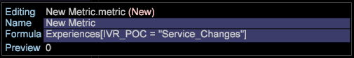
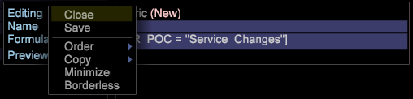
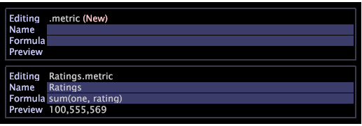
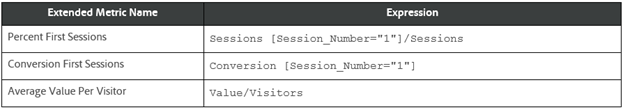

# Metrics Setup{#metrics-setup}

This section explains how to create metrics in Data Workbench.

## Understanding Metrics {#section-f0412e851fcb4ac9886dca4003d42cec}

Metrics are quantitative information about customer activity, such as Views, Orders, number of calls made, and Revenue. Metrics are the foundation of reports and help you view and understand data relationships.

Metric Dimension allows you to group metric counts by a specific Level. It also allows you to group metric counts by a specific level.

## Creating New Metrics {#section-60a413899d1b4707965e06fb5ef7fc4e}

Follow the steps below to create a new metric:

1. Click **Tool** > **Metric Editor**. 

1. In the metric editor, enter the new Metric name and formula. 

1. Save it to Metrics folder. 

## Creating and Editing Derived Metrics {#section-ebdcd3ec652f485e90e001d694eab6d0}

Use a Metric Editor to define a new metric by name, formula, and format, which is saved to the [!DNL User\profile_name\Metrics] folder for later use.

1. Open a new Metric Editor using the **Admin > Profile** menu option or by right-clicking the User column for the folder in which you want to create the metric and clicking **Create > New Metric**. A Metric Editor displays. 

1. In the *Name* parameter, type a name for the new metric. 

   >[!NOTE]
   >
   >Note that spaces ( ) are allowed while underscores (_) are not. In addition, you cannot use the following symbols: + - &#42; /

   

1. In the *Formula* parameter, type an expression for the new metric.

   >[!NOTE]
   >
   >Filters must be defined within brackets [ ] in the expression. For additional metric expression syntax rules, see [Syntax for Metric Expressions.](https://marketing.adobe.com/resources/help/en_US/insight/client/c_syntx_mtrc_exp.html)

   This table provides sample expressions for extended metrics. 

   >[!NOTE]
   >
   >When an appropriate expression is entered, the preview line displays the value of the new metric. If there is an error in the expression, the preview line displays an error message.

1. Right-click and select **Save**. When you save the metric, a file representing the new metric is created on your computer in the DWB *Installation directory \User\profile name\Metrics* folder.

## Editing Existing Derived Metrics {#section-4b5b7baf885b45cc8b358d1bd774e925}

1. In the Profile Manager or Metrics Manager, in the profile name column, right-click the check mark for the metric file that you want to edit and click **Make Local**. 
1. Right-click the check mark for the metric file in the User column and click **Open** from the workbench. 

   >[!NOTE]
   >
   >You also can open a Metric Editor by right-clicking any metric-related area within a visualization to display the metric menu.

1. In the **Metric Editor**, edit and save the metric definition as necessary using Steps 2-4 in *Creating New Derived Metrics*.

   If you would like all users of the profile to use the metric that you edited, you must publish it to the working profile using the Profile Manager.

Please refer to the documentation for more assistance:

[Syntax for Metric Expressions](https://marketing.adobe.com/resources/help/en_US/insight/client/c_syntx_mtrc_exp.html)

[Creating and Editing Derived Metrics](https://marketing.adobe.com/resources/help/en_US/insight/client/c_drvd_mtrcs.html) 
