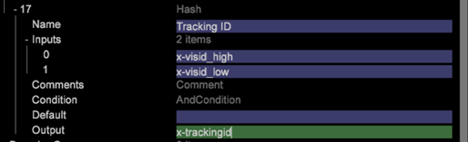
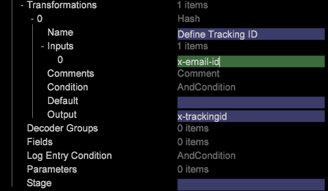

# Data processing - Building Primary Key{#data-processing-building-primary-key}

This section explains how to create Primary keys (Tracking ID) for Data Workbench datasets for schema design and implementation.

## Understanding Tracking ID {#section-24683031044a4af49988655ccb9a45fd}

After reading and decoding the data in DWB (using decoders), the first step is to define the Tracking Id and Timestamp. The Tracking ID is an identifier that uniquely identifies a Customer record. It can be any field in the feed like email ID, Social Security Number, Cookie ID, etc. The field to be used as Tracking ID is decided by the client during the discovery session. Tracking ID and Timestamp are mandatory fields and have to be defined for each record.

Usually, for online Data, Cookie ID (combination of *x-visid_high* and* x-visid_low*) is used as the default mechanism for unique Customer Identification, however, this can be changed as per Client's requirement. The date and time at which the request (or event) occurs is the *x-timestamp*. All records in DWB are group by *trackingid* and sorted on timestamp. The Required Field [!DNL Definitions.cfg] file is a Log Processing Dataset Include file that defines the required fields : *x-trackingid* and *x-timestamp*.

Note: *x-trackingid *in DWB is an inbuilt field and this name should not be used for any other field.

**Example 1**: Creating *x-trackingid* using Cookie ID (when only online data is used)

To create the *x-trackingid *in DWB using Cookie ID, use the Hash function to create the *x-trackingid* in the [!DNL foundation.cfg] file (it is a best practice to define tracking ID in [!DNL foundation.cfg] but it can be defined in any other configuration file under [!DNL Dataset > log processing] folder) as shown: 

**Example 2**: Creating *x-trackingid* using Email ID (when both online and offline data is available)

Assuming, both offline and online data is available (for this example), and the Email ID is available in both the data sources. Since, the Email ID uniquely identifies a customer, it will be used to create the *x-trackingid*.

Use the Hash function to create the *trackingId* as shown: 

