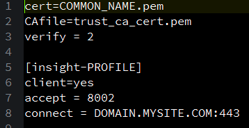
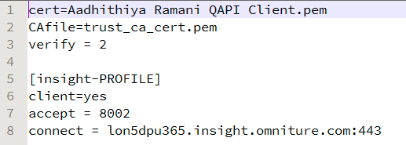
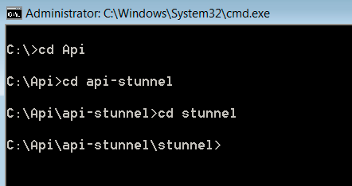
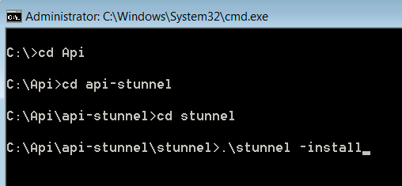
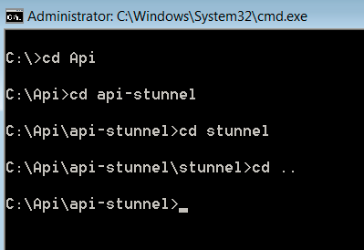
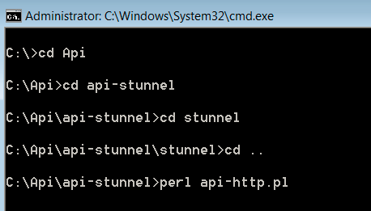
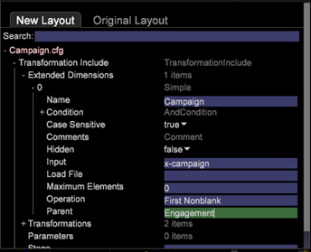

# Query API Setup{#query-api-setup}

A quick guide for setting up a Query API.

Follow the below steps for setting up the Query API:

1. Query API Certificate Acquisition

   Send an Email to the Tech Ops Team of Adobe Email - `Dataworkbench@adobe.com`.

   Please provide the CN name you want to use for the Query API( provide a generic name like `<Client>` Query API). 

   >[!NOTE]
   >
   >Tech Ops will generate the certificate and upload it in a URL. Please let the Adobe Consultants know after receiving the notification from Tech Ops on successful generation of the ticket so that the ticket will be sent to you by them back.

1. Downloading and Extracting the API Stunnel. Receive the api-stunnel file from you consultant.

   Make sure Perl is installed on your machine.

   In the extracted folder (the folder path where you copy the file), copy your Query API certificate inside the *stunnel* folder. 

1. Configure the Stunnel.conf

   There should be a file called *stunnel.conf* inside the *Stunnel* folder (where you copied your certificate).

   Edit the file in Notepad. 

   

   Change the parameters as follows: 

   Two parameters need to be changed in this file.

    * *Cert* = The name on your certificate. In this example it is Aadhithiya Ramani QAPI Client.pem. 
    * *Connect* =The server name for your main DPU.

1. Copying the *Query.pm*.

   The *Query.pm* file will be available in the Insight API Folder.

   Copy the *Query.pm* file and paste it in your Perl Library folder(usually it will be *C:\Perl64\lib *, but check where the Perl is installed in your machine). 

1. Modify the *api-http.pl* file

   The api-http.pl file will be available in the api-stunnel folder.

   Only one parameter to be modified

   *My $profile* = The profile name for which you are configuring the Query API. 

1. Instal the Query API.

   Open the command prompt in your system as "Administrator" and navigate to the directory where you extracted the *stunnel* as shown: 

   Run the following command *.\stunnel -install*. 

   After executing the command a window will pop stating that the *stunnel* is installed.

   >[!NOTE]
   >
   >After executing the command a window will pop stating that the *stunnel* is installed.

1. Testing the Query API stunnel configuration

   The Final step of this process will be to test the Query API configuration. In the command prompt which you used for installing the api-stunnel directory. 

   Run the Perl script available in that folder using the following command* perl api-http.pl*. 

   After running the script the results should be like the screenshot below (the date time and values in the result will vary according to the as of time and other paramters in the profile on which you have configured the Query API (in step 6). 
