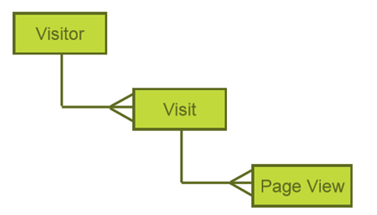
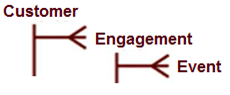
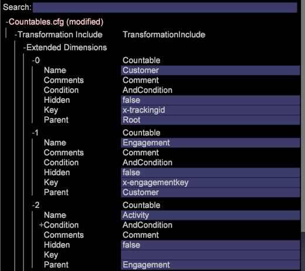
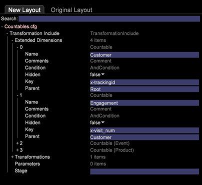
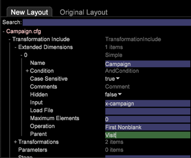
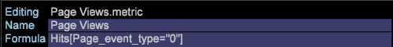
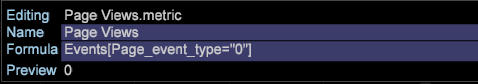
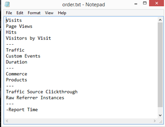
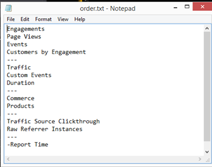
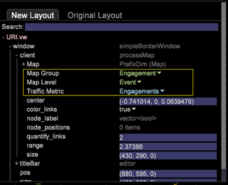

# Configuration Changes for New Schema{#configuration-changes-for-new-schema}

This document explains how to change all the default Data Workbench configurations after the new schema is in place.

## Understanding the Dataset Schema {#section-2ffac5170c894781bc943565af7ad479}

The foundation of the dataset schema consists of a key set of relationships that form the backbone of the Data Workbench web analytics schema. In the following example, typical web analytic schema provides an idea of the relationships between a visitor, a visit, and a page view. 

* Any given visitor may have one or more visits. 
* Any given visit is generated by only one visitor. 
* Any given visit may include one or more page views. 
* Any given page view belongs to only one visit. `<discoiqbr>`

As the web and the business world has evolved over the years the needs of web and data analysis have changed too. Web sites began as places to look at content. Now, you can look at content; interactively correspond through chats, video, or submissions; purchase products; and much more. In addition, businesses now want to integrate their web data with other channels of data in their business to gain a better view of their business as a whole. For example, a business may want to integrate their web, call center, email, social, and store and customer data together. With this integration of offline and online channels the dataset schemas have evolved over the years where no two dataset schemas are the same.

`<discoiqbr>`When you integrate the online and offline data, the term "visitor" doesn't always seem appropriate. As a result, the term "customer" is sometimes used instead of the visitor.  

The 'Engagement' level is used to enable a single view of time, when you have data from multiple data sources. For example, suppose you only have a single data source: e-commerce data collected by visitor activity on your web site. In that case, the Visit level indicates visits to your site from those visitors. Note that time dimensions - 'Day', 'Week', 'Month', etc. - are typically captured at the 'Visit' level.

Similarly "Event" level brings all the events (page view, call made to call center etc) happened during an engagement. It combines all the online and offline events for a customer during an engagement.

## New Countable Structure in DWB {#section-b77638ec04e4441cb51c56fd3d4abeb6}

The new schema structure replaces Visitor by Customer, Visit by Engagement and Hit by Event. 

## Configuration Changes as per New Dataset Schema {#section-27135515be5c471ba2ee879d1ef4771f}

To change the dataset schema from visitor to customer, you need to change the following configuration files:

1. All configuration files under Dataset folder where countable and extended dimensions are defined. 

1. Configuration files under Dimension folder, where the "visitor", "visit" or "event" are used as Level.

   Example: Campaign.cfg file. In the Adobe SC profile, Campaign is defined at Visit level. 

   The following example provides an idea of the parent schema change from Visit to Engagement: 

1. As some of the metrics are derived or created out of countables, configuration files under Metrics folder needs to be modified or created.

   For example: create a new metric [!DNL Customers.metric with formula = sum(one,customer)] or as Page Views.metric to *definw* it at the hit level. Modify the metric, and then change the level to Event instead of Hit.

   Adobe SC Page Views Metirc defined at Hits level: 

   `<discoiqbr>` `<discoiqbr>`The following will be the Page Views metric as per the new schema: 

1. Change the *order.txt* in the metrics folder so that it reflects the new or modified metrics related to the Customer, Engagement and Event.

   Adobe *SC order.txt* file. 

   *Order.txt* file with new schema changes: 

1. All the configuration files (.vw) under Visualization folder should be changed to refer to new levels : Customer, Engagement and Event. For example: 2D process Map, 3D process Map etc.

   Adobe SC default URI.vw for 2D process Map is defined at Hit level and Visit Group as shown below: 

   Changes to be made in URI.vw for new schema: 

