# Derived Dimensions Setup{#derived-dimensions-setup}

The different types of Derived (Client Side) Dimensions and how to setup those in Data Workbench.

## Types of Derived Dimensions {#section-33e6dcc9ab9745de9b830cecb2427ca3}

**Metric Dimensions**

Metric Dimension allows you to group metric counts by a specific Level. It also allows you to group metric counts by a specific level. Once, a Metric Dimension is created, you can segment data based on the metric value.

Example 1: You are a Travel Company and you want to understand difference of behavioral activities on the website between your frequent flyers and customers who have booked flight less than 5 times-how would you do that?

All you have is count of Bookings as a metric, how will you segment customers based on a metric -here, booking -to understand their behavior on the website?

Example 2: You are a Financial Bank and you want to group your customers based on number of CDs they have invested in. You want to segment your customers in 3 Tiers. Tier 1 -Customers with 10+ CDs, Tier 2 -Customers with >5 and <10 CDs and Tier 3 -Customers with >0 and <5 CDs

The information you have is metric which gives you counts of CD investments -how will you create Tired Customer Segments for your analysis?

*Creating Metric Dimension - via Workstation*

Mark one of the OOB metric dimensions as local and Rename that dimension with a custom name / Make local copy of the RenameDim.example and rename it to the proper dimension name with .dim extension

Open the newly created dimension in the workstation to make changes. Change following parameters of the metric dimension based on the requirements: 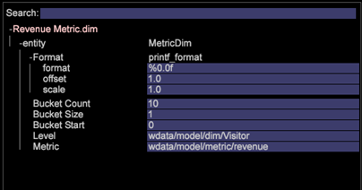

Metric - Metric to be grouped

Level - Level at which metrics will be grouped

Bucket Start - Starting element of the Metric Dimension. Enter the same value in offset.

Bucket Size - Grouping size of metric. Enter the same value in scale

Bucket Count - Maximum number of elements to be displayed in the dimension

Save the newly created dimension on the server if you want to share it with others.

**Prefix Dimensions**

The main purpose of the Prefix dimension is to group elements of the original dimension and to provide user friendly names to the grouped elements.

For example, you own a retail site and your site has various site sections such as Women's Apparel, Men's Apparel, Toys and Games, Home Decor, etc and each of these site sections has several pages associated with it. You want to do path analysis and get insights about the traffic that goes from one site section to other and so on. If you use URI dimension, you will be required to pull each page of each of the site section in the Path Browser or Process Map and carry on the analysis.

The same analysis can be done easily if there is a Prefix dimension which has pages of a site section grouped together as a single element.

Creating Prefix Dimension:

Open a 2D process map from the Visualization menu.

Change following parameters of the prefix dimension based on the requirements.

Change Map Dimension - The Dimension that you want to use for 2D process map (Ex: SMS Typology)

Change Map Level Dimension - Level of the above mentioned dimension

Change Map Clip Dimension - The countable level at which you want to look at the data.

Change Map Metric - The metric that you want to look at.

Once the 2D Process map is set, open the dimension that you mentioned in Change Map Dimension parameter.

Select the elements you want to group. Use CTRL+ALT and drag & drop the elements on to process map.

Right click on the dot that appears and rename the group name. If you have selected 3 elements to group, the default name will be 3 Selected.

Right click on the outline of the visualization and save dimension from the menu that appears.

**Rename Dimensions**

Rename Dimensions are created off of a pre-existing dimension. The main purpose of the rename dimension is to provide user friendly names to the elements of the dimension. The out of the box Rename dimension is the Page dimension which is created off of the URI dimension. The URI dimension can be confusing for a person who does not know technical names of the pages and that is why the Page dimension allows you to rename elements of the URI dimension.

CREATING CUSTOM RENAME DIMENSIONS:

Elements of the Renamed dimension hold a One-to-One mapping with the original base dimension's elements. You can verify this by opening the .dim file of the Rename Dimension in the Workstation/Note pad. You will notice that each element of the original dimension has only one value (Rename String) against it in the file.

If you have fewer elements for the rename purpose; you can create a .dim file in the workstation and rename each individual elements by the steps explained below.

Steps to create a .dim file for a Rename Dimension- Using the Workstation

Use this option if the numbers of elements to be renamed are less.

1. Open a blank workspace and open the Dimensions Manager. Right Click>Admin>Profile>Profile Manager. 
1. Expand the Dimensions Folder in the File Column. 
1. Expand the Page Folder in the File Column and Right Click on the Page.dim file in the Second to Last column (This column usually represents the Profile Name) and click on the "Make Local" option. 
1. Right Click on the Page.dim in the "User" column and click on the Copy option and Paste the copied .dim file in to the desired folder under the Dimensions directory. 
1. Click on OK on the error message. 
1. Now, you will notice that there are two Page.dim files under the Dimensions folder. One is the original file under Dimensions\Page directory and the second one is the one that you just copy pasted in step 4. 
1. Right Click on the recently pasted Page.dim file under the User column and click on the blue/grey input box that says Page.dim. The input box will turn green with the cursor blinking, indicating that it can be modified. Type the name of the Rename dimension that you want to create. 
1. You will notice that the Page.dim file in the File Column got changed to the new file name you gave in the step 7. Right click on the new.dim file in the User column (Last Column) and select Open>In Workstation. 
1. Once the .dim file is opened in the workstation; click on the plus sign (+) next to the entity and expand it. Observe the value present against the "Parent" field, it reflects "URI" dimension. It shows "wdata/model/dim/URI" Click on the blue/grey input box to change the URI to the name of the dimension whose elements you want to rename. 
1. Ensure the dimension that you want to rename does exist in the dataset. Dimension names are case sensitive so retain the case of the original dimension. 
1. Observe the "modified" appearing next to the dimension name. This indicates that the original dimension has been modified. To sustain the changes made in the step 9; Right Click on new.dim (modified) and click on the "Save as" option. 
1. Once the dimension is saved per step 10, the newly created rename dimension for the Campaigns is now available to you for the purpose of renaming. This is only available to you locally. 
1. In order for others to see the dimension created by you, it has to be saved on to the profile. Right click on the .dim file of the new dimension in the "User" column (Last Column) and click on the "Save To>Profile Name" in which you want to save the dimension. 
1. After saving the file to the profile, all Workstation users who have access to this profile will be able to see the rename dimension for the Campaigns.

Prefix and Rename dim creator Tool

Adobe has an Excel tool to generate Prefix and Rename Dimensions.

Below are the steps to generate the Prefix/Rename dimensions using the tool:

1. Save the Excel tool *Adobe_DWB_Dimension_Generator.xlsm* in a folder. Contact Adobe Customer Care to download the tool. 
1. Open the tool and enable macros: 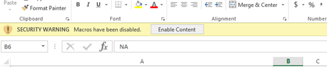

1. Fill the data sheet with the vales to be used.

   For example, we are creating Product Brand Prefix dimension based on Product Dimension. In the data Sheet, the following information is captured: 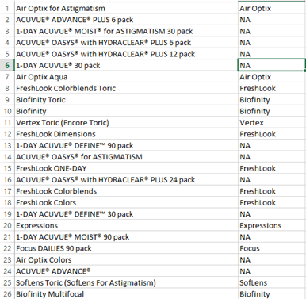

   Each product is assigned to a brand in the data sheet. 

1. In the Configuration tab, fill the information related to the dimension to be created. For the sample data above below information is entered: 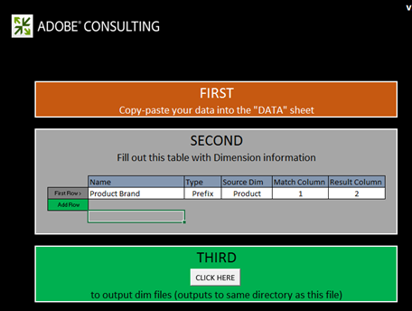

   Name: Name for the Prefix/Rename dimension

   Type: Prefix/Rename

   Source Dim: Original Dimension

   Match Column: Column to be matched

   Result column: Value to be used for new dimension. 

1. Click the button titled *Click Here*. 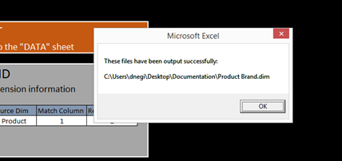

1. The dim file will be generated in the same folder where the tool was saved. 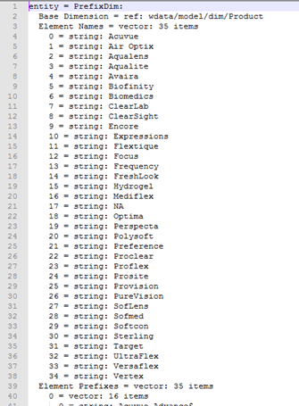

   Using the Profile Manager, save the dim file in the Dimension folder.

**Shift Dimensions**

Shift dimensions allows you to look at the Nth element of any dimension at the within any particular Countable Dimension.

They also give you the ability to look back at -Nth element of any dimension within any particular Countable Dimension

Example 1:

- The Nth page within a session -Next Page Dimension

- The Nth page for a visitor -Next Page for Visitor -across all Sessions

- The Nth call for a user

Why it is important to know Nth element of the countable dimension?

- You want to know the 5thPage Viewed in a Session.

- You want to do pathingon Campaigns to understand which was 2ndcampaign viewed after viewing " Free Checking Account" campaign?

- You want to understand which link visitor clicked before clicking "Chat with an Agent" link? 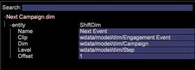

The Next URI is one of the OOB Shift dimensions which can be used as template. The example above is giving you 2nd(Offset = 1) element of the Campaign (Dim = Campaign) in the Engagement Event (Clip = Engagement Event)

Here offset 1 means look on the right -forward in the Event

Some other OOB Shift Dimensions

*Next Page:*

The next page viewed in a session after currently selected Page in the Page Dimension

Here offset is 1, Level is Page View, Dim is Page and Clip is Session

*Previous Page:*

The previous page viewed in a session before currently selected Page in the Page Dimension

Here offset is -1, Level is Page View, Dim is Page and Clip is Session

What will be the previous Campaign viewed before currently selected Campaign by a visitor?

Here offset is -1, Level is Campaign Response, Dim is Campaign Response Attribute Value and Clip is Visitor

*Creating Shift Dimension -Via Workstation*

* Mark one of the OOB shift dimension as local
* Rename that dimension with a custom name
* Open newly created dimension in the workstation to make changes
* Change following parameters of the metric dimension based on the requirements.

  * Level-Countable dimension 
  * Offset-You want to look forward of backwards 
  * Dim -Dimension whose elements you want to analyze 
  * Clip-Countable in you want to view.

* Save the newly created dimension on the server if you want to share it with others.

**Last N Dimension**

Last N Dimensions operates only on the Time Dimension and on the As of Time of the system. OOB time dimensions are Day, Week, Hour and Month. You can create, Last N dimension for each of these base time dimensions such as Last 10 Days, Last 72 hours, Last 8 Weeks, Last 6 Months, etc. Last N Dimension calculates Last N based on the current "Report Time Metric" or As of Time of the system. 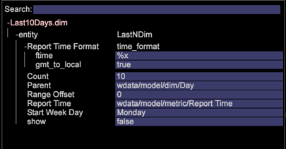

Count - Total number of elements to be displayed in the dimension

Range offset - Offset value to denote the starting point (Day/Week) to calculate the last N Day/Week.

**None.dim**

None.dim is a Alias dimension. It is used to create alias from extended dimensions.

Example:

In the None.dim the entity is defined as "wdata/model/dim/Parent/+name" (it can be changed) which means create the dimension as per the name of the dimension file. So if we create a copy of None.dim file under Dimension folder (for this example, copying and renaming the None.dim file under Visitor Profile folder) and rename it to "Log Source ID.dim", a new derived dimension with Log Source ID will appear in the Menu under Visitor Profile as shown below:

Before changes: 

After None.dim changes: 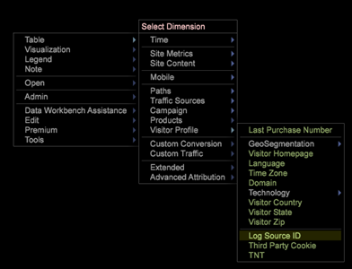

The entity can be changed to the extended dimension name, in this case another dimension with other name pointing to the same dimension as shown below:

In this example the "Source Name.dim" has the following content: 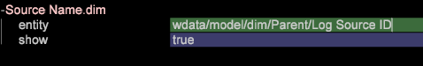

So another Dimension Source Name pointing to Log Source ID will appear. 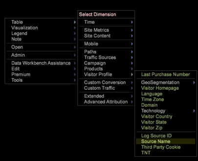

**Hiding Derived Dimensions**

To hide the Derived Dimension, set the *Show* property to "false". 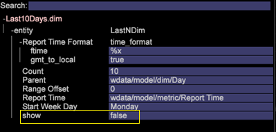

