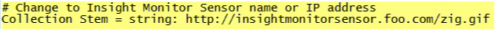
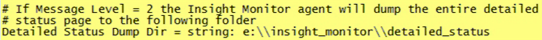
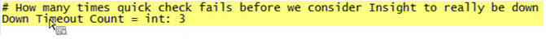
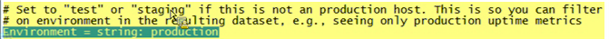
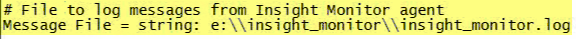
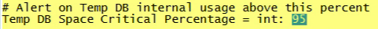

# Installing the Monitoring Profile{#installing-the-monitoring-profile}

Directions for installing the data workbench Monitoring Profile.

## Installation Steps {#section-d4355dbea8a447f48ab168db6ccff612}

1. Configure a new Sensor instance as if it will be used for tagged web page data collection. Be sure the zig.gif file is in the Sensor web server document root. Sensor can be run on the same host as the monitor profiles. (This is not an issue if using a text file for this purpose.)

   >[!NOTE]
   >
   >This Sensor instance must be dedicated to receiving only traffic from the Monitoring Agents. Also, the Sensor can be configured to run on a different port if you are re-purposing a web server for this collection.

1. In the [!DNL txlogd.conf] file there is the default line:

   ```
   <b>ContentFilterExclude</b> image/,text/css,application/x-javascript,text/javascript
   ```

   For the data workbench Monitoring Profile application (or any "tagged" page implementation), the image type has to be removed in order to collect via a GIF file. The updated line is:

   ```
   <b>ContentFilterExclude </b>text/css,application/x-javascript,text/javascript
   ```

1. Copy the [!DNL insight_monitor.zip/insight_monitor_agent] to a temporary location. 
1. Update [!DNL insight_monitor_agent.cfg] file for your environment. Follow the comments inside the configuration file:

   **The Monitoring configuration file:**

   

   Define where you are collecting all information and provide URL address. This needs to be a dedicated sensor and should receive no traffic except for this application.

   

   There are paths assuming there is an e: disk. You may want to change this path for your environment. 

   

   Sometime when running a Transform profile, data workbench can be unresponsive. This value lets you send an alert if three times in a row the process is unresponsive. This is a way of reducing false positive alerts.

   

   This is where you set the environment and group dimensions. This may be different from host to host.

   This is w here you can see exactly what the monitor agent is doing by viewing error logs in this path.

   

   This is to use the temp db internally. It may be alerted when reaching capacity. This is different than physical disk usage. 

1. Copy the *insight_monitor_agent* folder to each DPU and FSU host running the data workbench server. The default location as indicated in the configuration file is [!DNL e:\insight_monitor_agent] but you can change this location. 

1. Add a Windows scheduled task to invoke the agent every 10 minutes (this period is assumed in the processing rate calculations). The program is [!DNL e:insight_monitor/insight_monitor_agent.exe]. The argument is config-file e:\insight_monitor\insight_monitor.cfg. Start in e:\insight_monitor. The user running executing the task must have permission to read/write [!DNL e:\insight_monitor] and read the Win32 OLE object [!DNL root\CIMV2] (required to ascertain the data workbench server service start mode and to check the percentage of space on local disks) 

1. Confirm that the VSL file is starting to grow as monitor records accumulate. This will take some time as the traffic volume will be extremely low in a small installation (every 10 minutes the agent sends only one hit for the host-specific data, plus one hit per processing profile). 
1. Unzip insight_monitor.zip\profiles\Insight Historic to a temporary location. 
1. Update host name in [!DNL profile.cfg], [!DNL  [!DNL dataset\cluster.cfg]], and the [!DNL  [!DNL dataset\segment export.cfg]]. 

1. Update the files to the data workbench profiles directory. 
1. Update log server and path in [!DNL dataset\log processing.cfg] to the location where the Sensor VSLs are accumulating. 
1. [Optionally] do the same with the profiles [!DNL Insight Profile Status] and [!DNL Insight Server Status]. In addition, the status profiles should be reprocessed nightly with a trailing two day window. Add a Windows scheduled task: The program is [!DNL e:\insight_monitor\insight_reprocess.exe]. The argument is [!DNL --profile-path="PATH TO PROFILES\insight profile status" --start-days-ago=2]. Leave [!DNL start in] blank. Add another scheduled task for *"insight server status"*. *insight_reprocess.exe* requires read/write access to *log processing.cfg* to update the start time. 

1. In addition, the status profiles should be reprocessed nightly with a trailing two day window. Add a Windows scheduled task: The program is *e:\insight_monitor\insight_reprocess.exe*. The argument is - [!DNL -profile-path="PATH TO PROFILES\insight profile status" --start-days-ago=2]. Leave *start in* blank. Add another scheduled task for [!DNL "insight server status"]. [!DNL insight_reprocess.exe] requires read/write access to [!DNL log processing.cfg] to update the start time. Confirm that each profile is reading the monitor VSLs as they accumulate. Again, this will take some time—probably hours—because of the extremely low volume.

## Installation Notes {#section-17722441ab0046fcbcb46b957d56230a}

* **Configuring the Monitoring Profile in a licensed test environment**. The test environment package is included with your implementation of data workbench, allowing you to install and configure the application. If installing on a production FSU or DPU server, then you will need to configure the server to run on a separate port. 
* **Deploying a new Sensor specifically for the Monitoring Profile**. You will need to install a new instance of Sensor to the server running the Monitoring Profile. This is in addition to the production instance of Sensor. (There is no additional charge for installing Sensor on either a production or non-production server specifically for the Monitoring Profile.) 
* **Disable the monitor agent during data workbench maintenance**. To avoid polluting the uptime and performance metrics, you can set service start mode to manual for the service InsightServer (Omniture Insight Server). A handy PowerShell command is *set-service -name insightserver -startuptype manual*. Set it back to automatic after the maintenance: *set-service -name insightserver -startuptype automatic*. Another option is to temporarily disable the monitor agent scheduled task. 
* **The Status profiles need a trailing window** to drop old hosts and profiles as well as old host-profile mappings. However, if the amount of event data is so small that data workbench won't buffer it in, then you may need to extend the size of the window quite a bit to get it to process. 
* **The agent collects the overall and oldest as-of time from data workbench detailed status**, which is reported in local host time assuming the event data log time stamps are in UTC (as in VSL files). If the event data timestamps are in a non-UTC time zone the as-of time will be offset in the resulting Insight Profile Status profile. If **all** of your event data time stamps are in the same time zone you can add that offset to *Insight Profile Status\metrics\as of delay minutes.metric*. 

* **Two new dimensions were introduced to help the customer group their servers if they are in different states**, such as production, staging, testing servers, and servers in other states. For example if you are looking for "uptime", then you look at servers only in production mode. As a result, the Group dimension is just another way of arbitrarily grouping servers for your needs. For example, in the Monitoring Configuration file you can set, which host your department is servicing, such as Operations, Development, or Marketing.

