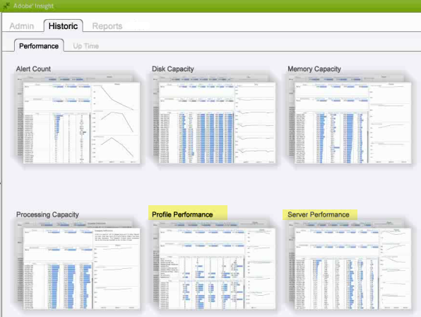
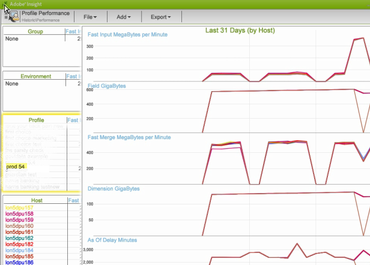
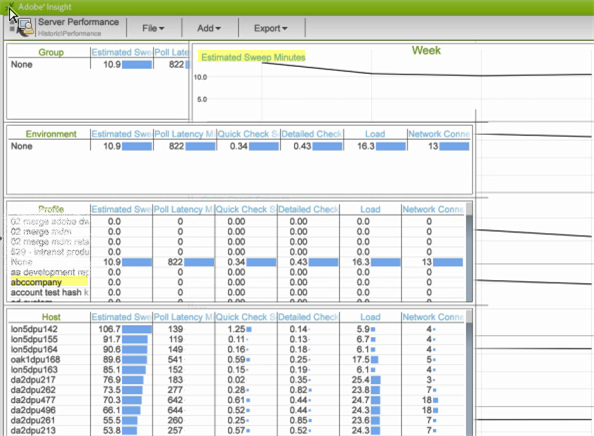
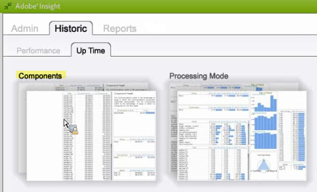
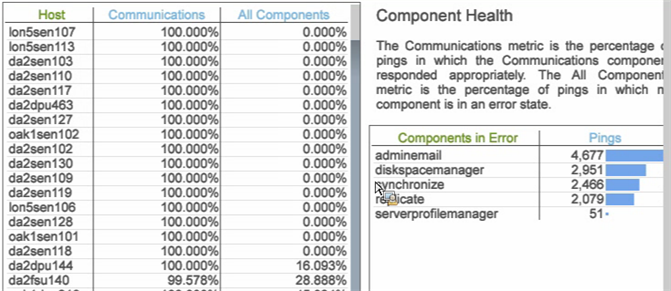
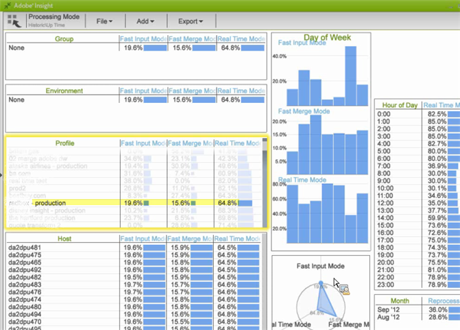

# Data Workbench Historic workspace{#data-workbench-historic-workspace}

Use the data workbench Historic profile to see how configuration, hardware, and other changes impact performance, stability, and server capacity over time.

The Historic profile includes a profile-based [Profile Performance](../../../home/monitoring-installation/monitoring-profiles/monitoring-historical-using.md#section-184a86f9de054970bf68515bb9dea85d) dataset and the server-based [Server Performance](../../../home/monitoring-installation/monitoring-profiles/monitoring-historical-using.md#section-5dad5870384b40e094d50173fcd90a09) dataset under the **[!UICONTROL Performance]** tab. These are the most commonly used datasets viewed for a past perspective of the data workbench server performance. In addition, you can view the [Components](../../../home/monitoring-installation/monitoring-profiles/monitoring-historical-using.md#section-5be7223abb384784bafe7b37c764ea66) and [Processing Mode](../../../home/monitoring-installation/monitoring-profiles/monitoring-historical-using.md#section-5be7223abb384784bafe7b37c764ea66) by selecting the **[!UICONTROL Up Time]** tab.

In addition, you can view the [Components](../../../home/monitoring-installation/monitoring-profiles/monitoring-historical-using.md#section-5be7223abb384784bafe7b37c764ea66) and [Processing Mode](../../../home/monitoring-installation/monitoring-profiles/monitoring-historical-using.md#section-5be7223abb384784bafe7b37c764ea66) by selecting the **[!UICONTROL Up Time]** tab.

For additional reference information about the dimensions used in the data workbench Historic profile, see [Dimensions in the Insight Historical profile.](../../../home/monitoring-installation/monitoring-appendix/monitoring-historical.md#concept-a42837c9c9274f83ad5bc5a6720f02b0)

## Profile Performance workspace {#section-184a86f9de054970bf68515bb9dea85d}

This dataset includes the following relevant metrics for data workbench monitoring.

* Fast Input MegaBytes per Minute—metrics displaying heavy data input during initial log processing. 
* Fast Merge MegaBytes per Minute—metrics displaying transformation.

>[!NOTE]
>
>To do a real performance assessment of your profile, look at rate rather than elapsed calendar time. The rate is measured as the changed values between polling every ten minutes.

## Server Performance workspace {#section-5dad5870384b40e094d50173fcd90a09}

This dataset monitors server metrics beyond the scope of included profiles, and includes the following relevant server metrics for data workbench monitoring.

* Estimated Sweep Minutes — Estimated query resolution time. 
* Poll Latency Milliseconds — Indicator of how busy software is by measuring how long it takes to get through a full cycle of servicing every component.

## Components workspace {#section-5be7223abb384784bafe7b37c764ea66}

This dataset is located under the Up Time tab.

The Components dataset includes two aspects for component health:

* Communications metric — Did the data workbench server process respond? 
* All Components metric — At top of Detailed Status page is a list of components the host is servicing within the data workbench server processes. If any component is in an error state then it is listed under the Components in Error table.

## Processing Mode workspace {#section-3e1dedb9474e4b4ba513240943e76817}

This workspace is located under the Up Time tab. This workspace lets you observe how much time is taken in fast input, fast merge, and real-time modes. 

This dataset provides important server load characteristics, such as identifying data load for

* Day of the week (for example a Fast Input Rate on Tuesday and Wednesday), 
* Hour of Day (what percentage of the day is it in Fast Input mode?)

